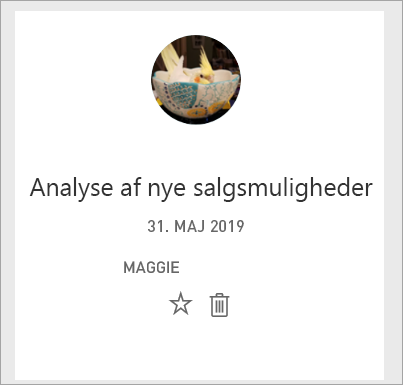
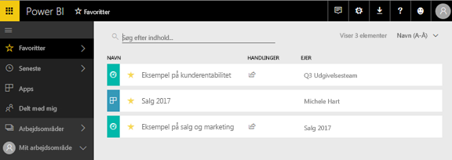

# Favoritdashboards, -rapporter og -apps i Power BI-tjenesten

[!INCLUDE[consumer-appliesto-yyny](../includes/consumer-appliesto-yyny.md)]

Når du gør indhold til en *favorit*, kan du hurtigt få adgang til det fra indholdslisten **Favoritter** og fra **Power BI Start** > **Favoritter og hyppige**. Favoritter er typisk det indhold, du besøger ofte, og de identificeres med en udfyldt stjerne.

   

   

## Tilføj et dashboard eller en rapport som en favorit

1. Åbn et dashboard eller en rapport, som du ofte bruger. Selv indhold, der er blevet delt med dig, kan være en favorit.

2. Vælg **Favoritter** eller stjerneikonet  på øverste menulinje i Power BI-tjenesten.
   
   
   
   Du kan også ændre et dashboard eller en rapport til et favoritelement fra et vilkårligt sted, hvor du kan se stjerneikonet, f.eks. Start, Seneste, Apps og Delt med mig. 
   
   

## Tilføj en app som en favorit

1. Vælg **Apps** i navigationsruden.

   

2. Hold musen over en app til at få vist flere detaljer. Vælg ikonet Stjerne  for at gøre det til favorit.
   
   

## Arbejd med favoritter
1. Du kan få adgang til dine favoritter ved at vælge pilen til højre for **Favoritter**. Herfra kan du vælge en favorit for at åbne den. Der vises op til fem favoritter alfabetisk. Hvis du har mere end fem, skal du vælge **Se alle** for at åbne indholdslisten Favoritter. 
   
   
2. Hvis du vil se alt det indhold, du har tilføjet som favoritter, skal du vælge **Favoritter** eller skærmbilledet Favoritter, . ikon. 
   
    
   
   Herfra kan du udføre handlinger. Du kan åbne en favorit, identificere ejere og tilmed dele favoritter med dine kolleger.

## Fjern markering af indhold som favorit
Hvis du ikke længere bruger en rapport så ofte, som du plejede, kan du fjerne den fra Favoritter. Når du fjerner indhold fra Favoritter, fjernes det fra listen med dine favoritter, men ikke fra Power BI.

1. Vælg **Favoritter** i navigationsruden for at åbne skærmbilledet **Favoritter**.
   
   
2. Vælg den sorte stjerne ud for det indhold, der skal fjernes som favorit.

> [!NOTE]
> Du kan også fjerne et dashboard, en rapport eller en app fra Favoritter. Du skal bare åbne og vælge den sorte stjerne for at omdanne den til en hvid stjerne igen. 
> 
> 
## Begrænsninger og overvejelser
På nuværende tidspunkt kan du angive en app som favorit, og dermed angives alle rapporter og dashboards for den pågældende app automatisk som favoritter. Det er ikke muligt at angive de enkelte apprapporter eller -dashboards som Favoritter. 

## Næste trin
- [Power BI: Grundlæggende begreber](end-user-basic-concepts.md)
- Har du flere spørgsmål? Prøv at spørge [Power BI-community'et](https://community.powerbi.com/).

