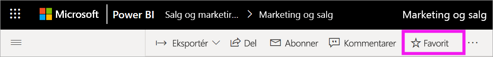
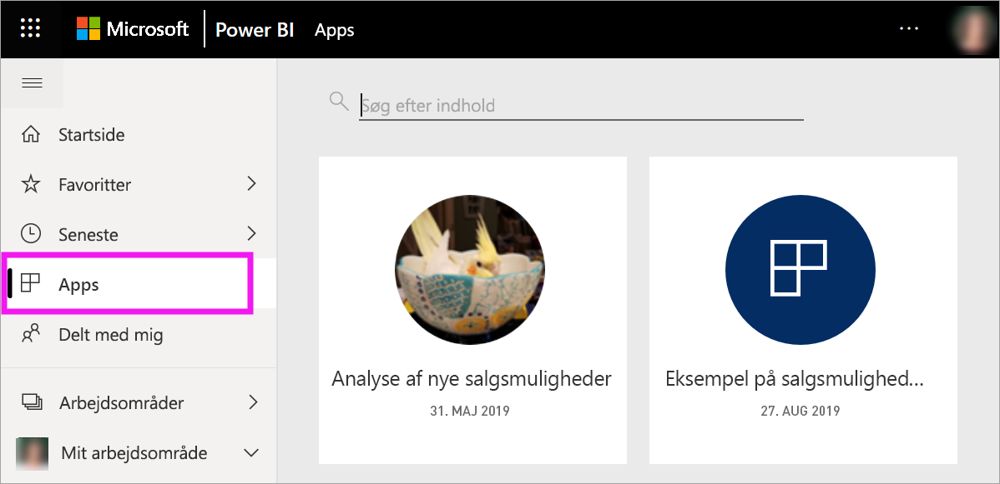
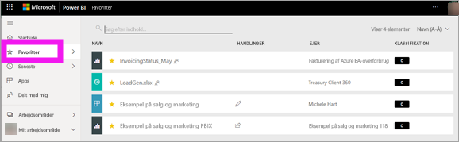
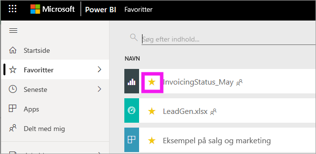

# Favoritdashboards, -rapporter og -apps i Power BI-tjenesten
Når du gør indhold til en *favorit*, kan du hurtigt få adgang til det fra indholdslisten **Favoritter** og fra **Power BI Start** > **Favoritter og hyppige**.  Favoritter er typisk det indhold, du besøger ofte, og de identificeres med en gul stjerne.

   

   

Du kan også vælge et enkelt dashboard som et [udvalgt dashboard](end-user-featured.md) i Power BI-tjenesten.

## Tilføj et dashboard eller en rapport som en *favorit*

1. Åbn et dashboard eller en rapport, som du ofte bruger. Selv indhold, der er blevet delt med dig, kan være en *favorit*.

2. Vælg **Favoritter** eller ikonet Stjerne  på øverste menulinje i Power BI-tjenesten.
   
   
   
   Du kan også ændre et dashboard eller en rapport til et favoritelement fra et vilkårligt sted, hvor du kan se stjerneikonet, f.eks. Start, Seneste, Apps og Delt med mig. 
   
   

## Tilføj en app som en *favorit*

1. Vælg **Apps** i navigationsruden.

   

2. Hold musen over en app til at få vist flere detaljer.  Vælg ikonet Stjerne   for at gøre det til favorit.
   
   

## Arbejd med *favoritter*
1. Du kan få adgang til dine favoritter ved at vælge pilen til højre for **Favoritter**.  Herfra kan du vælge en favorit for at åbne den. Der vises op til fem favoritter (alfabetisk). Hvis du har mere end fem, skal du vælge **Se alle** for at åbne indholdslisten Favoritter (se nr. 2 herunder). 
   
   
2. Hvis du vil se **alt** det indhold, du har tilføjet som favoritter, skal du vælge **Favoritter** eller ikonet Favoritter  i navigationsruden.  
   
    
   
   Herfra kan du udføre forskellige handlinger: åbne, identificere ejere og tilmed dele med kolleger.

## Fjern markering af indhold som favorit
Bruger du ikke længere en rapport så ofte, som du plejede?  Du kan fjerne det fra favoritter. Når du fjerner indhold fra favoritter, fjernes det fra listen med dine favoritter, men ikke fra Power BI.

1. Vælg **Favoritter** i venstre navigationsrude for at åbne skærmbilledet **Favoritter**.
   
   
2. Vælg den gule stjerne ud for det indhold, der skal fjernes som favorit.

> [!NOTE]
> Du kan også fjerne et dashboard, en rapport eller en app fra favoritter. Du skal blot åben og fjerne markeringen det gule ikon.   
> 
> 
## Begrænsninger og overvejelser
På nuværende tidspunkt kan du angive en app som favorit, og dermed angives alle rapporter og dashboards for den pågældende app automatisk som favoritter. Det er ikke muligt at angive de enkelte apprapporter eller -dashboards som favoritter. 

## Næste trin
[Power BI – Grundlæggende begreber](end-user-basic-concepts.md)

Har du flere spørgsmål? [Prøv at spørge Power BI-community'et](http://community.powerbi.com/)

