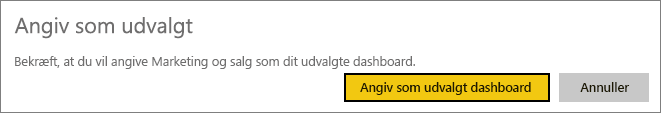
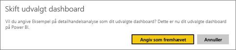
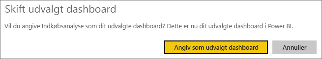
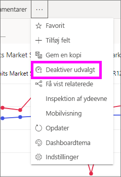

# Udvalgte dashboards i Power BI-tjenesten

[!INCLUDE [power-bi-service-new-look-include](../includes/power-bi-service-new-look-include.md)]

Mange af os har ét dashboard, som vi besøger oftere end andre. Det kan være det dashboard, vi bruger til at drive vores virksomhed. Det kan også være et dashboard, der indeholder en sammenlægning af felter fra mange forskellige dashboards og rapporter.

## Opret et udvalgt dashboard
Når du markerer et dashboard som *udvalgt*, vises dette dashboard, hver gang du åbner Power BI-tjenesten. 

Du kan også vælge et par dashboards og angive dem som Favoritter. Se [dashboardfavoritter](end-user-favorite.md).

Hvis du ikke har angivet et udvalgt dashboard, åbnes det senest anvendte dashboard i Power BI eller Power BI **Start**. 

### Angiv et dashboard som udvalgt
Se, hvordan Amanda opretter et udvalgt dashboard i videoen. Følg derefter trinnene for at prøve det selv.

<iframe width="560" height="315" src="https://www.youtube.com/embed/G26dr2PsEpk" frameborder="0" allowfullscreen></iframe>

1. Åbn det dashboard, du vil angive som udvalgt. 
2. Vælg **Flere indstillinger** (...) på den øverste menulinje, og vælg **Angiv som udvalgt**. 
   
    
3. Bekræft dit valg.
   
    

## Skift det udvalgte dashboard
Hvis du senere ændrer mening, kan du angive et nyt dashboard som udvalgt.

1. Følg de forrige trin 1 og 2.
   
    
2. Vælg **Angiv som udvalgt dashboard**. Selvom du fjerner markeringen af et dashboard som udvalgt, fjernes det ikke fra Power BI. 
   
    

## Fjern det udvalgte dashboard
Hvis du beslutter, at du ikke vil have et dashboard markeret som udvalgt, skal du gøre følgende for at fjerne markeringen.

1. Åbn det dashboard, der i øjeblikket er markeret som udvalgt.
2. Vælg **Flere indstillinger** (...) på den øverste menulinje, og vælg **Deaktiver udvalgt**.

    
   
## Næste trin
- [Gør et dashboard til favorit](end-user-favorite.md)
- Har du flere spørgsmål? Prøv at spørge [Power BI-community'et](https://community.powerbi.com/).

