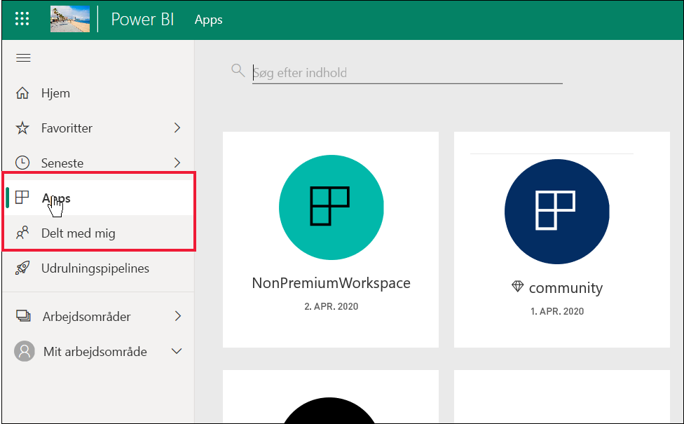

# Liste over Power BI-funktioner til *forbrugere* og andre gratis brugere

[!INCLUDE[consumer-appliesto-ynnn](../includes/consumer-appliesto-ynnn.md)]

Som *forbruger*kan du bruge Power BI-tjenesten til at udforske rapporter og dashboards, så du kan træffe forretningsbeslutninger. Disse rapporter og dashboards oprettes af *designere*, der har Power BI *Pro*-licenser. Pro-brugere har mulighed for at dele indhold med deres kolleger og styre, hvad deres kolleger kan og ikke kan foretage sig med dette indhold. Nogle gange kan designere dele indhold ved at sende dig links, og i nogle tilfælde installeres indholdet automatisk og vises i Power BI under **Apps** eller **Delt med mig**.

Der er mange forskellige måder, designere kan dele indhold på. Denne artikel henvender sig til *forbrugere* af Power BI, og vi vil derfor kun beskrive, hvordan forbrugerne modtager og interagerer med indhold. Du kan finde flere oplysninger om andre måder at dele indhold på under [Måder at dele dit arbejde på i Power BI](../service-how-to-collaborate-distribute-dashboards-reports.md).

Den [forrige](end-user-license.md) artikel indeholdt en beskrivelse af de forskellige typer Power BI-licenser (gratis og Pro) og abonnementer (Premium), og du fik mere at vide om, hvordan du finder ud af, hvilken licens og abonnement du bruger. I denne artikel kan du se, hvilke Power BI-funktioner der er tilgængelige for dig, afhængigt af din licens og dit abonnement.   

<art>

## Hurtig gennemgang af terminologi
Lad os gennemgå nogle Power BI-koncepter, før vi kommer til listen. Dette er en hurtig gennemgang, og hvis du har brug for flere oplysninger, kan du besøge [Licenser og abonnementer til forbrugere](end-user-license.md) eller [Grundlæggende koncepter i Power BI](end-user-basic-concepts.md).

### Arbejdsområder og roller
Der er to typer arbejdsområder: **Mit arbejdsområde** og apparbejdsområder. Kun du har adgang til dit **Mit arbejdsområde**. Samarbejde og deling kræver, at indholdsdesigneren bruger et apparbejdsområde. 

*Roller* i arbejdsområdet bruges i Power BI til at administrere, hvem der kan gøre hvad i et arbejdsområde. *Forbrugere* tildeles normalt rollen **Læser**. 

### Abonnement på Premium-kapacitet
Når en organisation har et abonnement på en Premium-kapacitet, kan administratorer og Pro-brugere tildele arbejdsområder til *Premium-kapaciteten*. Et arbejdsområde i en Premium-kapacitet er et sted, hvor Pro-brugere kan dele og samarbejde med gratis brugere – uden at det er nødvendigt for de gratis brugere at have Pro-licenser. I disse arbejdsområder har gratis brugere administratorrettigheder (se listen nedenfor). 

### Licenser 
Hver Power BI-tjenestebruger har enten en gratis licens eller en Pro-licens. Visse funktioner er forbeholdt brugere med Pro-licens.

- **Gratis licens** – tildeles typisk *forbrugerne* i en organisation. Bruges også af alle, der tilmelder sig Power BI som enkeltperson, og som ønsker at prøve [Power BI-tjenesten i separat tilstand](../service-self-service-signup-for-power-bi.md).  
- **Pro-licens** – tildeles typisk designere, analytikere og udviklere i en organisation.   
- **Gratis licens + Premium-kapacitet** – giver gratis brugere (*forbrugere*) mulighed for at se og interagere med indhold, som Pro-brugere har oprettet i en Premium-kapacitet og delt. På den måde kan Pro-brugere samarbejde med gratis brugere i arbejdsområdet eller ved at bruge **Delt med mig**.

Gratis brugere, der er medlemmer af en organisation, der har et abonnement på en Premium-kapacitet, får på den måde superkræfter. Så længe dine Pro-kolleger bruger arbejdsområder i en Premium-kapacitet til at dele indhold, kan gratis brugere få vist og samarbejde med disse Pro-kolleger.  **På den måde bliver den gratis bruger en *forbruger* i Power BI med mulighed for at modtage og dele indhold og træffe forretningsbeslutninger på denne baggrund.** 

## Liste over Power BI-funktioner til *forbrugere* og gratis brugere
Følgende diagram viser, hvilke opgaver der kan udføres af en *forbruger* i en organisation, der har et Premium-abonnement.    

Den første kolonne repræsenterer en gratis bruger, der arbejder med indhold i **Mit arbejdsområde**. Denne bruger kan ikke samarbejde med kolleger i arbejdsområder. Kolleger kan ikke dele indhold direkte med denne bruger, og denne bruger kan ikke dele fra **Mit arbejdsområde**. 

Den anden kolonne repræsenterer en *forbruger*.  En forbruger:

- Har en gratis brugerlicens.
- Er en del af en organisation, der har et abonnement på en Premium-kapacitet.
- Henter indhold (apps, dashboards, rapporter) fra Pro-brugere, der deler indholdet ved hjælp af apparbejdsområder i Premium-kapaciteten.
- Er tildelt rollen **Læser** for disse apparbejdsområder. 

### Forklaring
 – funktionen er tilgængelig i det aktuelle scenarie    
 – funktionen er ikke tilgængelig i det aktuelle scenarie    
 **** – funktionens tilgængelighed er begrænset til **Mit arbejdsområde**. Indhold i **Mit arbejdsområde** er til ejerens personlige brug og kan ikke deles eller ses af andre i Power BI.    
 \*-adgang til denne funktion kan slås til eller fra af en Pro-bruger eller en administrator.    
   

### Liste over funktioner

|Funktioner   | Scenarie 1: Gratis Power BI-bruger, der ikke har adgang til indhold, der er hostet i en Premium-kapacitet.    | Scenarie 2: Gratis Power BI-bruger med tilladelser som **Læser** til indhold, der er gemt i en Premium-kapacitet. Denne person er en *forbruger* i Power BI. |
|---|---|---|
|**Apps** 
|Installeres automatisk |  | *| 
|Åbn |  |   | 
|Favorit |  |   |
 |Rediger, opdater, del igen, udgiv igen |  |   |
 |Opret ny app |  |   |
 |Appsource: Download og åbn |   | | 
|Organisationslager: Hent og åbn|  |  |
 |**Apparbejdsområder**
| Opret, rediger eller slet arbejdsområde eller indhold  |   | |
|Tilføj godkendelser |   | | 
|Åbn og få vist  |   |    | 
| Læs data, der er gemt i dataflow i arbejdsområdet | ||
|**Dashboards**
|Modtag, få vist og interager med dashboards fra kolleger |  |    | 
| Føj beskeder til felter  |   |    | 
| Vis og reager på kommentarer fra andre: Tilføj dine egne kommentarer  |   |  *  | 
| Gem en kopi |  | | 
|Kopiér visualisering som billede | ||
|Opret, rediger, opdater, slet |  | | 
|Eksportér felt til Excel | | |
|Favorit || |
|Funktion | ||
|Fuldskærms- og fokustilstande | | |
|Global søgning |* |* |
|Indsigt på felter |     | *|
|  Spørgsmål og svar: Brug på dashboard  |* |* |
|Spørgsmål og svar: Tilføj udvalgte og gemte spørgsmål |   | |
|Spørgsmål og svar: Gennemse stillede spørgsmål |   | |  
|Inspektion af ydeevne |  | |
|Fastgør felter fra Spørgsmål og svar eller rapporter |  | | 
|Udskriv |* |* |
|Opdater |  | | 
|Del igen |   | | 
|Tilmeld dig selv til et abonnement |* |*  |
|Tilmeld andre til et abonnement |   | | 
|**Datasæt**
|  Tilføj, slet, rediger  |    |   |   
| Opret en rapport i et andet arbejdsområde, der er baseret på et datasæt i dette arbejdsområde |   | |  
|  Indsigt i datasæt  |   || 
|Planlæg opdatering |  || 
|**Rapporter**
|Modtag rapporter fra kolleger |  |    | 
| Samarbejd med kolleger på samme version af en rapport | |    | 
| Analysér rapport i Excel  |*  |*  | 
| Få vist bogmærker, der er oprettet af andre, og tilføj dine egne bogmærker  | |  |
| Vis og reager på kommentarer fra andre: Tilføj nye kommentarer  | |  |
|Skift visningsdimensioner   |  |   | 
| Gem en kopi | |*  
|Kopiér visualisering som billede* |
| Fremhæv og filtrer visualiseringer tværgående   | |  |
|  Analysér   |  |  |
| Detaljeadgang |* |* |
|  Integrer (udgiv på internettet, offentligt) | * | |  
|  Eksportér opsummerede data fra rapportvisualiseringer*  | | |
|Eksportér underliggende data fra rapportvisualiseringer* |  |  | 
|  Markér rapporten som favorit  | | |
|  Filtre: Skift typer  |* |* |
|  Filtre: Interager   || |
|  Filtre: fast  |* |* |
| Søg i filtreringsruden |* |* |
| Fuldskærms- og fokustilstande   | | |
|  Indsigt i rapporter1  |   || 
| Dataafstamningsvisning  | | |
|PDF: Opret fra rapportsider | |  |
|Inspektion af ydeevne || |
| PowerPoint: Opret fra rapportsider*   | | |
|  Fremhæv indhold på startside  |   | | 
| Udskriv rapportsider* | | |
|Interager med visualisering i Spørgsmål og svar | | |
|QR-kode | | |
|  Opdater  | | |
|  Del indhold med eksterne brugere  |   | | 
| Del: Giv andre tilladelse til at dele elementer igen |   | | 
|Vis som tabel (vis data)| | |
|  Udsnitsværktøjer: Tilføj eller slet  | | |
| Interager med udsnitsværktøjer | | |
|  Sortér visualiseringer i rapporter  | | |
|  Tilmeld dig selv et abonnement på rapporter* | | |
|  Tilmeld andre et abonnement på rapporter  |   | | 
|  Vis relaterede | | |
|  Visualiseringer: Skift typer i rapporter  |* |* |
|  Skift visuelle interaktioner  |  | |
|  Visualiseringer: Tilføj ny  |  | |
|  Visualiseringer: Tilføj nye felter  |   | |
|Visualiseringer: Skift type |  | |
| Visualiseringer: Peg for at få vist detaljer og værktøjstip  |  | |

1. Kun tilgængelig i indholdsvisningen **Delt med mig**. 

## Næste trin
[Power BI for *forbrugere*](end-user-consumer.md)    
