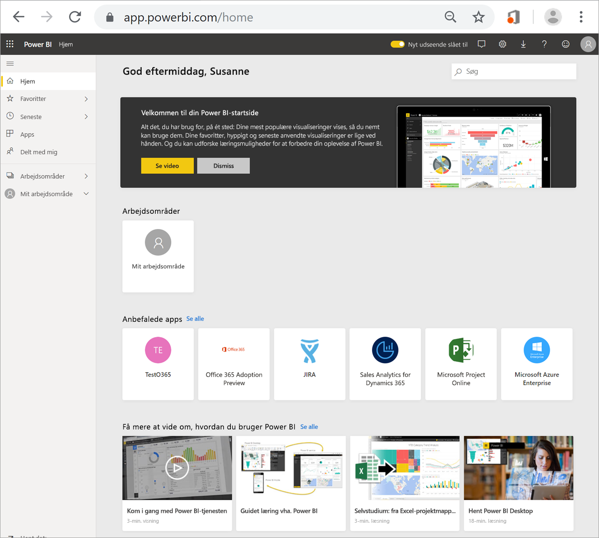
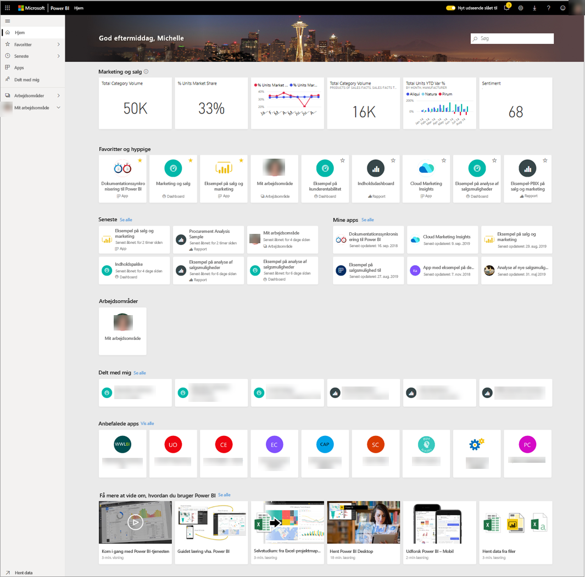
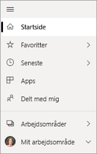

# Find dine dashboards, rapporter og apps
I Power BI henviser begrebet *indhold* til apps, dashboards og rapporter. Indhold oprettes af Power BI-*designere*, der deler det med kolleger som dig. Dit indhold er tilgængeligt og kan ses i Power BI-tjenesten, og det bedste sted at begynde med at arbejde i Power BI er fra landingssiden for startsiden.

## Udforsk Power BI Start
Når du logger på, åbnes Power BI og viser dit lærred for startsiden, som vist i følgende figur.
 

I Power BI Start kan du finde og få vist dit indhold på tre forskellige måder. De giver alle tre adgang til den samme indholdspulje, men er bare forskellige måder at komme til indholdet på. I nogle tilfælde vil søgningen være den nemmeste og hurtigste måde at finde noget på, men andre gange er det smartest at vælge et *kort* på lærredet for startsiden.

- På lærredet for startsiden kan du se og organisere dit foretrukne og nyeste indhold sammen med anbefalede indholds- og læringsressourcer. Alt indhold vises som et *kort* med en titel og et ikon. Når du vælger et kort, åbnes det pågældende indhold.
- I venstre side findes den såkaldte navigationsrude. I denne rude er det samme indhold organiseret lidt anderledes, dvs. efter Favoritter, Seneste, Apps og Delt med mig. Herfra kan du få vist lister med indhold og vælge den, der skal åbnes.
- I øverste højre hjørne giver det globale søgefelt dig mulighed for at søge efter indhold efter titel, navn eller nøgleord.

I følgende emner gennemgås de enkelte muligheder for at søge efter og få vist indhold.

## Lærred på startsiden
Du kan se alt det indhold, du har tilladelse til at bruge, på lærredet for startsiden. I starten har du måske ikke så meget indhold på lærredet for startsiden (se billedet ovenfor), men det ændrer sig, i takt med at du begynder at bruge Power BI med dine kolleger.

Dit lærred for startsiden opdateres også med de anbefalede indholds- og læringsressourcer. 
 
Når du arbejder i Power BI-tjenesten, modtager du dashboards, rapporter og apps fra kolleger, og startsiden bliver efterhånden fyldt ud. Med tiden kan den komme til at ligne følgende startside.

 
I de næste par emner ser vi nærmere på denne startside, oppefra og ned.

## Det vigtigste indhold lige ved hånden

### Favoritter og hyppige
Dette øverste afsnit indeholder links til det indhold, du besøger oftest, eller som du har mærket som [udvalgt eller favorit](end-user-favorite.md). Læg mærke til, at flere kort har gule stjerner. Disse to apps og dette dashboard er blevet mærket som favoritter.
 
### Seneste og Mine apps
I næste afsnit vises det indhold, du har besøgt for nylig. Læg mærke til tidsstemplet på de enkelte kort. I afsnittet **Mine apps** vises de apps, der er blevet delt med dig, eller som du har [downloadet fra AppSource](end-user-apps.md). De nyeste apps vises her. Du kan vælge **Se alle** for at få vist en liste over alle apps, der er delt med dig.

### Arbejdsområder
Som Power BI-*forbruger* har du typisk kun ét arbejdsområde, **Mit arbejdsområde**. 

### Delt med mig
Kolleger deler apps med dig, men de kan også dele individuelle dashboards og rapporter. I afsnittet **Delt med mig** kan du se, at der er tre dashboards og tre rapporter, som dine kolleger har delt med dig.

### Anbefalede apps
På baggrund af dine aktivitets- og kontoindstillinger viser Power BI et sæt anbefalede apps. Når du vælger en app, åbner kortet appen.
 
### Læringsressourcer
Nederst på lærredet for startsiden er der et sæt læringsressourcer. Hvilke ressourcer der vises, afhænger af dine aktiviteter og indstillinger samt af Power BI-administratoren. 
 
## Udforsk navigationsruden

Brug navigationsruden til at finde og flytte mellem dashboards, rapporter og apps. I nogle tilfælde er brugen af navigationslinjen den hurtigste måde at få adgang til indhold på.
Navigationsruden er der, når du åbner landingssiden for startsiden, og den forbliver statisk, efterhånden som du åbner andre områder i Power BI-tjenesten.
  
I navigationsruden organiseres dit indhold i objektbeholdere, der svarer til dem, du allerede har set på lærredet for startsiden: Favoritter, Seneste, Apps og Delt med mig. Ved hjælp af pop op-vinduer kan du vælge kun at få vist det nyeste indhold i hver af disse objektbeholdere, eller du kan navigere til indholdslister for at se alt indhold for de enkelte beholderkategorier.
 
- Hvis du vil åbne et af disse indholdsafsnit og få vist en liste over alle elementer, skal du markere overskriften.
- Hvis du vil se de nyeste elementer i de enkelte objektbeholdere, skal du vælge pop op-vinduet ( **>** ).

    

 
Du kan også bruge navigationsruden til hurtigt at finde det ønskede indhold. Indhold er organiseret på en måde, der ligner lærredet for startsiden, men det vises på lister i stedet for på kort. 

## Søg i alt dit indhold
Nogle gange er det hurtigst at finde dit indhold ved at søge efter det. Du har f.eks. opdaget, at et dashboard, du ikke har brugt i et stykke tid, ikke vises på dit lærred for startsiden. Eller måske kommer du i tanke om, at din kollega, Aaron, har delt det med dig, men du kan ikke huske, hvad han kaldte det, eller hvilken type indhold han delte, eller om det var et dashboard eller en rapport.
 
Du kan angive hele eller en del af navnet på dashboardet og søge efter det. Du kan også angive din kollegas navn og søge efter indhold, han har delt med dig. Under søgningen søges der efter resultater i alt det indhold, du ejer, eller som du har adgang til.

## Næste trin
Oversigt over [grundlæggende begreber i Power BI](end-user-basic-concepts.md)
