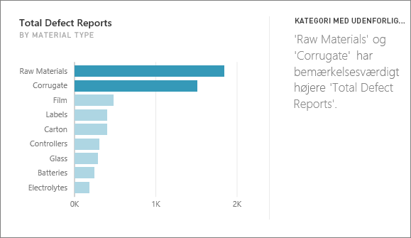
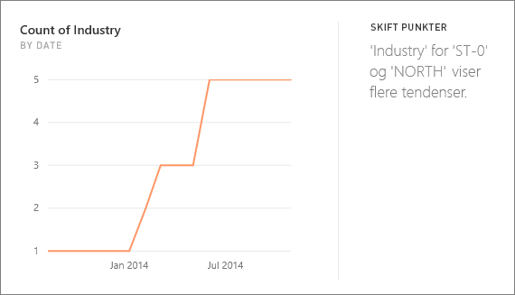
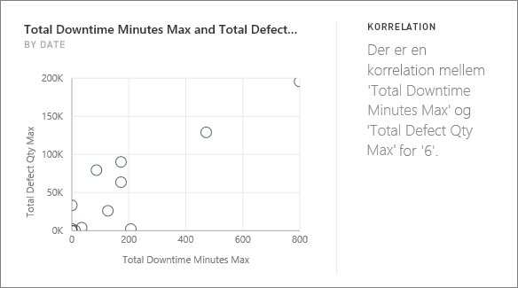
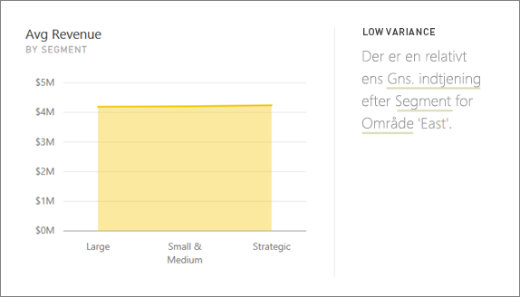
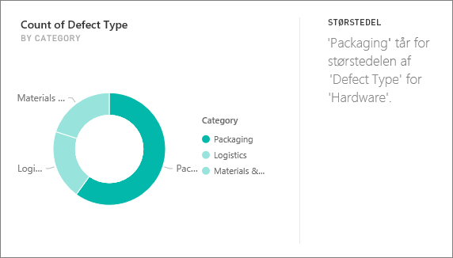
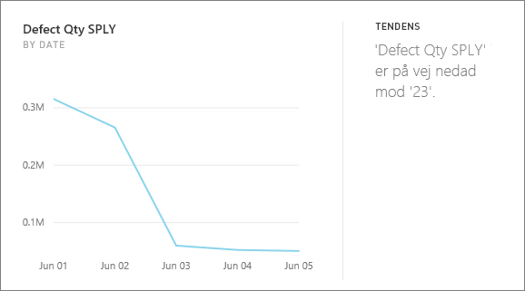
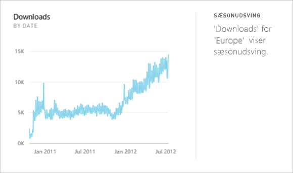
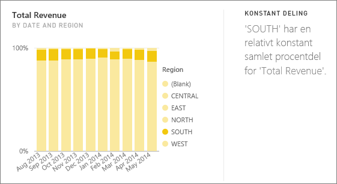
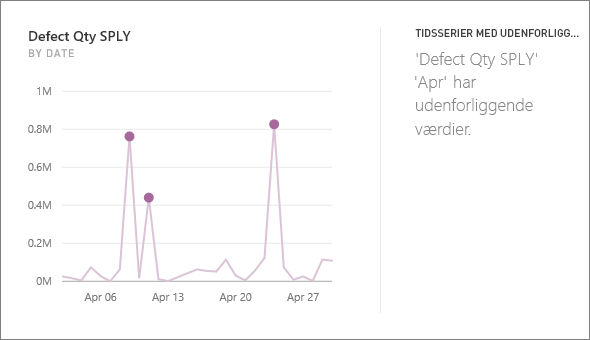

# Indsigtstyper, der understøttes af Power BI

Power BI-tjenesten kan automatisk søge efter indsigter i dine dashboards eller rapporter.

## Hvordan fungerer indsigter?
Power BI søger hurtigt i forskellige undersæt af dit datasæt. I takt med at Power BI søger, anvendes et sæt avancerede algoritmer for at finde indsigt, der kan være interessant. Power BI scanner så meget af et datasæt som muligt i et tildelt tidsrum.

Du kan køre indsigt i forhold til et datasæt eller et dashboardfelt.   

## Hvilke typer indsigter kan vi finde?
Det er nogle af de algoritmer, vi bruger:

## Kategori med udenforliggende værdier (top/bund)
Fremhæver tilfælde, hvor et eller to medlemmer i en dimension for en måling i modellen har meget større værdier end andre medlemmerne i dimensionen.  

## Skift punkter i en tidsserie
Fremhæver, når der er betydelige ændringer i tendenser i en tidsserie af data.

## Korrelation
Registrerer tilfælde, hvor flere målinger viser en korrelation mellem hinanden, når de afbildes mod en dimension i datasættet.

## Lav varians
Registrerer tilfælde, hvor datapunkter ikke er langt fra middelværdien.

## Majoritet (overordnede faktorer)
Finder tilfælde, hvor en majoritet af en samlet værdi kan tilskrives en enkelt faktor, når den opdeles på en anden dimension.  

## Samlede tendenser i tidsserie
Registrerer op- eller nedadgående tendenser i tidsseriedata.

## Sæsonudsving i tidsserie
Finder periodiske mønstre i tidsseriedata, f.eks. ugentlige, månedlige eller årlige sæsonudsving.

## Konstant deling
Fremhæver tilfælde, hvor der er en overordnet-underordnet-korrelation mellem andelen af en underordnet værdi i forhold til den samlede værdi af den overordnede på tværs af en kontinuerlig variabel.

## Tidsserier med udenforliggende værdier
Registrerer for data på tværs af en tidsserie, når der er specifikke datoer og klokkeslæt med værdier, som er væsentligt anderledes end de andre dato-/klokkeslætsværdier.

## Næste trin
[Power BI-indsigter](end-user-insights.md)

Har du flere spørgsmål? [Prøv at spørge Power BI-community'et](http://community.powerbi.com/)

