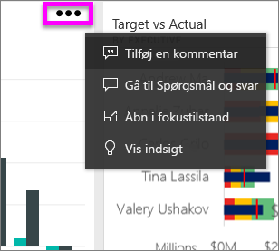
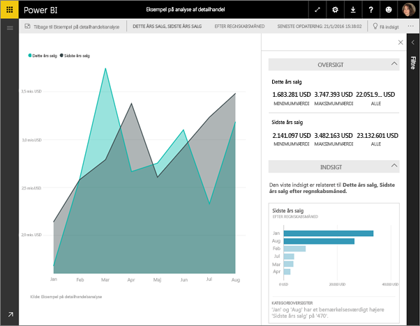
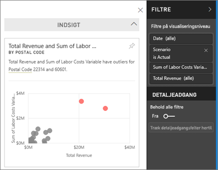
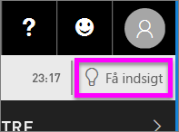
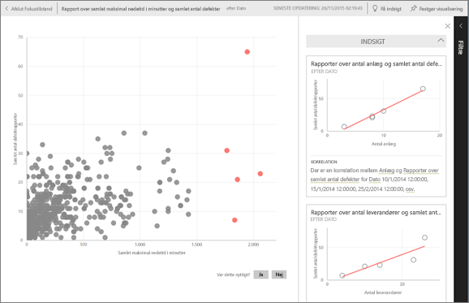

# Få vist dataindsigt på dashboardfelter med Power BI
Hvert enkelt visualiseringsfelt på dashboardet er en indgang til at udforske data. Når du vælger et felt, åbnes en rapport, hvor du kan filtrere, sortere og fordybe dig i datasættet bag rapporten. Når du kører indsigt, udfører Power BI denne udforskning af data for dig.

Kør Quick Insights for at oprette interessante interaktive visualiseringer, der er baseret på dine data. Hurtig indsigt kan køres på et bestemt dashboardfelt, og du kan tilmed køre indsigt på en indsigt.

Funktionen Quick Insights er baseret på et voksende [sæt avancerede analytiske algoritmer](end-user-insight-types.md), der er udviklet sammen med Microsoft Research, som vi vil fortsætte med at bruge for at gøre det muligt for flere personer at finde indsigter i deres data på nye og intuitive måder.

## Kør indsigt på et dashboardfelt
Når du kører indsigt på et dashboardfelt, søger Power BI kun i de data, der bruges til at oprette dette enkelte dashboardfelt. 

1. [Åbn et dashboard](end-user-dashboards.md).
2. Peg på et felt. vælg ellipsen (...), og vælg **Vis indsigt**. 

    

3. Feltet åbnes i [Fokustilstand](end-user-focus.md) med indsigtskortene vist langs højre.    
   
        
4. Er der en indsigt, der vækker din interesse? Vælg indsigtskortet for at udforske mere. Den valgte indsigt vises til venstre, og nye indsigtskort, som udelukkende er baseret på dataene i den enkelte indsigt, vises til højre.    

 ## Interager med indsigtskortene
Når du har åbnet en indsigt, kan du fortsætte med at udforske.

   * Filtrer visualiseringen på lærredet.  Du kan få vist filtrene ved at vælge pilen i det øverste højre hjørne for at udvide ruden Filtre.

     
   
   * Kør indsigt på selve indsigtskortet. Dette kaldes ofte **relateret indsigt**. I øverste højre hjørne skal du vælge ikonet med elpæren  eller **Få indsigt**.
     
     
     
     Indsigterne vises til venstre, og nye kort, som udelukkende er baseret på dataene i den enkelte indsigt, vises til højre.
     
     

Vælg **Afslut Fokustilstand** i øverste venstre hjørne, hvis du vil vende tilbage til det oprindelige indsigtslærred.

## Overvejelser og fejlfinding
- **Vis indsigter** fungerer ikke med DirectQuery. Det fungerer kun med data, der er uploadet til Power BI.
- **Vis indsigter** fungerer ikke med alle typer af dashboardfelter. Det er f.eks. ikke tilgængeligt for brugerdefinerede visualiseringer.<!--[custom visuals](end-user-custom-visuals.md)-->

## Næste trin
Få mere at vide om de [tilgængelige typer Hurtig indsigt](end-user-insight-types.md)

