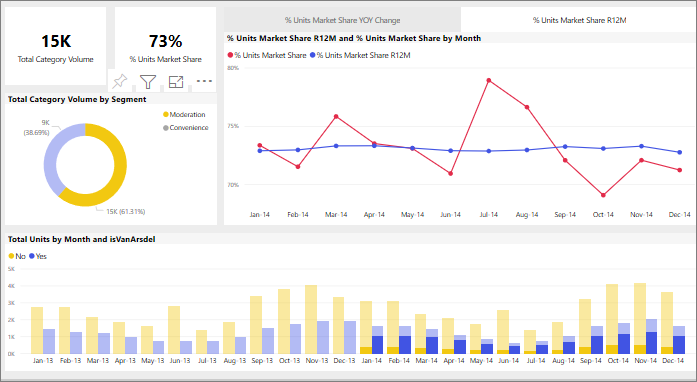

# Sådan krydsfiltrerer visualiseringer hinanden i en Power BI-rapport
En af de fantastiske funktioner i Power BI er den måde, som alle visualiseringer på rapportside er forbundet på. Hvis du vælger et datapunkt i en af visualiseringerne, ændres alle andre visualiseringer med disse data på siden på baggrund af dette valg. 

Som standard, hvis du vælger et datapunkt i én visualisering på en rapportside vil tværgående filtrering, tværgående fremhævning, og analysere de andre visualiseringer på siden. 

Dette kan være nyttigt at identificere hvordan én værdi i dine data, der bidrager til en anden. F.eks, at vælge redigering segmentet i kransediagram, fremhæves bidraget fra dette segment til hver kolonne i de enheder i alt efter måned diagrammet, og det har filtreret kurvediagrammet til højre.

Se [Om filtrering og fremhævning](../power-bi-reports-filters-and-highlighting.md). 

Lige præcis hvordan visualiseringerne på en side interagerer på, angives af *designeren* af rapporten. Designere har mulighed for at slå interaktion mellem visualiseringer til og fra og ændre standardfunktionsmåden for tværgående filtrering, tværgående fremhævning og analysering. 
  
> [!NOTE]
> Begreberne *tværgående filter* og *tværgående fremhævning* bruges til at skelne mellem den funktionsmåde, der er beskrevet her, og hvad der sker, når du bruger ruden **Filtre** til at filtrere og fremhæve visualiseringer.  

## Overvejelser og fejlfinding
- Hvis rapporten indeholder en visualisering, der understøtter [detailudledning](../power-bi-visualization-drill-down.md), som standard foretager detailudledning i én visualisering har ingen indvirkning på de andre visualiseringer på rapportsiden.     
- Hvis du bruger visualA til at interagere med visualB, anvendes filtre på visualiseringsniveau fra visualA til visualB.

## Næste trin
[Sådan bruger du rapportfiltre](../power-bi-how-to-report-filter.md)
