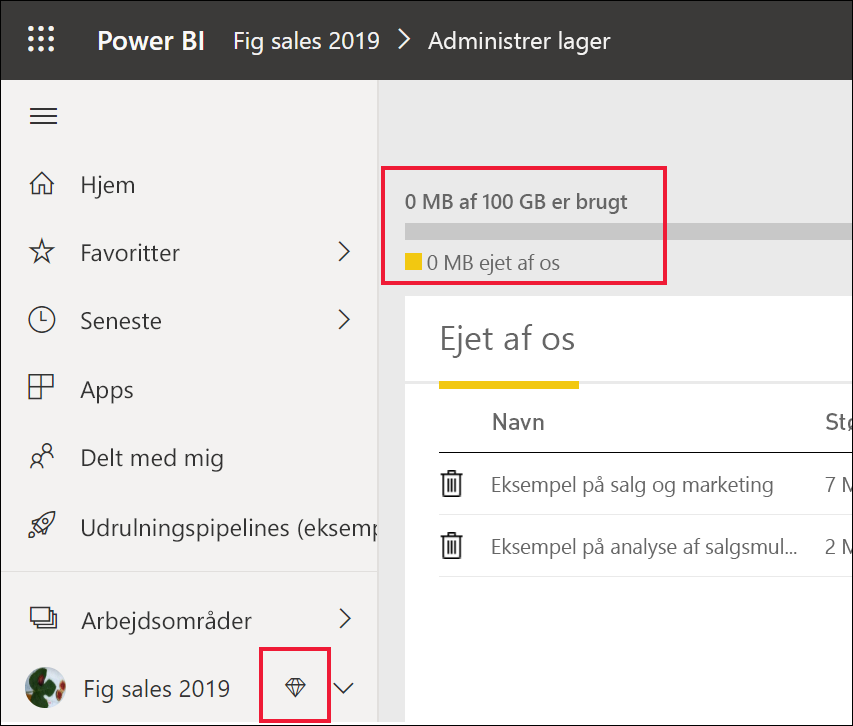
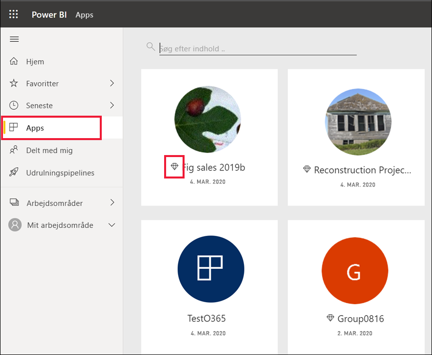
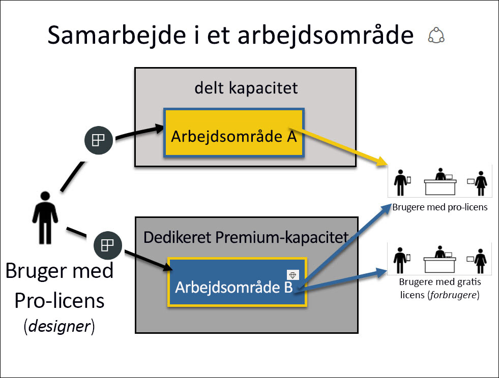
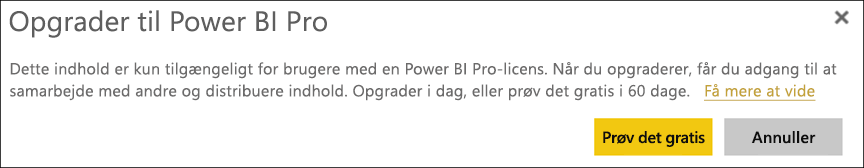

# Brug af Power BI-tjenesten som *forbruger*

[!INCLUDE[consumer-appliesto-ynnn](../includes/consumer-appliesto-ynnn.md)]

Som [*forbruger*](end-user-consumer.md) kan du bruge Power BI-tjenesten til at udforske rapporter og dashboards for at kunne træffe forretningsbeslutninger baseret på data. Hvis du har brugt Power BI i et stykke tid eller har chattet med dine *designerkolleger*, har du sandsynligvis opdaget, at nogle funktioner kun fungerer, hvis du har en bestemt licens- eller abonnementstype eller bestemte tilladelser. 

Dét, du kan udføre i Power BI-tjenesten, afhænger af tre ting:
-    den licens- og abonnementstype, du bruger
-    hvor indholdet gemmes
-    de roller og tilladelser, du er tildelt

Denne artikel indeholder en beskrivelse af funktionerne for hver licenstype, og hvordan *hvor indholdet gemmes* kan påvirke, *hvad du kan udføre med det*. Du får også mere at vide om, hvordan du kan slå din licens og dit abonnement op og finde ud af, hvor dit indhold er gemt. Du kan finde flere oplysninger om roller og tilladelser under [roller i arbejdsområder](end-user-workspaces.md).

## Licenser

Hver bruger af Power BI-tjenesten bruger enten en *gratis* licens eller en *Pro*-licens. Hvis du er Power BI-*forbruger*, bruger du sandsynligvis en gratis licens, der administreres af din administrator. 

Det er muligt at have mere end én licens på samme tid.  Tjenesten giver dig altid en funktionalitet, der svarer til den bedste licens, som du har i øjeblikket. 

## Power BI Premium-kapacitet

Premium er et abonnement for organisationer, der giver dig en anden måde at gemme indhold på, nemlig i en dedikeret kapacitet. Med Premium kan alle – uanset om de befinder sig i eller uden for organisationen – få vist dit Power BI-indhold uden at købe individuelle Power BI Pro-licenser. 

Premium muliggør omfattende distribution af indhold for Pro-brugere uden at kræve Pro-licenser for modtagere, der får vist indholdet. Der kræves Pro-licenser til indholdsdesignere. Designerne opretter forbindelse til datakilder og modeldata og opretter rapporter og dashboards, der er pakket som arbejdsområdeapps. Brugere uden en Pro-licens kan stadig få adgang til et arbejdsområde, der er i en Power BI Premium-kapacitet, så længe de har rollen Fremviser.

I disse arbejdsområder tildeler designere roller, f.eks. **Læser**, **Bidragyder**, **Medlem** og **Administrator**, som afgør, i hvor høj grad kolleger kan interagere med indholdet. Du kan finde flere oplysninger under [tilladelser og roller i arbejdsområder](end-user-workspaces.md). 

Du kan finde flere oplysninger om Premium-kapacitet under [Hvad er Microsoft Power BI Premium?](../admin/service-premium-what-is.md)

## Find ud af, hvilke licenser du har

Besøg [din Microsoft-side **Min konto**](https://portal.office.com/account) for at se, hvilke licenser der er tildelt dig.  Vælg fanen **Abonnementer**.

Den første bruger, Pradtanna, har Office 365 E5, som omfatter en Power BI Pro-licens.

Den anden bruger, Zalan, har en gratis Power BI-licens. 

## Find ud af, om du har adgang til Premium-kapacitet

Derefter skal du kontrollere, om du er en del af en organisation, der har Premium-kapacitet. Begge brugere ovenfor, Pro eller gratis, kan tilhøre en organisation, som har Premium-kapacitet.  Lad os se på den anden bruger, Zalan.  

Vi kan afgøre, om Zalans organisation har Premium-kapacitet ved at slå den tilgængelige lagermængde op. 

- Vælg **Mit arbejdsområde** i Power BI-tjenesten, og vælg derefter tandhjulsikonet øverst til højre. Vælg **Administrer personligt lager**.

    

    Hvis du kan se mere end 10 GB, er du medlem af en organisation, der har et Premium-abonnement. Billedet nedenfor viser, at Zalans organisation har op til 100 GB lagerplads.  

    

Bemærk, at en Pro-bruger allerede har delt et arbejdsområde med Zalan. Rombeikonet indikerer, at dette arbejdsområde er gemt i en Premium-kapacitet. 

## Identificer indhold, der hostes i en Premium-kapacitet

En anden måde at finde ud af, om din organisation har Premium-kapacitet på, er ved at søge efter apps og apparbejdsområder med et rombeikon. Romben indikerer, at indholder er gemt i en Premium-kapacitet. 

På billedet nedenfor er tre af disse apps gemt i en Premium-kapacitet.

    
Så længe *designeren* placerer arbejdsområdet i den dedikerede Premium-kapacitet, kan du som *forbruger* få vist delt indhold, samarbejde med kolleger, arbejde med appdashboards og -rapporter og meget mere **i dette arbejdsområde**. Omfanget af dine tilladelser angives af din Power BI-administrator og af indholdsdesigneren. 

   

## Samling af det hele

Når en organisation køber et Premium-abonnement, tildeler administratoren normalt Pro-licenser til de medarbejdere, der skal arbejde i en Premium-kapacitet, hvor de opretter og deler indhold. Og administratoren tildeler gratis licenser til alle, der har brug for dette indhold. Pro-brugerne opretter [apparbejdsområder](end-user-workspaces.md) og føjer indhold (dashboards, rapporter og apps) til disse arbejdsområder. Hvis du vil give brugere af den gratis version mulighed for at samarbejde i disse arbejdsområder, skal administratoren eller Pro-brugeren tildele arbejdsområderne til en *dedikeret kapacitet*.    
 

|Licenstype  |Delt kapacitet  |Dedikeret kapacitet  |
|---------|---------|---------|
|**Gratis**     |  Bruges som en personlig sandkasse, hvor du opretter indhold til dig selv og interagerer med dette indhold. Dette er en god måde at prøve Power BI-tjenesten på. Du kan ikke bruge indhold fra andre eller dele dit indhold med andre 1     |   Interagerer med indhold, der er tildelt en dedikeret kapacitet og delt med dig. Brugere af den gratis version og Pro-brugere kan samarbejde, uden at det kræves, at brugerne af den gratis version har Pro-konti.      |
|**Pro**     |  Mulighed for at samarbejde med andre Pro-brugere ved at oprette og dele indhold.        |  Mulighed for at samarbejde med brugere af den gratis version og Pro-brugere ved at oprette og dele indhold.       |

1 Se [Overvejelser og fejlfinding](#considerations-and-troubleshooting). 

I diagrammet nedenfor repræsenterer venstre side de Pro-brugere, der opretter og deler indhold i apparbejdsområder. 

- **Arbejdsområde A** blev oprettet i en organisation, der ikke har en Premium-kapacitet. 

- **Arbejdsområde B** blev oprettet i en organisation, der har et Premium-abonnement, og arbejdsområdet blev gemt i en dedikeret kapacitet. Dette arbejdsområde har et rombeikon.  

    

Power BI Pro-*designeren* kan dele og samarbejde med andre Pro-brugere i et hvilket som helst af de tre arbejdsområder. Men den eneste måde, at Power BI Pro-brugeren kan dele og samarbejde med brugere af den gratis version på, er ved hjælp af Arbejdsområde B, som er i en dedikeret Premium-kapacitet.  I arbejdsområdet tildeler designeren roller til samarbejdspartnerne. Din rolle bestemmer, hvilke handlinger du kan udføre i arbejdsområdet. *Forbrugere* i Power BI tildeles normalt rollen *Fremviser*. Du kan finde flere oplysninger om roller i [Arbejdsområder til Power BI-forbrugere](end-user-workspaces.md).

## Overvejelser og fejlfinding
- Det er muligt at have mere end én Power BI-licens. Power BI-tjenesten giver dig altid den funktionalitet, der svarer til den bedste licens, som du har i øjeblikket. Hvis du f.eks. både har en Pro-licens og en gratis licens, bruger Power BI-tjenesten Pro-licensen.

- Hvis du vil dele og oprette indhold (dashboards, rapporter, apps), er du måske ikke Power BI-*forbruger*, men i stedet *designer*. Overvej at skifte til en Pro-brugerlicens. Du kan tilmelde dig en gratis 60-dages prøveversion af Power BI Pro ved at vælge den opgraderingsdialogboks, der vises i Power BI-tjenesten, når du forsøger at bruge en Pro-funktion.

    

  Når den 60-dages prøveversion udløber, ændres din licens tilbage til en gratis Power BI-licens. Når det er sket, har du ikke længere adgang til funktioner, der kræver en Power BI Pro-licens. Hvis du vil fortsætte med en Pro-licens, skal du kontakte din administrator for at købe en Power BI Pro licens. Hvis du ikke har en administrator, kan du besøge [siden Power BI-priser](https://powerbi.microsoft.com/pricing/).     

- Du skal ikke være nervøs, hvis du har tilmeldt dig en gratis licens, for den udløber aldrig. Så hvis du opgraderer til en Pro-prøveversion, eller din organisation giver dig en Pro-licens, og prøveversionen udløber, eller din organisation fjerner din Pro-licens, har du stadig den gratis licens, medmindre du eller en administrator annullerer licensen. 

- 1 En gratis brugerlicens til Power BI-tjenesten er perfekt til dem, der vil udforske tjenesten eller bruge den til personlige dataanalyser og visualiseringer ved hjælp af **Mit arbejdsområde**. En bruger af den gratis version bruger ikke Power BI til at samarbejde med kolleger. Brugere med gratis licenser kan ikke få vist indhold, der deles med andre, eller dele deres eget indhold med andre Power BI-brugere. 

    

## Næste trin
- [Er jeg en Power BI-*forbruger*?](end-user-consumer.md)    
- [Få mere at vide om arbejdsområder](end-user-workspaces.md)    
- [Få vist Power BI-forbrugerfunktioner efter licenstype](end-user-features.md)
