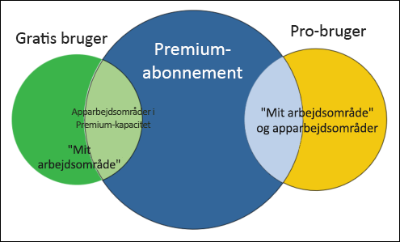
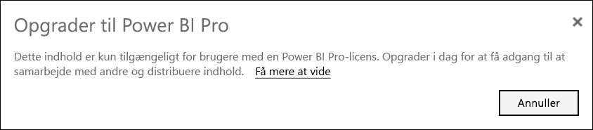
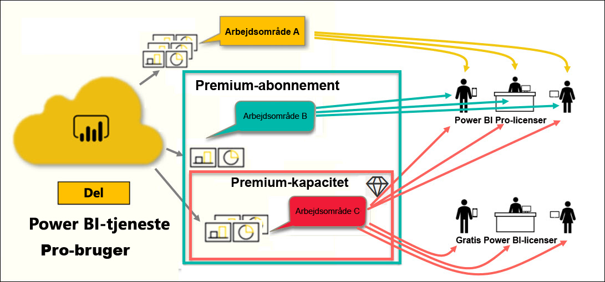

# Typer af Power BI-licenser

[!INCLUDE[consumer-appliesto-ynnn](../includes/consumer-appliesto-ynnn.md)]

Som *forbruger*kan du bruge Power BI-tjenesten til at udforske rapporter og dashboards, så du kan træffe forretningsbeslutninger. Hvis du har brugt Power BI i et stykke tid eller har chattet med dine *designer*kollegaer, har du sandsynligvis opdaget, at nogle funktioner kun virker, hvis du har en bestemt licenstype eller et bestemt abonnement. 

I denne artikel forklares forskellene mellem brugerlicenser og organisationsabonnementer, og hvordan de samarbejder: gratis, Pro, Premium og Premium-kapacitet. Du får også mere at vide om, hvordan du kan finde ud af, hvilken licens- og abonnementskombination du bruger.  

Vi starter med at se på de to licenskategorier – bruger- og organisationsabonnementer. Vores udgangspunkt er de standardfunktioner, der er tilgængelige for hver af licenserne. Derefter kigger vi på, hvordan din Power BI-administrator og indholdsejerne kan bruge roller og tilladelser til at ændre standardegenskaberne for licenser og abonnementer. 

Hvis din licens tillader det, kan din administrator f.eks. begrænse din mulighed for at foretage dig ting, f.eks. eksport af data, brug af spørgsmål og svar, forespørgsler på naturligt sprog eller publicering på internettet. Når en rapport*designer* tildeler indhold til et [arbejdsområde](end-user-workspaces.md), kan de tildele dig til en arbejdsområderolle. Rollerne bestemmer, hvad du kan og ikke kan gøre i dette arbejdsområde. *Designeren* kan justere grænserne for din licens yderligere ved hjælp af tilladelsesindstillinger. Det er med andre ord kompliceret. Denne artikel vil forhåbentlig kaste lidt lys over disse forhold.

## Brugerlicenser
Den første licenstype er en **brugerlicens**. Hver Power BI-tjenestebruger har enten en gratis licens eller en Pro-licens. Visse funktioner er forbeholdt brugere med Pro-licens.  

- **En Power BI Pro-licens (uden et Premium-abonnement)** gør det muligt for en bruger at samarbejde med andre Pro-brugere ved at oprette og dele indhold. Det er kun brugere med en Pro-licens, der kan publicere rapporter, abonnere på dashboards og rapporter og samarbejde med kollegaer i arbejdsområder. 

    

    Power BI Pro er en individuel brugerlicens, der giver brugerne mulighed for at læse og interagere med rapporter og dashboards, som andre har publiceret til Power BI-tjenesten. Brugere med denne licenstype kan dele indhold og samarbejde med andre Power BI Pro-brugere. Det er kun brugere med en Power BI Pro-brugerlicens, der kan publicere eller dele indhold med andre brugere eller bruge indhold, der er oprettet af andre, med undtagelse af indhold, der hostes i en [Power BI Premium-kapacitet](#understanding-premium-and-premium-capacity). Du kan finde flere oplysninger under [Power BI Premium-kapacitet](#understanding-premium-and-premium-capacity) nedenfor. Pro-licenser bruges typisk af *rapportdesignere* og udviklere. 

- **En separat gratis Power BI-licens (uden et Premium-abonnement)** , er, selvom den stadig er effektiv, til de brugere, der lige er startet med Power BI, eller de brugere, der opretter indhold til sig selv. Se [Tilmeld dig Power BI-tjenesten som enkeltperson](../service-self-service-signup-for-power-bi.md).   

    En gratis separat brugerlicens er perfekt til nogen, der bruger Microsoft-eksemplerne til at lære Power BI at kende. Brugere med gratis separate licenser kan ikke få vist indhold, der deles med andre, eller dele deres eget indhold med andre Power BI-brugere. 

    

    Alle kunder, der har en gratis uafhængig licens, kan opgradere til en [gratis prøveversion af Power BI Pro-licensen](../service-self-service-signup-for-power-bi.md). Prøveversionen giver dig alle de effektive funktioner, som en Power BI Pro bruger har.

    

- **En gratis Power BI-licens med et Premium-abonnement** Når en organisation har et Premium-abonnement, kan administratorer og professionelle brugere tildele arbejdsområder til *Premium-kapacitet* og give gratis brugere adgang til disse arbejdsområder. Et arbejdsområde i en Premium-kapacitet er et sted, hvor Pro-brugere kan dele og samarbejde med gratis brugere – uden at det er nødvendigt for de gratis brugere at have Pro-konti. I disse arbejdsområder har brugere med en gratis licens udvidede tilladelser. De kan samarbejde og dele, eksportere data, abonnere, interagere med filtre og meget mere. 

Er du med indtil videre?  OK. Lad os se nærmere på **Premium-kapacitet**.

## Få en forståelse for Premium og Premium-kapacitet
Premium er et **organisations**abonnement. Tænk på den som at tilføje et lag af funktioner og funktionalitet oven på alle Power BI-**brugerlicenserne** i en organisation. 

Når en organisation køber en Premium-licens, tildeler administratoren normalt Pro-licenser til de medarbejdere, der vil oprette og dele indhold. Og administratoren tildeler gratis licenser til alle, der har brug for dette indhold. Pro-brugerne opretter [apparbejdsområder](end-user-workspaces.md) og føjer indhold (dashboards, rapporter og apps) til disse arbejdsområder. Hvis du vil give gratis brugere mulighed for at samarbejde i disse arbejdsområder, gemmer administrator- eller Pro-brugeren arbejdsområder i en *Premium-kapacitet*. 

Når en organisation køber en Premium-licens, modtager de kapacitet i Power BI-tjenesten, der udelukkende er allokeret til dem. Den deles ikke af andre organisationer. Kapaciteten understøttes af dedikeret hardware, der administreres fuldt ud af Microsoft. Organisationer kan vælge at anvende deres dedikerede kapacitet bredt eller allokere den til bestemte arbejdsområder. En organisation kan have alle arbejdsområder i en kapacitet eller kun nogle. Du kan identificere et arbejdsområde i en Premium-kapacitet efter ved hjælp af dens rombeikon .  Et arbejdsområde i en Premium-kapacitet er et sted, hvor Pro-brugere kan dele og samarbejde med gratis brugere – uden at det er nødvendigt for de gratis brugere at have Pro-konti. 

I en Premium-kapacitet skal indholdsdesignere dog have en Pro-licens. Designerne opretter apparbejdsområder, opretter forbindelse til datakilder, modellerer data og opretter rapporter og dashboards, der deles direkte eller pakkes og deles som apps. Brugere uden en Pro-licens kan stadig få adgang til et apparbejdsområde, der er i Power BI Premium, så længe det pågældende arbejdsområde befinder sig i en Premium-*kapacitet*, og så længe arbejdsområdets ejer giver dem tilladelse.

I diagrammet nedenfor repræsenterer venstre side de Pro-brugere, der opretter og deler indhold i apparbejdsområder. 

- **Arbejdsområde A** er oprettet i en organisation, der ikke har et Premium-abonnement. 

- **Arbejdsområde B** er oprettet i en organisation, der har et Premium-abonnement, selvom dette bestemte arbejdsområde ikke blev gemt i en Premium-kapacitet. Arbejdsområdet er ikke markeret med et rombeikon.

- **Arbejdsområde C** er oprettet i en organisation, der har et Premium-abonnement, og blev gemt i en Premium-kapacitet. Dette arbejdsområde er markeret med et rombeikon.  

Power BI Pro-*designeren* kan dele og samarbejde med andre Pro-brugere i ethvert af de tre arbejdsområder. Så længe designeren deler arbejdsområdet med hele organisationen eller tildeler arbejdsområderoller til Pro-brugerne. 

Power BI Pro-brugeren kan kun dele og samarbejde med gratis brugere ved hjælp af arbejdsområde C. Arbejdsområdet skal være tildelt en Premium-kapacitet, for at gratis brugere kan få adgang til arbejdsområdet. I arbejdsområdet tildeler designeren roller til samarbejdspartnere: *Administrator*, *Medlem*, *Bidragyder* eller *Fremviser*. Din rolle bestemmer, hvilke handlinger du kan udføre i arbejdsområdet. *Forbrugere* i Power BI tildeles normalt rollen *Fremviser*. Hvis du vil vide mere, kan du se [Arbejdsområder for Power BI-forbrugere](end-user-workspaces.md).

## Find ud af, hvilken licens og hvilket abonnement du har
Du kan finde oplysninger om Power BI-licenser og -abonnementer på flere måder. 

Først skal du finde ud af, hvilken **bruger**licens, du har.

- Visse versioner af Microsoft Office omfatter en Power BI Pro-licens.  Hvis du vil se, om din version af Office indeholder Power BI, kan du gå til [Office Portal](https://portal.office.com/account) og vælge **Abonnementer**.

    Den første bruger, Pradtanna, har Office 365 E5, som omfatter en Power BI Pro-licens.

    

    Den anden bruger, Zalan, har en gratis Power BI-licens. 

    

Derefter skal du kontrollere, om din konto også er en del af et Premium-abonnement. Begge brugerne ovenfor kan tilhøre en organisation, der har en Premium-licens.  Lad os se på den anden bruger, Zalan.  

- Vælg **Mit arbejdsområde** i Power BI-tjenesten, og vælg derefter tandhjulsikonet øverst til højre. Vælg **Administrer personligt lager**.

    

    Licenser **pr. bruger**, Pro eller gratis omfatter 10 GB lager i cloudmiljøet, der kan bruges til hosting af Power BI-rapporter eller Excel-projektmapper. Hvis du kan se mere end 10 GB, er du medlem af en organisationskonto med en Premium-licens.

    

    Vær opmærksom på, at Zalans-brugerlicens på Office Portal-siden var til Power BI (gratis). Men da hans organisation købte et Premium-abonnement i Power BI-tjenesten, er Zalan ikke begrænset til 10 GB lagerplads. Han har 100 GB. Som *forbruger* i en organisation med en Premium-licens, og så længe *designeren* placerer arbejdsområdet i en Premium-kapacitet, har Zalan mulighed for at få vist delt indhold, samarbejde med kolleger, arbejde med apps og meget mere. Omfanget af hans tilladelser angives af hans Power BI-administrator og af indholdsdesigneren. Bemærk, at en Pro-bruger allerede har delt et arbejdsområde med Zalan. Rombeikonet giver ham besked om, at dette arbejdsområde er gemt i en Premium-kapacitet. 

   
## Få mere at vide om arbejdsområderoller
Indtil videre har vi gennemgået licenser pr. bruger, Premium-abonnementer, apparbejdsområder og Premium-kapacitet. Lad os nu tage et kig på *roller* i arbejdsområdet.

Da dette er en artikel til *forbrugere* af Power BI, har vi følgende scenarie:

-  Du er *gratis* bruger i en organisation, der har et Power BI Premium-abonnement. 
- En Power BI Pro-bruger har oprettet en samling dashboards og rapporter og publiceret denne samling som en *app* til hele organisationen.  
- Apps findes i *arbejdsområder*, og arbejdsområdet er i en Premium-kapacitet.    
- Dette app-arbejdsområde har ét dashboard og to rapporter.
- Pro-brugeren har tildelt os rollen **Fremviser**.

### Rollen Fremviser
*Designere* i Power BI kan bruge roller til at administrere, hvem der kan gøre hvad i et arbejdsområde, så teams kan samarbejde. En af disse roller er **Fremviser**. 

Når arbejdsområdet er i en Power BI Premium-kapacitet, kan brugere med rollen som Fremviser få adgang til arbejdsområdet, også selvom de ikke har en Power BI Pro-licens. Og eftersom fremviserrollen ikke kan få adgang til eller eksportere de underliggende data, er det en sikker måde at interagere med dashboards, rapporter og apps på.

> [!TIP]
> Hvis du vil have mere at vide om de andre roller (Administrator, Medlem og Bidragyder), skal du se [Oprettelse af et nyt arbejdsområde](../service-new-workspaces.md).

## Næste trin
[Er jeg Power BI-*forbruger*?](end-user-consumer.md)    
[Få mere at vide om arbejdsområder](end-user-workspaces.md)    
<!--[View Power BI features by license type](end-user-features.md) -->

