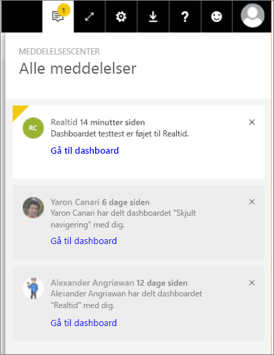

# Få vist Power BI-meddelelser
Meddelelsescenteret er et sekventielt feed af oplysninger, der er knyttet til din Power BI-oplevelse. Åbn det for at se meddelelser om nye dashboards, der er delt med dig, ændringer af dit gruppeområde, oplysninger om Power BI-begivenheder og -møder, beskeder, du har indstillet, og meget mere. Du kan [indstille beskeder i Power BI-tjenesten](../service-set-data-alerts.md) og også i Power BI-mobilapps.

Se Amanda gennemgå meddelelser, hun har modtaget, administrere sine meddelelser og svare på dem. Følg derefter vejledningen under videoen for selv at prøve det.

<iframe width="560" height="315" src="https://www.youtube.com/embed/bZMSv5KAlcE" frameborder="0" allowfullscreen></iframe>

1. Når du logger på Power BI, føjes nye meddelelser, der blev sendt til dig, mens du var offline, til dit feed. Hvis du har nye meddelelser, vises en gul boble sammen med antallet af nye elementer i Power BI.
   
   
2. Vælg meddelelsesikonet på Power BI-menulinjen.
   
   
3. Meddelelser vises med de nyeste øverst, og ulæste meddelelser er fremhævet. Meddelelser gemmes i 90 dage, medmindre du sletter dem hurtigere, eller når de når den maksimale grænse på 100.
   
   
4. Hvis du vil afvise en meddelelse, skal du vælge ikonet X.

### Næste trin
* [Databeskeder i Power BI-tjeneste](../service-set-data-alerts.md)
* [Opret et Microsoft Flow, der udløses af en databesked i Power BI](../service-flow-integration.md)
* [Indstil databeskeder i iPhone-appen (Power BI til iOS)](mobile/mobile-set-data-alerts-in-the-mobile-apps.md)
* [Indstil databeskeder i Power BI-mobilappen til Windows 10](mobile/mobile-set-data-alerts-in-the-mobile-apps.md)
* Har du flere spørgsmål? [Prøv at spørge Power BI-community'et](http://community.powerbi.com/)

