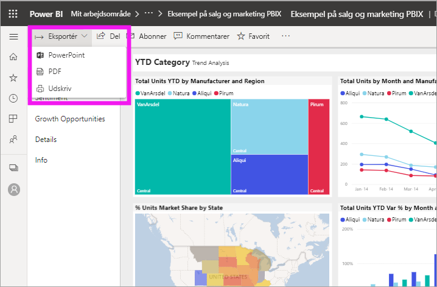
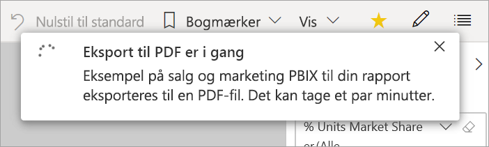
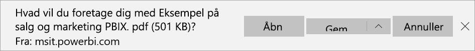

# Eksportér rapporter fra Power BI til PDF

[!INCLUDE [power-bi-service-new-look-include](../includes/power-bi-service-new-look-include.md)]

Med Power BI kan du publicere din rapport i PDF-format og nemt oprette et dokument ud fra din Power BI-rapport. Når du eksporterer til PDF, bliver hver side i Power BI-rapporten en individuel side i PDF-dokumentet.

## Eksportér din Power BI-rapport til PDF
Vælg en rapport for at vise den på lærredet i Power BI-tjenesten. Du kan også vælge en rapport fra din **startside**, dine **apps** eller en hvilken som helst objektbeholder i navigationsruden til venstre.

1. Vælg **Eksportér** > **PDF** på menulinjen.

    

    Der vises et pop op-vindue, hvor du har mulighed for at vælge **Aktuelle værdier** eller **Standardværdier**. Med **Aktuelle værdier** eksporteres rapporten i den aktuelle tilstand, hvilket omfatter de aktive ændringer, du har foretaget af udsnits- og filterværdier. De fleste brugere vælger denne indstilling. Alternativt kan du vælge **Standardværdier**, hvor rapporten eksporteres i sin oprindelige tilstand, som *designeren* har delt den, og hvor ændringer, du har foretaget af den oprindelige tilstand, ikke afspejles.
    
    Derudover er der et afkrydsningsfelt, hvor du kan markere, om du vil eksportere skjulte faner i en rapport. Markér afkrydsningsfeltet, hvis du kun vil eksportere de rapportfaner, der er synlige for dig i browseren. Hvis du foretrækker at inkludere alle skjulte faner i din eksport, kan du undlade at markere afkrydsningsfeltet. Hvis afkrydsningsfeltet er nedtonet, er der ingen skjulte faner i rapporten. Når du har foretaget dine valg, skal du vælge **Eksportér** for at fortsætte.
    
    Der vises en statuslinje i øverste højre hjørne. Eksporten kan tage et par minutter. Du kan fortsætte med at arbejde i Power BI, mens rapporten eksporteres.

    

    Når eksportprocessen er fuldført i Power BI-tjenesten, ændres meddelelsesbanneret for at give dig besked.

2. Derefter finder du din fil der, hvor din browser viser downloadede filer. På det følgende billede vises det som et downloadbanner i bunden af browservinduet.

    

Så nemt er det. Du kan downloade filen og åbne den med en hvilken som helst PDF-fremviser, f.eks. den der er tilgængelig i Microsoft Edge.

## Begrænsninger og overvejelser
Der er nogle få overvejelser og begrænsninger, du skal huske på, når du arbejder med funktionen **Eksportér til PDF**.

* R-visualiseringer understøttes ikke i øjeblikket. Disse visualiseringer er tomme i PDF'en, og der vises en fejlmeddelelse. 
* Brugerdefinerede visualiseringer, der er blevet certificeret, understøttes. I [Få en brugerdefineret visualisering certificeret](../power-bi-custom-visuals-certified.md) kan du finde flere oplysninger om certificerede brugerdefinerede visualiseringer, herunder hvordan du får en brugerdefineret visualisering certificeret. Brugerdefinerede visualiseringer, der ikke er blevet certificeret, understøttes ikke. De vises med en fejlmeddelelse i PDF'en. 
* Rapporter med mere end 30 rapportsider kan ikke eksporteres i øjeblikket.
* Processen med at eksportere rapporten til PDF kan tage nogle minutter at fuldføre, så vær tålmodig. Faktorer, som kan påvirke den tid, det kræver, omfatter rapportens struktur og den aktuelle belastning på Power BI-tjenesten.
* Hvis menuelementet **Eksportér til PDF** ikke er tilgængeligt i Power BI-tjenesten, er det sandsynligvis fordi, din lejeradministrator har deaktiveret funktionen. Kontakt din lejeradministrator for at få flere oplysninger.
* Baggrundsbilleder beskæres med diagrammets omgivende område. Det anbefales, at du fjerner baggrundsbilleder, før du eksporterer til PDF.
* Rapporter, der ejes af en bruger uden for dit Power BI-lejerdomæne, f.eks. en rapport, der ejes af nogen uden for din organisation, og som er delt med dig, kan ikke publiceres til PDF.
* Hvis du deler et dashboard med en person uden for din organisation og dermed en bruger, der ikke er i din Power BI-lejer, kan denne bruger ikke eksportere det delte dashboards tilknyttede rapporter til PDF. Hvis du f.eks. er aaron@contoso.com, kan du dele med cassie@cohowinery.com. Men cassie@cohowinery.com kan ikke eksportere de tilknyttede rapporter til PDF.
* Når du eksporterer rapporter til PDF, som indeholder et baggrundsbillede, kan du muligvis se et forvrænget billede i eksporten, hvis du bruger indstillingen **Normal** eller **Udfyld** til **sidens baggrund**. Du får de bedste resultater ved at bruge indstillingen **Udfyld** for at undgå problemer med dit eksporterede dokument.
* I Power BI-tjenesten anvendes din Power BI-sprogindstilling som sprog i forbindelse med PDF-eksporten. Hvis du vil se eller angive dine sprogindstillinger, skal du vælge tandhjulsikonet  > **Indstillinger** > **Generelt** > **Sprog**.
* Filtre for URL-dresser respekteres ikke i øjeblikket, når du vælger **Aktuelle værdier** til din eksport.

## Næste trin
[Udskriv en rapport](end-user-print.md)
