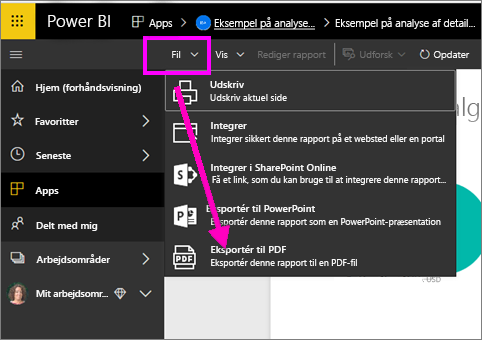
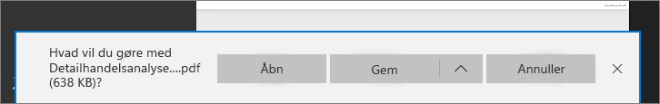

# Eksportér rapporter fra Power BI til PDF
Med Power BI kan du publicere din rapport i PDF-format og nemt oprette et dokument ud fra din Power BI-rapport. Når du **eksporterer til PDF**, bliver hver side i Power BI-rapporten en enkelt side i PDF-dokumentet.

## Sådan eksporterer du en Power BI-rapport til PDF
Vælg en rapport for at vise den på lærredet i Power BI-tjenesten. Du kan også vælge en rapport fra din startside, dine programmer eller en hvilken som helst anden sektion i navigationsruden til venstre.

1. Vælg **Fil** > **Eksportér til PDF** på menulinjen.

    

    Der vises et pop op-vindue, hvor du har mulighed for at vælge **Aktuel visning** eller **Standardvisning**.  Med **Aktuel visning** eksporteres rapporten i den aktuelle tilstand, hvilket omfatter de aktive ændringer, du har foretaget i udsnits- og filterværdier.  De fleste brugere vælger denne indstilling.  Alternativt kan du vælge **Standardvisning**, hvor rapporten eksporteres i sin oprindelige tilstand (som forfatteren har delt den), og hvor ændringer, du har foretaget af den oprindelige tilstand, ikke afspejles.
    
    Derudover er der et afkrydsningsfelt, hvor du kan markere, om du vil eksportere skjulte faner i en rapport.  Du skal blot markere afkrydsningsfeltet, hvis du kun vil eksportere de rapportfaner, der er synlige for dig i browseren.  Hvis du foretrækker at inkludere alle skjulte faner i din eksport, skal du undlade at markere afkrydsningsfeltet.  Hvis afkrydsningsfeltet er nedtonet, er der ingen skjulte faner i rapporten.  Når du har foretaget dine valg, skal du klikke på knappen Eksportér for at fortsætte.
    
    Der vises en statuslinje i øverste højre hjørne. Det kan tage nogle få minutter at eksportere, og du kan fortsætte med at arbejde i Power BI, mens rapporten eksporteres.

    

    Når dette er fuldført, ændres meddelelsesbanneret for at give dig besked om, at Power BI-tjenesten er færdig med eksporten.

2. Derefter finder du din fil der, hvor din browser viser downloadede filer. På det følgende billede vises det som et downloadbanner i bunden af browservinduet.

    

Så nemt er det. Du kan downloade filen og åbne den med en hvilken som helst PDF-fremviser, f.eks. den der er tilgængelig i Microsoft Edge.

## Begrænsninger og overvejelser
Der er nogle få overvejelser og begrænsninger, du skal huske på, når du arbejder med funktionen **Eksportér til PDF**.

* **R-visuals** understøttes ikke i øjeblikket. I PDF'en vil disse visualiseringer være tomme, og der vises en fejlmeddelelse.  

* **Brugerdefinerede visuals**, der er blevet **certificeret**, understøttes. Hvis du vil have flere oplysninger om certificerede brugerdefinerede visuals, herunder hvordan du får en brugerdefineret visual certificeret, skal du se [Sådan får du en brugerdefineret visual certificeret](../power-bi-custom-visuals-certified.md). Brugerdefinerede visualiseringer, som ikke er certificeret, understøttes ikke. De vises med en fejlmeddelelse i PDF'en.   

* Rapporter med mere end 30 rapportsider kan ikke eksporteres i øjeblikket.

* Processen med at eksportere rapporten til PDF kan tage nogle minutter at fuldføre, så vær tålmodig. Faktorer, som kan påvirke den tid, det kræver, omfatter rapportens struktur og den aktuelle belastning på Power BI-tjenesten.

* Hvis menuelementet **Eksportér til PDF** ikke er tilgængeligt i Power BI-tjenesten, er det sandsynligvis fordi, din lejeradministrator har deaktiveret funktionen. Kontakt din lejeradministrator for at få flere oplysninger.

* Baggrundsbilleder beskæres med diagrammets omgivende område. Det anbefales, at du fjerner baggrundsbilleder, før du eksporterer til PDF.

* Rapporter, der ejes af en bruger uden for dit Power BI-lejerdomæne (f.eks. en rapport, der ejes af nogen uden for din organisation, og som er delt med dig), kan ikke publiceres til PDF.

* Hvis du deler et dashboard med en person uden for din organisation (og dermed en bruger, der ikke er i din Power BI-lejer), kan denne bruger ikke eksportere det delte dashboards tilknyttede rapporter til PDF. Hvis du f.eks. er aaron@contoso.com, kan du dele med cassie@cohowinery.com. Men cassie@cohowinery.com kan ikke eksportere de tilknyttede rapporter til PDF.

* Når du eksporterer rapporter til PDF, som indeholder et baggrundsbillede, kan du muligvis se et forvrænget billede i eksporten, hvis du bruger indstillingen "Normal" eller "Udfyld" til sidens baggrund.  Det anbefales, at du bruger indstillingen "Tilpas" for at få de bedste resultater og undgå problemer med dit eksporterede dokument.

* I Power BI-tjenesten anvendes din Power BI-sprogindstilling som sprog i forbindelse med PDF-eksporten. Hvis du vil se eller angive dine sprogindstillinger, skal du vælge tandhjulsikonet > **Indstillinger** > **Generelt** > **Sprog**.

* URL-filtre respekteres ikke i øjeblikket, når du vælger "Aktuelle værdier" til din eksport.

## Næste trin
[Udskriv en rapport](end-user-print.md)
