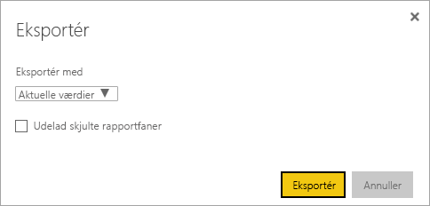
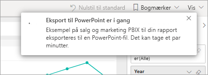
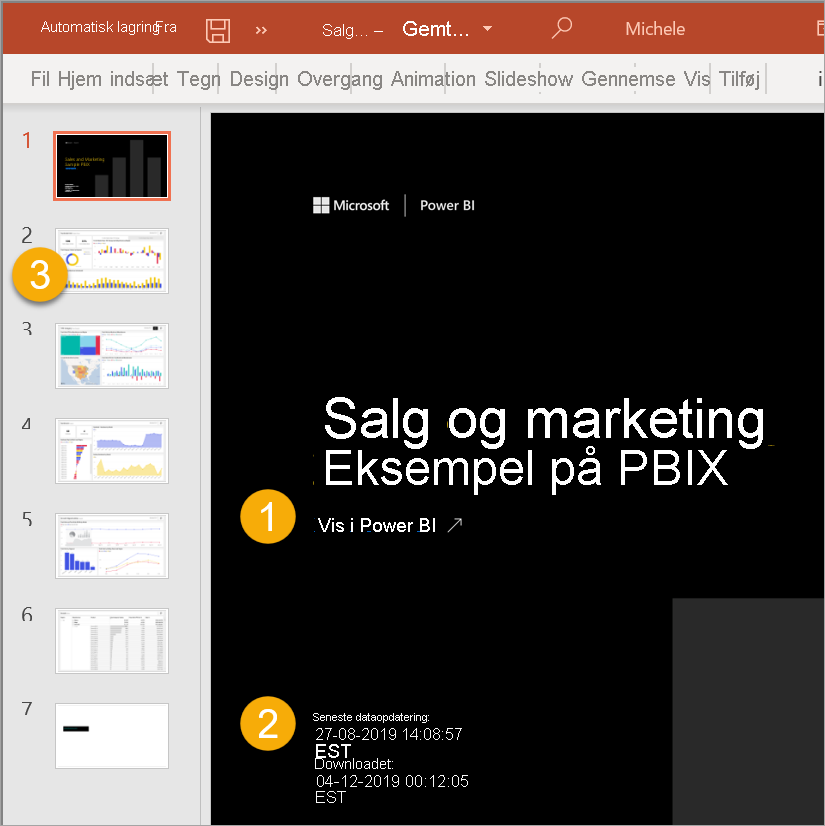
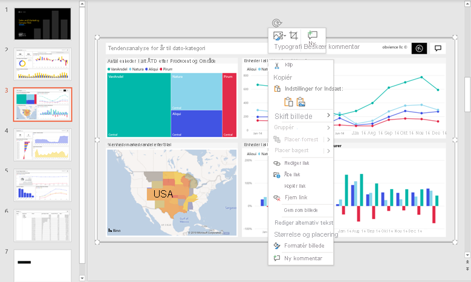

# Eksportér rapporter fra Power BI til PowerPoint

[!INCLUDE[consumer-appliesto-yyny](../includes/consumer-appliesto-yyny.md)]

[!INCLUDE [power-bi-service-new-look-include](../includes/power-bi-service-new-look-include.md)]

Med Power BI kan du publicere din rapport i Microsoft PowerPoint og nemt oprette et slidesæt ud fra din Power BI-rapport. Når du eksporterer til PowerPoint, sker der følgende:

* Hver side i Power BI-rapporten bliver til en enkelt slide i PowerPoint.
* Hver enkelt side i Power BI-rapporten eksporteres som et enkelt billede i høj opløsning i PowerPoint.
* Du kan bevare de indstillinger for filtre og udsnit, du har føjet til rapporten.
* Der oprettes et link i PowerPoint, som linker til Power BI-rapporten.

Du kan hurtigt eksportere din **Power BI-rapport** til **PowerPoint**. Følg de trin, der er beskrevet i det næste afsnit.

## Eksportér en Power BI-rapport til PowerPoint
Vælg en rapport i **Power BI-tjenesten** for at få den vist på lærredet. Du kan også vælge en rapport fra **Startside**, **Apps** eller en hvilken som helst objektbeholder i navigationsruden.

Når den rapport, du vil eksportere til PowerPoint, vises på lærredet, skal du vælge **Eksportér** > **PowerPoint** på menulinjen.

Der vises et pop op-vindue, hvor du har mulighed for at vælge **Aktuelle værdier** eller **Standardværdier**. Med **Aktuelle værdier** eksporteres rapporten i den aktuelle tilstand, hvilket omfatter de aktive ændringer, du har foretaget af udsnits- og filterværdier. De fleste brugere vælger denne indstilling. Alternativt kan du vælge **Standardværdier**, hvor rapporten eksporteres i sin oprindelige tilstand, som *designeren* har delt den, og hvor ændringer, du har foretaget af den oprindelige tilstand, ikke afspejles.

> [!NOTE]
> **De aktuelle værdier** omfatter ikke rulletilstanden for visuals.

 
Derudover er der et afkrydsningsfelt, hvor du kan markere, om du vil eksportere skjulte faner i en rapport. Markér afkrydsningsfeltet, hvis du kun vil eksportere de rapportfaner, der er synlige for dig i browseren. Hvis du foretrækker at inkludere alle skjulte faner i din eksport, kan du undlade at markere afkrydsningsfeltet. Hvis afkrydsningsfeltet er nedtonet, er der ingen skjulte faner i rapporten. Et eksempel på en skjult fane er en fane med værktøjstip. [Brugerdefinerede værktøjstip](../desktop-tooltips.md) oprettes af rapport*designere* og vises ikke som rapportfaner i Power BI-tjenesten for *forbrugerne*. 

Når du har foretaget dine valg, skal du vælge **Eksportér** for at fortsætte. Du får vist et meddelelsesbanner i øverste højre hjørne af Power BI-tjenestens browservindue, hvor der står, at rapporten eksporteres til PowerPoint. Eksporten kan tage et par minutter. Du kan fortsætte med at arbejde i Power BI, mens rapporten eksporteres.

Når eksportprocessen er fuldført i Power BI-tjenesten, ændres meddelelsesbanneret for at give dig besked. Derefter finder du din fil der, hvor din browser viser downloadede filer. På det følgende billede vises det som et downloadbanner i bunden af browservinduet.

Så nemt er det. Du kan downloade filen, åbne den med PowerPoint og derefter ændre eller forbedre den, ligesom du ville gøre med et hvilket som helst andet PowerPoint-slidesæt.

## Se din eksporterede PowerPoint-fil
Når du åbner den PowerPoint-fil, som Power BI har eksporteret, kan du finde nogle smarte og nyttige elementer. Se følgende billede, og se derefter de nummererede elementer, som beskriver nogle af disse smarte funktioner.

1. Den første side i slidesættet indeholder navnet på din rapport og et link, så du kan få den rapport, som slidesættet er baseret på, **vist i Power BI**.
2. Du får også nogle nyttige oplysninger om rapporten. Under **Seneste dataopdatering** kan du se den dato og det klokkeslæt, som den eksporterede rapport er baseret på. Under **Downloadet** kan du se den dato og det klokkeslæt, hvor Power BI-rapporten blev eksporteret til en PowerPoint-fil.
3. Hver rapportside er en separat slide, sådan som det er vist i navigationsruden. 
4. Din publicerede rapport er gengivet på det sprog, der er angivet under dine Power BI-indstillinger, og ellers i henhold til indstillingen for landestandard i din browser. Hvis du vil se eller angive dine sprogindstillinger, skal du vælge tandhjulsikonet  > **Indstillinger** > **Generelt** > **Sprog**. Du kan finde oplysninger om landestandard i [Understøttede sprog og lande eller områder til Power BI](../supported-languages-countries-regions.md).

Når du skifter til en bestemt slide, kan du se, at hver rapportside er et uafhængigt billede.

Hvad du herefter gør med dit PowerPoint-slidesæt eller nogen af billederne i høj opløsning, er op til dig.

## Overvejelser og fejlfinding
Der er nogle få overvejelser og begrænsninger, du skal huske på, når du arbejder med funktionen **Eksportér til PowerPoint**.

* R-visualiseringer og Python understøttes ikke i øjeblikket. Sådanne visualiseringer eksporteres som et tomt billede til PowerPoint med en fejlmeddelelse, hvor der står, at den pågældende visualisering ikke understøttes.
* Brugerdefinerede visualiseringer, der er blevet certificeret, understøttes. I [Få en brugerdefineret visualisering certificeret](../developer/power-bi-custom-visuals-certified.md) kan du finde flere oplysninger om certificerede brugerdefinerede visualiseringer, herunder hvordan du får en brugerdefineret visualisering certificeret. Brugerdefinerede visualiseringer, der ikke er blevet certificeret, understøttes ikke. De eksporteres som et tomt billede til PowerPoint med en fejlmeddelelse, hvor der står, at den pågældende visualisering ikke understøttes.
* ESRI-visualiseringen understøttes ikke
* Rapporter med mere end 30 rapportsider kan ikke eksporteres i øjeblikket.
* Visuals med rullepaneler eksporteres i standardtilstanden. I visual'et i PowerPoint vises kun den øverste del af dataene. Det er ikke muligt at rulle i PowerPoint, da hvert enkelt dias er et billede. 
* Processen med at eksportere rapporten til PowerPoint kan tage nogle minutter at fuldføre, så vær tålmodig. Faktorer, som kan påvirke den tid, det kræver, omfatter rapportens struktur og den aktuelle belastning på Power BI-tjenesten.
* Hvis menuelementet **Eksportér til PowerPoint** ikke er tilgængeligt i Power BI-tjenesten, er det sandsynligvis fordi, din lejeradministrator har deaktiveret funktionen. Kontakt din lejeradministrator for at få flere oplysninger.
* Baggrundsbilleder beskæres med diagrammets omgivende område. Det anbefales, at du fjerner baggrundsbilleder, før du eksporterer til PowerPoint.
* Sider i PowerPoint oprettes altid i 9:16-standardstørrelsen, uanset de oprindelige sidestørrelser eller dimensioner i Power BI-rapporten.
* Rapporter, der ejes af en bruger uden for dit Power BI-lejerdomæne, f.eks. en rapport, der ejes af nogen uden for din organisation og er delt med dig, kan ikke publiceres til PowerPoint.
* Hvis du deler et dashboard med en person uden for din organisation og dermed en bruger, der ikke er i din Power BI-lejer, kan denne bruger ikke eksportere det delte dashboards tilknyttede rapporter til PowerPoint. Hvis du f.eks. er aaron@contoso.com, kan du dele med david@cohowinery.com. Men david@cohowinery.com kan ikke eksportere de tilknyttede rapporter til PowerPoint.
* Eksport fungerer muligvis ikke med ældre versioner af PowerPoint.
* Hver rapportside eksporteres som tidligere nævnt som et enkelt billede i PowerPoint-filen.
* I Power BI-tjenesten anvendes din Power BI-sprogindstilling for PowerPoint-eksporten. Hvis du vil se eller angive dine sprogindstillinger, skal du vælge tandhjulsikonet  > **Indstillinger** > **Generelt** > **Sprog**.
* **Downloadtidspunktet** på det forreste slide af den eksporterede PowerPoint-fil svarer til eksporttidspunktet iht. den tidszone, der er angivet på din computer.
* Når du eksporterer til PPTX, udskiftes brugerdefinerede skrifttyper med standardskrifttyper i rapporter, hvor der bruges temaer med brugerdefinerede skrifttyper.
* Filtre for URL-dresser respekteres ikke i øjeblikket, når du vælger **Aktuelle værdier** til din eksport.

## Næste trin
[Udskriv en rapport](end-user-print.md)
