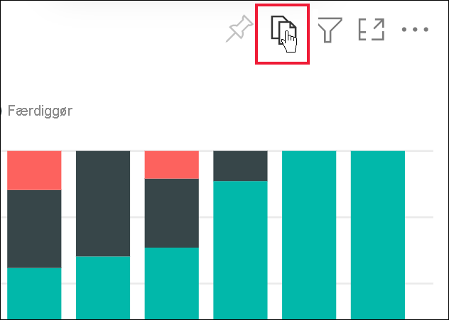

# Eksportér rapporter til PowerPoint

[!INCLUDE[consumer-appliesto-yyny](../includes/consumer-appliesto-yyny.md)]

Med Power BI-tjenesten (app.powerbi.com) kan du publicere din rapport i Microsoft PowerPoint og nemt oprette et slidesæt ud fra din Power BI-rapport. Når du eksporterer til PowerPoint, sker der følgende:

* Hver side i Power BI-rapporten bliver til en enkelt slide i PowerPoint.
* Hver enkelt side i Power BI-rapporten eksporteres som et enkelt billede i høj opløsning i PowerPoint.
* Du kan bevare de indstillinger for filtre og udsnit, du har føjet til rapporten.
* Der oprettes et link i PowerPoint, som linker til Power BI-rapporten.

Du kan hurtigt eksportere din **Power BI-rapport** til **PowerPoint**. Følg de trin, der er beskrevet i det næste afsnit.

Du kan også kopiere én visualisering ad gangen fra Power BI-tjenesten og indsætte den i PowerPoint (eller et andet program, der understøtter indsættelse). Vælg ikonet **Kopiér som billede** for at kopiere visualiseringen til Udklipsholder. Åbn derefter PowerPoint, og indsæt visualiseringen. Du kan finde flere oplysninger under [Kopiér visualiseringer som statiske billeder](../power-bi-visualization-copy-paste.md).

## Eksportér en Power BI-rapport til PowerPoint
Vælg en rapport i **Power BI-tjenesten** for at få den vist på lærredet. Du kan også vælge en rapport fra **Startside**, **Apps** eller en hvilken som helst objektbeholder i navigationsruden.

[!INCLUDE [power-bi-service-new-look-include](../includes/power-bi-service-new-look-include.md)]

Når den rapport, du vil eksportere til PowerPoint, vises på lærredet, skal du vælge **Eksportér** > **PowerPoint** på menulinjen.

Der vises et pop op-vindue, hvor du har mulighed for at vælge **Aktuelle værdier** eller **Standardværdier**. Med **Aktuelle værdier** eksporteres rapporten i den aktuelle tilstand, hvilket omfatter de aktive ændringer, du har foretaget af udsnits- og filterværdier.  De fleste brugere vælger denne indstilling. Hvis du har rullet, inkluderes tilstanden for visualiseringen ikke i de **aktuelle værdier**, men i stedet eksporteres den øverste del af dataene. Alternativt kan du vælge **Standardværdier**, hvor rapporten eksporteres i sin oprindelige tilstand, som *designeren* har delt den, og hvor ændringer, du har foretaget af den oprindelige tilstand, ikke afspejles.

 
Derudover er der et afkrydsningsfelt, hvor du kan markere, om du vil eksportere skjulte faner i en rapport. Markér afkrydsningsfeltet, hvis du kun vil eksportere de rapportfaner, der er synlige for dig i browseren. Hvis du foretrækker at inkludere alle skjulte faner i din eksport, kan du undlade at markere afkrydsningsfeltet. Hvis afkrydsningsfeltet er nedtonet, er der ingen skjulte faner i rapporten. Et eksempel på en skjult fane er en fane med værktøjstip. [Brugerdefinerede værktøjstip](../create-reports/desktop-tooltips.md) oprettes af rapport*designere* og vises ikke som rapportfaner i Power BI-tjenesten for *forbrugerne*. 

Når du har foretaget dine valg, skal du vælge **Eksportér** for at fortsætte. Du får vist et meddelelsesbanner i øverste højre hjørne af Power BI-tjenestens browservindue, hvor der står, at rapporten eksporteres til PowerPoint. 

Eksporten kan tage et par minutter. Faktorer, som kan påvirke den tid, det kræver, omfatter rapportens struktur og den aktuelle belastning på Power BI-tjenesten. Du kan fortsætte med at arbejde i Power BI, mens rapporten eksporteres.

Når eksportprocessen er fuldført i Power BI-tjenesten, ændres meddelelsesbanneret for at give dig besked. Derefter finder du din fil der, hvor din browser viser downloadede filer. På det følgende billede vises det som et downloadbanner i bunden af browservinduet.

Så nemt er det. Du kan downloade filen, åbne den med PowerPoint og derefter ændre eller forbedre den, ligesom du ville gøre med et hvilket som helst andet PowerPoint-slidesæt.

## Åbn PowerPoint-filen
Når du åbner den PowerPoint-fil, som Power BI har eksporteret, kan du finde nogle smarte og nyttige elementer. Se følgende billede, og se derefter de nummererede elementer, som beskriver nogle af disse smarte funktioner. Sider i PowerPoint oprettes altid i 9:16-standardstørrelsen, uanset de oprindelige sidestørrelser eller dimensioner i Power BI-rapporten.

1. Den første side i slidesættet indeholder navnet på din rapport og et link, så du kan få den rapport, som slidesættet er baseret på, **vist i Power BI**.
2. Du får også nogle nyttige oplysninger om rapporten. Under **Seneste dataopdatering** kan du se den dato og det klokkeslæt, som den eksporterede rapport er baseret på. Under **Downloadet** kan du se den dato og det klokkeslæt, hvor Power BI-rapporten blev eksporteret til en PowerPoint-fil. Tidspunktet for **downloaden** er angivet til computerens tidszone på eksporttidspunktet.

3. Hver rapportside er en separat slide, sådan som det er vist i navigationsruden. 
4. Din publicerede rapport er gengivet på det sprog, der er angivet under dine Power BI-indstillinger, og ellers i henhold til indstillingen for landestandard i din browser. Hvis du vil se eller angive dine sprogindstillinger, skal du vælge tandhjulsikonet  > **Indstillinger** > **Generelt** > **Sprog**. Du kan finde oplysninger om landestandard i [Understøttede sprog og lande eller områder til Power BI](../fundamentals/supported-languages-countries-regions.md).

Når du får vist en bestemt slide, kan du se, at hver rapportside er et uafhængigt billede. Det er ikke muligt at rulle i PowerPoint, da hvert enkelt dias er et statisk billede.

Hvad du herefter gør med dit PowerPoint-slidesæt eller nogen af billederne i høj opløsning, er op til dig.

## Overvejelser og fejlfinding
Der er nogle få overvejelser og begrænsninger, du skal huske på, når du arbejder med funktionen **Eksportér til PowerPoint**.
 

* Filtre for [URL-adresser](../service-url-filters.md) respekteres ikke i øjeblikket, når du vælger **Aktuelle værdier** til din eksport.

* Når du eksporterer til PowerPoint, vil denne skrifttype blive erstattet af en standardskrifttype, hvis der benyttes en brugerdefineret skrifttype i rapporten.

* Følgende visualiseringstyper understøttes ikke, og de eksporteres ikke til PowerPoint:
   - [Brugerdefinerede visualiseringer, der ikke er blevet certificeret](../developer/power-bi-custom-visuals-certified.md), understøttes ikke. 
   - [ESRI ArcGIS-visualiseringen](../visuals/power-bi-visualizations-arcgis.md) understøttes ikke
   - R- og Python-visualiseringer understøttes ikke.
   - Baggrundsbilleder beskæres med diagrammets omgivende område. Det anbefales, at du fjerner baggrundsbilleder, før du eksporterer til PowerPoint.

* Nogle rapporter kan ikke eksporteres. Disse omfatter:
    - Rapporter, der ejes af en bruger uden for dit Power BI-lejerdomæne, f.eks. en rapport, der ejes af nogen uden for din organisation, og som er delt med dig.
    - Hvis du deler et dashboard med en person uden for din organisation og dermed en bruger, der ikke er i din Power BI-lejer, kan denne bruger ikke eksportere det delte dashboards tilknyttede rapporter til PowerPoint. Hvis du f.eks. er aaron@contoso.com, kan du dele med david@cohowinery.com. Men david@cohowinery.com kan ikke eksportere de tilknyttede rapporter til PowerPoint.
    - Rapporter med mere end 30 rapportsider. Det er kun de første 30 sider, der eksporteres.
    - Rapporter, der eksporteres til ældre versioner af PowerPoint.

* Hvis menuelementet **Eksportér til PowerPoint** ikke er tilgængeligt i Power BI-tjenesten, er det sandsynligvis fordi, din lejeradministrator har deaktiveret funktionen. Kontakt din lejeradministrator for at få flere oplysninger.
* I Power BI-tjenesten anvendes din Power BI-sprogindstilling for PowerPoint-eksporten. Hvis du vil se eller angive dine sprogindstillinger, skal du vælge tandhjulsikonet  > **Indstillinger** > **Generelt** > **Sprog**.

## Næste trin
[Kopiér visualiseringer som statiske billeder](../power-bi-visualization-copy-paste.md)    
[Udskriv en rapport](end-user-print.md)
