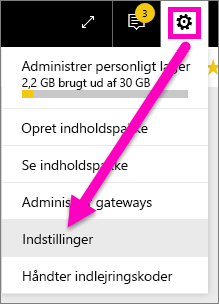
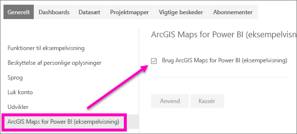

# Tilmeld dig prøveversionsfunktioner i Power BI-tjenesten
## Hvad er *prøveversionsfunktioner*?
I takt med at vi foretager forbedringer af Power BI-tjenesten, frigiver vi nogle nye funktioner som *prøveversionsfunktioner*. Prøveversionsfunktioner kan slås til og fra, hvilket giver dig mulighed for at prøve dem.

> [!TIP]
> Prøveversionsfunktioner fås også til Power BI Desktop. Du kan få flere oplysninger ved at [gå til community-forummet for Power BI Desktop](https://community.powerbi.com/t5/Desktop/bd-p/power-bi-designer).
> 
> 

## Find prøveversioner, og aktivér (deaktiver) dem
1. Åbn menuen Indstillinger ved at vælge tandhjulsikonet i øverste højre hjørne af Power BI-skærmen, og vælg **Indstillinger**.
   
   .
2. Vælg fanen **Generelt**. Hvis der er en prøveversion, kan du enten se en indstilling for **prøveversion** eller også vises en prøveversion til venstre.  I dette eksempel er der en prøveversion for ArcGIS Maps. 
   
   
3. Vælg alternativknappen **Til**, eller markér afkrydsningsfeltet for at prøve den nye oplevelse. Vælg derefter **Anvend**.
4. Du deaktiverer prøveversionen ved at følge trin 1-3 ovenfor og vælge **Fra** i trin 3 eller fjerne markeringen af afkrydsningsfeltet og vælge **Anvend**.

Har du spørgsmål eller feedback? [Besøg Power BI-communityforummet](http://community.powerbi.com/t5/Navigation-Preview-Forum/bd-p/NavigationPreview).

