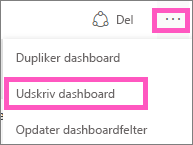
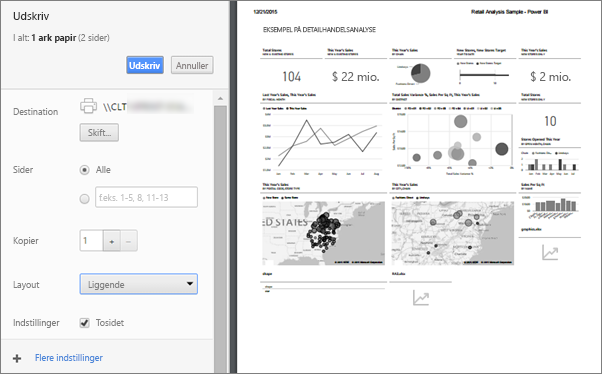
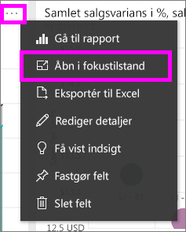
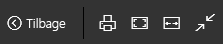
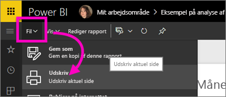

# Udskriv fra Power BI-tjenesten
Udskriv et helt dashboard, et dashboardfelt, en rapportside eller en rapportvisualisering fra Power BI-tjenesten. Rapporter kan kun udskrives med én side ad gangen – du kan ikke udskrive hele rapporten på en gang.

> [!NOTE]
> Udskrivning er kun tilgængelig i Power BI-tjenesten og ikke Power BI Desktop.
> 
> 

Se Amanda udskrive fra sit dashboard og sin rapport. Følg derefter den trinvise vejledning under videoen for selv at prøve det.

<iframe width="560" height="315" src="https://www.youtube.com/embed/jtlLGRKBvXY" frameborder="0" allowfullscreen></iframe>

## Udskriv et dashboard
1. Åbn det dashboard, du vil udskrive.
2. Vælg ellipsen (...) i øverste højre hjørne, og vælg **Udskriv dashboard**.
   
    
3. Vinduet Udskriv til browseren åbnes. Vælg indstillingerne og udskriftsdestinationen, og vælg **Udskriv**.
   
   > [!NOTE]
   > Den viste udskriftsdialogboks afhænger af den browser, du bruger.
   > 
   
    

## Udskriv et dashboardfelt
1. [Åbn feltet i fokuseringstilstand](end-user-focus.md) ved at vælge ellipsen og vælge ikonet Fokus .
   
    
2. Åbn feltet i [fuldskærmstilstand](end-user-focus.md) ved at vælge ikonet for fuld skærm  på den øverste navigationslinje.
3. Peg på feltet for at få vist menuen Indstillinger.
   
    
4. Vælg ikonet Udskriv .     
   
   > [!NOTE]
   > Den viste udskriftsdialogboks afhænger af den browser, du bruger.
   > 
   > 

## Udskriv en rapportside
Rapporter kan udskrives med én side ad gangen.

1. Åbn rapporten i Læsevisning eller Redigeringsvisning.
2. Vælg **Filer** > **Udskriv** for at udskrive den aktuelle rapportside.
   
    
3. Vinduet Udskriv til browseren åbnes.
   
   > [!NOTE]
   > Den viste udskriftsdialogboks afhænger af den browser, du bruger.
   > 
   > 

## Udskriv en rapportvisualisering
1. [Åbn det visuelle element i fokuseringstilstand](end-user-focus.md) ved at pege på feltet og vælge ikonet Fokus  i øverste højre hjørne.
2. Følg trin 2-3 under *Udskriv en rapportside* ovenfor.

## Overvejelser og fejlfinding
* Spørgsmål: Jeg kan ikke finde knappen **Udskriv**.    
* Svar: Hvis du bruger Power BI Desktop, understøttes udskrivning ikke.  Udskrivning fungerer kun i Power BI-tjenesten.
* Spørgsmål: Jeg kan ikke udskrive alle rapportsider på én gang.    
* Svar: Det er korrekt. Rapportsider kan kun udskrives med én side ad gangen.
* Spørgsmål: Jeg kan ikke udskrive til PDF-fil.    
* Svar: Du kan kun se denne indstilling, hvis du allerede har konfigureret PDF-driveren i din browser.    
* Spørgsmål: Dér jeg ser, når jeg vælger **Udskriv**, stemmer ikke overens med det, du viser mig her.    
* Svar: Skærmbillederne for udskrivning varierer afhængigt af browser og softwareversion.
* Spørgsmål: Min udskrift er ikke skaleret korrekt.  Mit dashboard kan ikke være på siden. Andre spørgsmål om skalering og retning.    
* Svar: Vi kan ikke garantere, at udskriften bliver præcist den samme som i Power BI-tjenesten. Bl.a. skalering, margener, visuelle detaljer, retning og størrelse styres ikke af Power BI. Du kan finde hjælp til sådanne problemer ved at se i dokumentationen til din browser.      

## Næste trin
[Del dashboards og rapporter med kollegaer og andre](../service-share-dashboards.md)

Har du flere spørgsmål? [Prøv at spørge Power BI-community'et](http://community.powerbi.com/)

