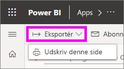
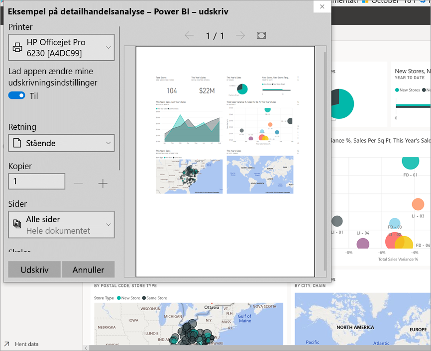
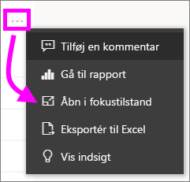
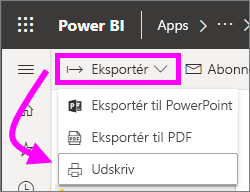

# Udskriv fra Power BI-tjenesten

[!INCLUDE[consumer-appliesto-yynn](../includes/consumer-appliesto-yynn.md)]
## Hvad kan udskrives
[!INCLUDE [power-bi-service-new-look-include](../includes/power-bi-service-new-look-include.md)]

Udskriv et helt dashboard, et dashboardfelt, en rapportside eller en rapportvisualisering fra Power BI-tjenesten. Hvis rapporten indeholder mere end én side, skal du udskrive hver side separat. 

## Overvejelser i forbindelse med udskrivning

De fleste Power BI-dashboards og -rapporter oprettes af rapport*designere* for at blive brugt online og se fantastiske ud, når de vises på forskellige enheder. Når du udskriver en rapport, kan du styre, hvordan indholdet vises på papir, i din browser. 

Der findes browserindstillinger, som du kan bruge til at justere udskriften, men det kan stadigvæk ske, at du ikke opnår det ønskede resultat. Overvej at [eksportere til PDF](end-user-pdf.md) først og udskrive PDF-filen i stedet for. 

## Juster indstillinger for browserudskrivning
Når du udskriver fra Power BI, åbnes vinduet Udskriv i browseren. Vinduet Udskriv i de enkelte webbrowsere er forskellige. Men de har alle har de samme indstillinger, som du kan bruge til at styre udskriftens udseende med. 

Her er nogle få hurtige tip, du kan bruge, når du skal formatere din udskrift.

   > 
1. Hvis dit dashboard, din rapport eller dit visual er bredere end den/det er høj(t), kan du overveje at bruge layoutet **Liggende**. 

   

2. Hvis du vil have plads til mere på en udskrevet side, skal du justere ting som margener og skalering. 

    

Eksperimenter med din browsers indstillinger, indtil du har opnået det ønskede layout. Nogle browsere giver også mulighed for at udskrive baggrundsgrafik. 

## Udskriv et dashboard
1. Åbn det dashboard, du vil udskrive.
2. Vælg Eksportér i øverste venstre hjørne, og vælg **Udskriv denne side**.
   
    

3. Vinduet Udskriv til browseren åbnes. Vælg indstillingerne. Hvis dit dashboard f. eks. er bredere, end det er langt, kan du ændre layoutet til **Liggende**. Vælg **Udskriv**.
   
    

## Udskriv et dashboardfelt
1. Åbn dashboardet i [fuldskærmstilstand](end-user-focus.md) ved at vælge ikonet for fuld skærm  på menulinjen foroven.

3. [Åbn feltet i Fokustilstand](end-user-focus.md) ved at holde over det for at få vist **Flere indstillinger** (...), og vælg **Åbn i Fokustilstand** eller ikonet for fokus.
   
    

4. Peg på feltet for at få vist menuen Indstillinger.
   
    

4. Vælg ikonet Udskriv .     

5. Vinduet Udskriv til browseren åbnes. Vælg indstillingerne. Hvis dit felt f. eks. ikke kan være på siden, kan du vælge at ændre skaleringen til 75 %. Vælg **Udskriv**.

     

> [!TIP]
> Hvis du har fulgt alle disse trin, og dit felt stadig ikke vises på den ønskede måde, kan du prøve følgende.
> 1. Åbn vinduet Udskriv, og foretag ændringer af de udskriftsindstillinger, du mener, vil give dig den bedste udskrift. Du kan f. eks. ændre layout, margener og skalering. 
> 2. Men i stedet for at udskrive skal du vælge **Annuller**. 
> 3. Gennemgå trin 1-5 igen. Dit felt justeres til de nye indstillinger i vinduet Udskriv og er klar til udskrivning.

## Udskriv en rapportside
Rapporter kan udskrives med én side ad gangen.

1. Åbn rapporten, og vælg **Eksportér** > **Udskriv** for at udskrive den aktuelle rapportside.
   
    
2. Vinduet Udskriv til browseren åbnes.

3. Følg udskrivnings trinnene fra **Udskriv et dashboard**ovenfor.
   

## Udskriv en rapportvisualisering
1. [Åbn det visuelle element i fokuseringstilstand](end-user-focus.md) ved at pege på feltet og vælge ikonet Fokus  i øverste højre hjørne.

2. Vælg **Eksportér** > **Udskriv** i øverste venstre hjørne for at udskrive visualiseringen.

    

3. Følg udskrivnings trinnene fra **Udskriv et dashboard**ovenfor.

## Overvejelser og fejlfinding

* Spørgsmål: Jeg kan ikke udskrive alle rapportsider på én gang.    
* Svar: Det er korrekt. Rapportsider kan kun udskrives med én side ad gangen.
* Spørgsmål: Jeg kan ikke udskrive til PDF-fil.    
* Svar: Du kan kun se denne indstilling, hvis du allerede har konfigureret PDF-driveren i din browser.    
* Spørgsmål: Dér jeg ser, når jeg vælger **Udskriv**, stemmer ikke overens med det, du viser mig her.    
* Svar: Skærmbillederne for udskrivning varierer afhængigt af browser og softwareversion.
* Spørgsmål: Min udskrift er ikke skaleret korrekt.  Mit dashboard kan ikke være på siden. Andre spørgsmål om skalering og retning.    
* Svar: Vi kan ikke garantere, at udskriften bliver præcist den samme som i Power BI-tjenesten. Bl.a. skalering, margener, visuelle detaljer, retning og størrelse styres ikke af Power BI. Prøv at justere udskriftsindstillingerne for din browser. Nogle af dem, der er foreslået ovenfor, er sideretning (stående eller liggende), margenstørrelse og skalering. Hvis disse ikke hjælper kan du se i dokumentationen til din browser.      
* Spørgsmål: Når jeg udskriver fra fuldskærmsvisning, kan jeg ikke se indstillingen Udskriv, når jeg holder markøren over visual'et.   
* Svar: Gå tilbage til dashboardet eller rapporten i standardvisning, og åbn visual'et i fokustilstand og derefter i fuldskærmsvisning. 

## Næste trin
[Del dashboards og rapporter med kollegaer og andre](../collaborate-share/service-share-dashboards.md)

Har du flere spørgsmål? [Prøv at spørge Power BI-community'et](https://community.powerbi.com/)
