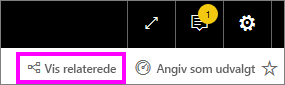

# Spørgsmål og svar til Power BI-**forbrugere**
## Hvad er Spørgsmål og svar?
Den hurtigste måde at få svar ud af dine data på er nogle gange at stille et spørgsmål på et naturligt sprog. For eksempel "Hvad var den samlede omsætning sidste år".

Brug Spørgsmål og svar til at udforske dine data ved hjælp af intuitive funktioner på et naturligt sprog, og få svar i form af diagrammer og grafer. Spørgsmål og svar adskiller sig fra en søgemaskine – Spørgsmål og svar giver kun resultater om dataene i Power BI.

**Spørgsmål og svar til Power BI** er tilgængelig med en Pro- eller Premium-licens.  [Spørgsmål og svar i Power BI-mobilapps](mobile/mobile-apps-ios-qna.md) og [Spørgsmål og svar med Power BI Embedded](../developer/qanda.md) behandles i særskilte artikler. På nuværende tidspunkt understøtter **Spørgsmål og svar i Power BI** kun besvarelse af spørgsmål på et naturligt sprog på engelsk, men der findes en prøveversion til spansk, som kan aktiveres af Power BI-administratoren.

At stille spørgsmålet er kun begyndelsen.  Nyd det, mens du suser gennem dine data og tilpasser eller udvider dit spørgsmål, opdager pålidelige nye oplysninger, fokuserer på detaljer og zoomer ud for at få et større overblik. Du bliver henrykt over de nye indblik og opdagelser, du gør.

Oplevelsen er virkelig interaktiv ... og hurtig! Med lager i hukommelsen som drivkraft får du næsten øjeblikkeligt svar.

## Hvor kan jeg bruge Spørgsmål og svar?
Du finder Spørgsmål og svar på dashboards i Power BI-tjenesten og nederst på dashboardet i Power BI Mobil. Medmindre designeren har givet dig redigeringstilladelser, kan du bruge Spørgsmål og svar til at udforske data, men ikke gemme visualiseringer, der er oprettet ved hjælp af Spørgsmål og svar.

## Brug Spørgsmål og svar på et dashboard i Power BI-tjenesten
I Power BI-tjenesten (app.powerbi.com) indeholder et dashboard felter, der er fastgjort fra et eller flere datasæt, så du kan stille spørgsmål om alle dataene, der er indeholdt i alle disse datasæt. Hvis du vil se, hvilke rapporter og datasæt der blev brugt til at oprette dashboardet, skal du vælge **Få vist relaterede** på menulinjen.

## Hvordan starter jeg?
Først skal du blive bekendt med indholdet. Se nærmere på visualiseringerne på dashboardet og i rapporten. Få en fornemmelse af typen og rækken af data, der er tilgængelig for dig. 

Eksempel:

* Hvis en visualiserings aksemærkater og værdier omfatter "salg", "konto", "måned" og "muligheder", kan du med sikkerhed stille spørgsmål som: "Hvilken *konto* har den højeste *mulighed*, eller vis *salg* efter måned som et liggende søjlediagram."

* Hvis du har data om et websteds ydeevne i Google Analytics, kan du spørge Spørgsmål og svar om, hvor meget tid der er brugt på en webside, antallet af entydige besøg på siden og brugerengagement. Eller hvis du forespørger på demografiske data, kan du stille spørgsmål om alder og indkomst i husholdningen efter placering.

Når du er fortrolig med dataene, kan du vende tilbage til dashboardet og placere markøren i spørgsmålsfeltet. Dette åbner skærmen Spørgsmål og svar.

 

Selv inden du begynder at skrive, viser Spørgsmål og svar en ny skærm med forslag som hjælp til at udforme dit spørgsmål. Du får vist udtryk og spørgsmål, der indeholder navnene på tabellerne i de underliggende datasæt, og kan muligvis se *udvalgte** spørgsmål, der er oprettet af ejeren af datasættet.

Du kan vælge et af dem for at føje dem til feltet med spørgsmål og derefter tilpasse dem, så de finder et bestemt svar. 

Spørgsmål og svar kan også hjælpe dig med at stille spørgsmål ved hjælp af prompter, automatisk fuldførelse og visuelle tips. 

 

### Hvilken visualisering bruger Spørgsmål og svar?
Spørgsmål og svar vælger den bedste visualisering baseret på de data, der bliver vist. Nogle gange er data i det eller de underliggende datasæt defineret som en bestemt type eller kategori, og det hjælper Spørgsmål og svar med at vide, hvordan de skal vises. Hvis data f.eks. er defineret som en datotype, er det mere sandsynligt, at de vises som et kurvediagram. For data, der er kategoriseret som en by, er det mere sandsynligt, at de vises som et kort.

Du kan også fortælle Spørgsmål og svar, hvilken visualisering der skal bruges, ved at føje den til dit spørgsmål. Men husk, at det ikke altid er muligt for Spørgsmål og svar at vise dataene i den ønskede visualiseringstype. Spørgsmål og svar viser en prompt med en liste over visualiseringstyper, du kan arbejde med.

## Overvejelser og fejlfinding
**Spørgsmål:** Jeg kan ikke se Spørgsmål og svar på dette dashboard.    
**Svar 1:** Hvis du ikke kan se et spørgsmålsfelt, skal du starte med at kontrollere dine indstillinger. Det gør du ved at vælge tandhjulsikonet i øverste højre hjørne af Power BI-værktøjslinjen.   

Vælg derefter **Indstillinger** > **Dashboards**. Kontrollér, at der er en markering ud for **Vis søgefeltet for Spørgsmål og svar på dette dashboard**.    
  

**Svar 2:** Nogle gange slår *designeren* af dashboardet eller administratoren Spørgsmål og svar fra. Spørg dem, om det er okay at slå det til igen.   

**Spørgsmål:** Jeg får ikke de resultater, jeg gerne vil se, når jeg skriver et spørgsmål.    
**Svar**: Tal med *designeren* af dashboardet. Der er mange ting, som designeren kan gøre for at forbedre Spørgsmål og svar. Designeren kan f.eks. omdøbe kolonner i datasættet, så der bruges begreber, som er nemme at forstå (`CustomerFirstName` i stedet for `CustFN`). Da designeren kender datasættet virkelig godt, kan designeren også komme med nyttige spørgsmål og føje dem til lærredet for Spørgsmål og svar.

## Næste trin
[Tip til Spørgsmål og svar for Power BI-forbrugere](end-user-q-and-a.md)
