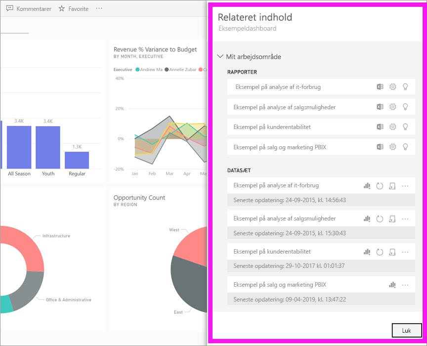
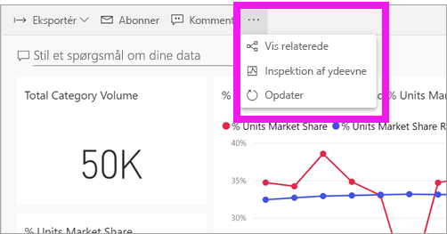
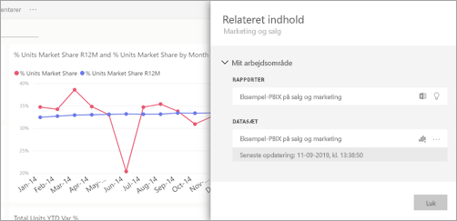
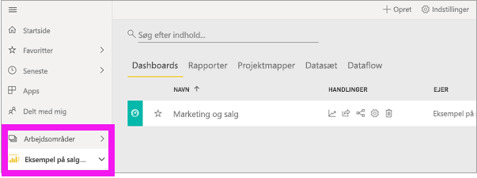
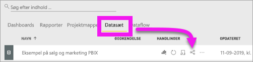
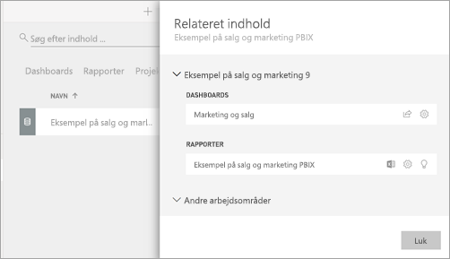

# Få vist relateret indhold i Power BI-tjenesten

[!INCLUDE[consumer-appliesto-ynny](../includes/consumer-appliesto-ynny.md)]

[!INCLUDE [power-bi-service-new-look-include](../includes/power-bi-service-new-look-include.md)]

Ruden **Relateret indhold** viser, hvordan din Power BI-tjenestes indhold – dashboards, rapporter og datasæt – er forbundet. Ruden **Relateret indhold** er også startstedet til at udføre en handling. Herfra kan du gøre forskellige ting, f.eks. at åbne et dashboard, åbne en rapport, generere indsigt, analysere dataene i Excel m.m.  

I Power BI er rapporter baseret på datasæt, rapportens visualiseringer er fastgjort til dashboards, og dashboardets visualiseringer linker tilbage til rapporter. Men hvordan ved du, hvilke dashboards der er vært for visualiseringer fra din marketingrapport? Og hvordan finder du disse dashboards? Bruger dashboardet Indkøb visualiseringer fra mere end ét datasæt? Hvis det er tilfældet, hvad hedder de så, og hvordan kan du åbne og redigere dem? Bruges dit HR-datasæt overhovedet i nogen rapporter eller på nogen dashboards? Eller kan det flyttes, uden at det medfører brudte links? Denne slags spørgsmål kan du få svar i ruden **Relateret indhold**.  Ruden viser ikke kun relateret indhold, den gør det også muligt for dig at udføre handlinger på indholdet og let navigere mellem relateret indhold.

> [!NOTE]
> Funktionen Relateret indhold virker ikke med streamingdatasæt.
> 
> 

## Få vist relateret indhold for et dashboard eller en rapport
Se Will få vist relateret indhold for et dashboard. Følg derefter de trinvise instruktioner under videoen for selv at afprøve det med datasættet Eksempel på indkøbsanalyse.

<iframe width="560" height="315" src="https://www.youtube.com/embed/B2vd4MQrz4M#t=3m05s" frameborder="0" allowfullscreen></iframe>

Når du har åbnet et dashboard eller en rapport, skal du vælge **Flere indstillinger** (...) på menulinjen og vælge **Vis relateret** på rullelisten.

Ruden **Relateret indhold** åbnes. I forbindelse med et dashboard vises alle de rapporter, der har visualiseringer fastgjort til dashboardet, og deres tilknyttede datasæt i ruden. For dette dashboard er der kun fastgjort visualiseringer fra én rapport, og den rapport er kun baseret på ét datasæt. 

Her kan du handle direkte på det relaterede indhold.  Vælg f.eks. navnet på en rapport eller et dashboard for at åbne den eller det.  For en rapport på listen skal du vælge et ikon for at [analysere i Excel](../collaborate-share/service-analyze-in-excel.md) eller [få indsigt](end-user-insights.md). I forbindelse med et datasæt kan du se seneste opdateringsdato og -klokkeslæt, [analysere i Excel](../collaborate-share/service-analyze-in-excel.md) og [få indsigt](end-user-insights.md).  

## Få vist relateret indhold for et datasæt
Du skal som minimum bruge *visningstilladelser* til et datasæt for at åbne ruden **Relateret indhold**. I dette eksempel bruger vi [eksemplet Indkøbsanalyse](../create-reports/sample-procurement.md).

Find overskriften **Arbejdsområder** i navigationsruden, og vælg et arbejdsområde på listen. Hvis du har indhold i et arbejdsområde, vises det på lærredet til højre. 

I et arbejdsområde skal du vælge fanen **Datasæt** og finde ikonet **Få vist relaterede**.

Vælg ikonet for at åbne ruden **Relateret indhold**.

Her kan du handle direkte på det relaterede indhold. Vælg f.eks. et dashboard- eller rapportnavn for at åbne det.  For alle dashboards på listen skal du vælge et ikon for at [dele dashboardet med andre](../collaborate-share/service-share-dashboards.md) eller for at åbne vinduet **Indstillinger** for dashboardet. For en rapport skal du vælge ikonet for at [analysere i Excel](../collaborate-share/service-analyze-in-excel.md), [omdøbe](../create-reports/service-rename.md) eller [få indsigt](end-user-insights.md).  

## Begrænsninger og fejlfinding
* Hvis du ikke kan se "Få vist relaterede", skal du i stedet kigget efter . Vælg ikonet for at åbne ruden **Relateret indhold**.
* Hvis du vil åbne Relateret indhold for en rapport, skal du være i [Læsevisning](end-user-reading-view.md).
* Funktionen Relateret indhold fungerer ikke til streaming af datasæt.

## Næste trin
* [Introduktion til Power BI-tjenesten](../fundamentals/service-get-started.md)
* Har du flere spørgsmål? [Prøv at spørge Power BI-community'et](https://community.powerbi.com/)
