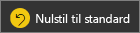
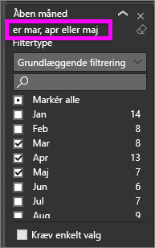
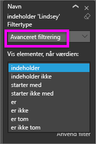
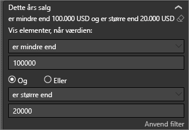
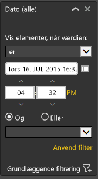

# Få en præsentation af ruden Rapportfiltre
I denne artikel tager et kig på ruden filtre i rapporter i Power BI-tjenesten. Brug filtre for at få ny indsigt i dine data.

Der er mange forskellige måder at filtrere data på i Power BI, og vi anbefaler, at du først læser [Om filtre og fremhævning](../power-bi-reports-filters-and-highlighting.md).

## Arbejde med ruden Filtre i rapporter
Når en kollega deler en rapport med dig, skal du søge efter ruden **Filtre**. Nogle gange er den skjult langs højre kant af rapporten. Vælg den for at udvide den.   

Ruden Filtre indeholder filtre, der er føjet til rapporten af rapport*designeren*. *Forbrugere* som dig, kan arbejde med de eksisterende filtre og gemme dine ændringer, men kan ikke tilføje nye filtre i rapporten. På skærmbilledet ovenfor har designeren f.eks. tilføjet to filtre på sideniveau: Segment og kører år. Du kan interagere og ændre filtrene, men du kan ikke tilføje et tredje filter på sideniveau.

Rapporter bevarer eventuelle ændringer, du foretager i ruden filtre, og disse ændringer er foretaget til den mobile version af rapporten i Power BI-tjenesten. Du kan nulstille ruden Filtre til designerens standardindstilling ved at vælge **Nulstil til standard** på den øverste menulinje.  

   

## Få vist alle filtrene for en rapportside
Ruden filtre viser alle de filtre, der er føjet til rapporten efter de *designer*. Ruden filtre er også det område, hvor du kan få vist oplysninger om filtre og interagere med dem. Du kan gemme de ændringer, du foretager, eller brug **Nulstil til standard** vende tilbage til de oprindelige filterindstillinger.

Hvis der er ændringer, du vil gemme, kan du også oprette en personlig bogmærke.  Du kan finde flere oplysninger i [Tilføj et bogmærke i en rapport](end-user-bookmarks.md).

Der er flere typer af rapportfiltre, som vises, og som administreres fra ruden filtre, der gælder for et visuelt element på en rapportside og i hele rapporten.

I dette eksempel har vi valgt en visualisering, der har 2 filtre. Siden i rapporten har filtre, der er angivet under også den **filtre på denne side** overskrift. Og hele rapporten har et filter til dato.

Ordet **Alle** er vist ud for nogle af filtrene, og det betyder, at alle værdier er inkluderet i filteret.  Eksempelvis **Segment(All)** på skærmbilledet ovenfor, fortæller os om, at denne rapportside inkluderer data om alle produkt målgrupper.  På den anden side, sideniveau filteret for **område er vestlige** fortæller os, siden i rapporten kun indeholder data for det vestlige område.

Alle, der får vist denne rapport, kan arbejde med disse filtre.

### Vis kun de filtre, der anvendes til et visuelt element
For at få nærmere på de filtre, der anvendes på et bestemt visuelt element, du holder markøren over det visuelle element for at få vist filterikonet . Vælg filterikonet for at få vist en pop op-vindue med alle de filtre, udsnitsværktøjer og så videre, der påvirker dette visuelle element. Filtrene på pop op-vinduet, er de samme filtre, der vises på den **filtre** rude. 

 
Her er typerne filtre, der kan få vist denne visning:
- Grundlæggende filtre
- Udsnit
- Tværgående fremhævning
- Tværgående filtrering
- Avancerede filtre
- Top N-filtre
- Filtre for Relativ dato
- Udsnitsværktøjer til synkronisering
- Filtre for Inkluder/Ekskluder
- Filtre sendt via en URL-adresse

I eksemplet nedenfor:
1. Vi kan se, søjlediagrammet, er blevet krydsfiltreres.
2. **Inkluderet** fortæller os, at den tværgående filtrering er til **Segment**, og de tre er inkluderet. 
3. Et udsnit er anvendt for **kvartal**.
4. **Område** er anvendt et filter på denne rapportside, og
5. **isVanArsdel** og **år** er filtre, der anvendes til denne visual.

### Søg i et filter
Et filter kan nogle gange have en lang liste over værdier. Brug søgefeltet til at søge efter og vælge den ønskede værdi. 

### Vis filter detaljer
Se nærmere på de tilgængelige værdier og optællinger for at forstå et filter.  Få vist oplysninger om filteret ved at pege og at vælge pilen ud for Filternavnet. 
  

### Rediger valg af filter
En måde at søge efter indsigt i data er at arbejde med filtrene. Du kan ændre filtervalg ved hjælp af på rullepilen ved siden af feltnavnet.  Afhængigt af det filter og den type data, der filtreres, vil dine muligheder alt fra enkle valg på en liste for at identificere celleområder datoerne eller tallene. Vi har ændret filteret i avancerede filtre nedenfor, **samlede enheder ÅTD** på træstrukturen skal være mellem 2.000 og 3.000. Bemærk, at dette fjerner Prirum fra træstrukturen. 
  

> [!TIP]
> Hold CTRL-tasten nede, kan du vælge mere end én filterværdi ad gangen. De fleste filtre understøtter flere markeringer. 

### Nulstil filter til standard
Hvis du vil tilbage ud af alle ændringer du har foretaget i de filtre, Vælg **Nulstil til standard** på den øverste menulinje.  Det vender tilbage filtrene til den oprindelige tilstand, som er angivet af rapporten *designer*. 

    
### Ryd et filter
Hvis der er et filter, som du gerne angive til **(alle)** , rydde det ved at vælge viskelæderikonet  ud for Filternavnet.
  
<!--  too much detail for consumers

## Types of filters: text field filters
### List mode
Ticking a checkbox either selects or deselects the value. The **All** checkbox can be used to toggle the state of all checkboxes on or off. The checkboxes represent all the available values for that field.  As you adjust the filter, the restatement updates to reflect your choices. 

Note how the restatement now says "is Mar, Apr or May".

### Advanced mode
Select **Advanced Filtering** to switch to advanced mode. Use the dropdown controls and text boxes to identify which fields to include. By choosing between **And** and **Or**, you can build complex filter expressions. Select the **Apply Filter** button when you've set the values you want.  

## Types of filters: numeric field filters
### List mode
If the values are finite, selecting the field name displays a list.  See **Text field filters** &gt; **List mode** above for help using checkboxes.   

### Advanced mode
If the values are infinite or represent a range, selecting the field name opens the advanced filter mode. Use the dropdown and text boxes to specify a range of values that you want to see. 

By choosing between **And** and **Or**, you can build complex filter expressions. Select the **Apply Filter** button when you've set the values you want.

## Types of filters: date and time
### List mode
If the values are finite, selecting the field name displays a list.  See **Text field filters** &gt; **List mode** above for help using checkboxes.   

### Advanced mode
If the field values represent date or time, you can specify a start/end time when using Date/Time filters.  

-->

## Næste trin
[Få mere at vide om, hvordan og hvorfor visuals krydsfiltrerer og krydsfremhæver hinanden på en rapportside](end-user-interactions.md)