# Få en præsentation af ruden Rapportfiltre
Denne artikel ser nærmere på ruden Rapportfiltre. Du får vist ruden i [redigeringsvisning og læsevisning i Power BI-tjenesten](end-user-reading-view.md) og i [rapportvisning i Power BI Desktop](../desktop-report-view.md).

Der er mange forskellige måder at filtrere data på i Power BI, og vi anbefaler, at du først læser [Om filtre og fremhævning](../power-bi-reports-filters-and-highlighting.md).

## Arbejde med ruden Filtre i rapporter
I Power BI Desktop åbnes rapporter i Rapportvisning. I Power BI-tjenesten kan rapporter åbnes i enten [Redigeringsvisning eller Læsevisning](end-user-reading-view.md). I Redigeringsvisning og i Desktop-versionens Rapportvisning kan rapportejere [føje filtre til en rapport](../power-bi-report-add-filter.md) og gemme filtrene sammen med rapporten. De personer, der åbner rapporten i Læsevisning, kan arbejde med filtrene og gemme deres ændringer, men de kan ikke tilføje nye filtre i rapporten.

I Power BI-tjenesten gemmes de ændringer, du foretager i ruden Filtre, sammen med rapporten og overføres til mobilversionen af rapporten. Du kan nulstille ruden Filtre til opretterens standardindstilling ved at vælge **Nulstil til standard** på den øverste menulinje.     

## Åbning af ruden Filtre
Når en rapport er åbnet, vises ruden Filtre i højre side af rapportcanvasset. Hvis du ikke kan se ruden, skal du vælge pilen i øverste højre hjørne for at udvide den. Hvis du er i Power BI-tjenestens Læsevisning, er ruden Filtre den eneste tilgængelige rude i højre side.

I dette eksempel har vi valgt en visualisering, der indeholder seks filtre. Der er også filtre på rapportsiden. De er angivet under overskriften **Filtre på sideniveau**. Der er ét [detaljeadgangsfilter](../power-bi-report-add-filter.md), og et filter for hele rapporten: **FiscalYear** is 2013 or 2014.

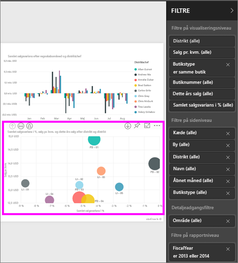

Ordet **Alle** er vist ud for nogle af filtrene, og det betyder, at alle værdier er inkluderet i filteret.  **Chain(All)** på skærmbilledet nedenfor viser f.eks., at denne rapportside inkluderer data om alle store kæder.  På den anden side viser rapportfilteret **FiscalYear is 2013 or 2014**, at rapporten kun indeholder data for regnskabsårene 2013 og 2014.

Alle, der får vist denne rapport, kan arbejde med disse filtre.

* Få vist oplysninger om filtret ved at pege på det med musen, og vælg pilen ud for filteret.
  
   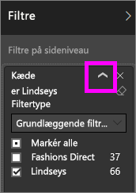
* Skift filtret. Du kan f.eks. ændre **Lindseys** til **Fashions Direct**.
  
     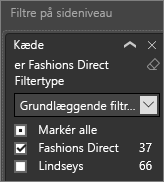

* Nulstil filtrene til den oprindelige tilstand ved at vælge **Nulstil til standard** på den øverste menulinje.    
    
    
* Slet filtret ved at vælge **x** ud for filternavnet.
  
  Sletning af et filter, fjerner det fra listen, men det sletter ikke dataene i rapporten.  Hvis du f.eks. sletter filtret **FiscalYear is 2013 or 2014**, bevares dataene for de to regnskabsår i rapporten, men rapporten filtreres ikke længere til kun at vise 2013 og 2014. Den viser alle de regnskabsår, som dataene indeholder.  Når du sletter filteret, kan du dog ikke redigere det igen, da det er fjernet fra listen. Det er bedre at rydde filteret ved at vælge viskelæderikonet .
  
  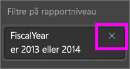

## Filtre i Redigeringsvisning
Når en rapport er åbnet i Desktop-versionens eller i Power BI-tjenestens Redigeringsvisning, vises ruden Filtre i højre side af rapportcanvassen i den nederste halvdel af **ruden Visualisering**. Hvis du ikke kan se ruden, skal du vælge pilen i øverste højre hjørne for at udvide den.

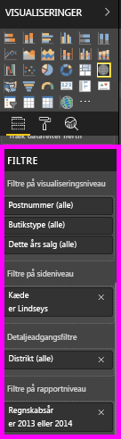.  

Hvis der ikke er valgt en visualisering i canvassen, er det kun de filtre, der gælder for hele rapportsiden, hele rapporten samt eventuelle detaljeadgangsfiltre (hvis der er angivet nogen), der vises i ruden Filtre. I nedenstående eksempel er der ikke valgt en visualisering, og der er ingen filtre på sideniveau eller detaljeadgangsniveau, men der er et filter på rapportniveau.  

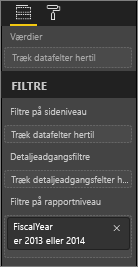  

Hvis der vælges en visualisering på canvassen, får du også vist de filtre, der kun gælder for denne visualisering:   

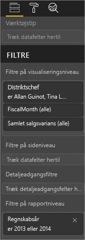

Hvis du vil have vist indstillingerne for et bestemt filter, skal du vælge pil ned ud for filternavnet.  I eksemplet nedenfor er filteret på rapportniveauet angivet til 2013 og 2014. Og dette er et eksempel på **grundlæggende filtrering**.  Hvis du vil have vist de avancerede indstillinger, skal du vælge **Avanceret filtrering**.

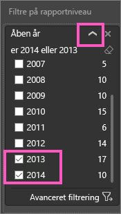

## Ryd et filter
 Vælg viskelæderikonet  i enten den avancerede eller grundlæggende filtreringstilstand for at fjerne filtret. 

## Tilføj et filter
* I Desktop-versionens eller Power BI-tjenestens Redigeringsvisning skal du føje et filter til en visualisering, side, detaljeadgang eller rapport ved at vælge et felt i ruden Felter og trække det til den ønskede filterbrønd, hvor du kan se teksten **Træk felter hertil**. Når et felt er blevet tilføjet som et filter, kan du finjustere det vha. kontrolelementerne til grundlæggende og avanceret filtrering (beskrevet nedenfor).

* **Hvis du trækker et nyt felt til filtreringsområdet på visualiseringsniveau**, føjes feltet ikke til visualiseringen, men du kan filtrere visualiseringen med det nye felt. I nedenstående eksempel føjes **Kæde** til visualiseringen som et nyt filter. Bemærk, at hvis du bare tilføjer **Kæde** som et filter, ændres visualiseringen ikke, før du anvender kontrolelementerne til grundlæggende eller avanceret filtrering.

    

* Alle de felter, der bruges til at oprette en visualisering, findes også som filtre. Du skal først vælge en visualisering for at aktivere den. De felter, der bruges i visualiseringen, angives i ruden Visualiseringer og i ruden Filtre under overskriften **Filtre på visualiseringsniveau**.
  
   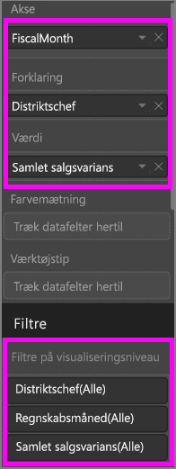  
  
   Du kan finjustere et af disse felter vha. kontrolelementerne til grundlæggende og avanceret filtrering (beskrevet nedenfor).

## Filtertyper: filtre for tekstfelter
### Listetilstand
Når du markerer et afkrydsningsfelt, vælger eller fravælger du værdien. Afkrydsningsfeltet **Alle** kan bruges til at slå tilstanden for alle afkrydsningsfelterne til eller fra. Afkrydsningsfelterne repræsenterer alle de værdier, der er tilgængelige for det pågældende felt.  Når du justerer filteret, opdateres afstemningen, så den afspejler dine valg. 

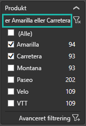

Bemærk, hvordan der nu står "is Amarilla or Carretera" for afstemningen

### Avanceret tilstand
Vælg **Avanceret filtrering** for at skifte til avanceret tilstand. Brug kontrolelementerne på rullelisten og tekstfelterne til at identificere, hvilke felter der skal inkluderes. Ved at vælge mellem **Og** og **Eller** kan du udvikle komplekse filterudtryk. Vælg knappen **Anvend filter**, når du har angivet de ønskede værdier.  

## Filtertyper: filtre for numeriske felter
### Listetilstand
Hvis værdierne er begrænsede, vises der en liste, når du vælger feltnavnet.  Se under **Filtre for tekstfelter** &gt; **Listevisning** ovenfor for at få hjælp til at bruge afkrydsningsfelterne.   

### Avanceret tilstand
Hvis værdierne er uafgrænsede eller repræsenterer et interval, åbnes den avancerede filtertilstand, når du vælger feltnavnet. Brug rullelisten og tekstfelterne til at angive et interval af værdier, du vil have vist. 

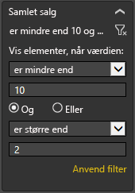

Ved at vælge mellem **Og** og **Eller** kan du udvikle komplekse filterudtryk. Vælg knappen **Anvend filter**, når du har angivet de ønskede værdier.

## Filtertyper: dato og klokkeslæt
### Listetilstand
Hvis værdierne er begrænsede, vises der en liste, når du vælger feltnavnet.  Se under **Filtre for tekstfelter** &gt; **Listevisning** ovenfor for at få hjælp til at bruge afkrydsningsfelterne.   

### Avanceret tilstand
Hvis feltværdierne repræsenterer en dato eller et klokkeslæt, kan du angive et start/sluttidspunkt, når du bruger filtrene Dato/Klokkeslæt.  

## Næste trin
[Filtre og fremhævning i rapporter](../power-bi-reports-filters-and-highlighting.md)  
[Arbejde med filtre og fremhævning i Læsevisning for en rapport](end-user-reading-view.md)  
[Opret filtre i Redigeringsvisning for en rapport](../power-bi-report-add-filter.md)  
[Rediger, hvordan visualiseringer i rapporter krydsfiltrerer og krydsfremhæver hinanden](end-user-interactions.md)

Læs mere om [rapporter i Power BI](end-user-reports.md)  
[Power BI – Grundlæggende begreber](end-user-basic-concepts.md)

Har du flere spørgsmål? [Prøv at spørge Power BI-community'et](http://community.powerbi.com/)

