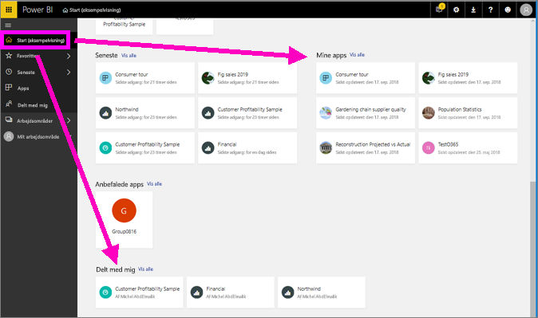
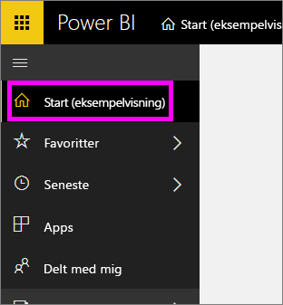
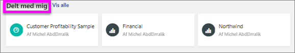
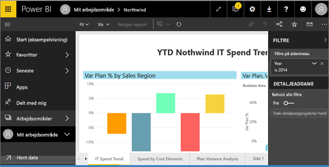
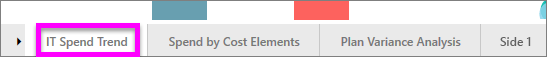
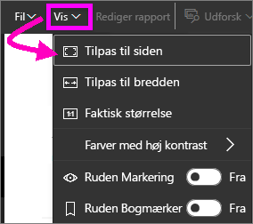
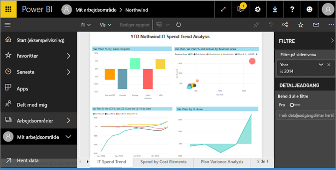
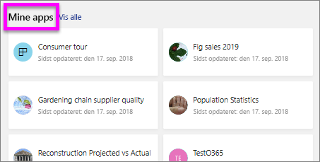
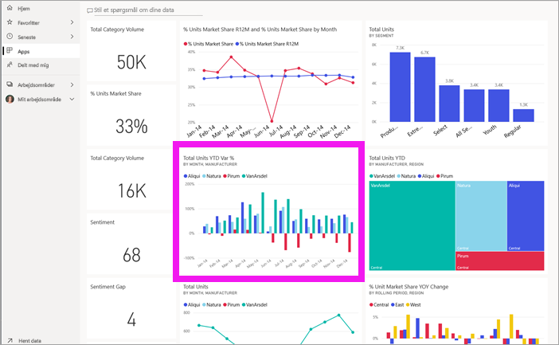
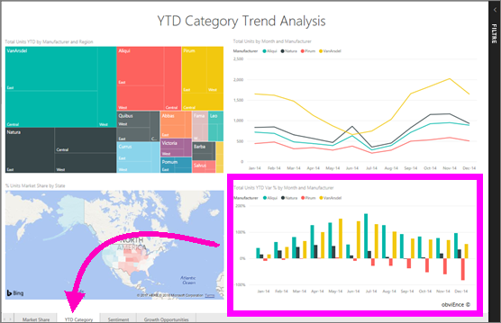

# Få vist en rapport i Power BI-tjenesten for *forbrugere*
En rapport er en eller flere sider med visualiseringer. Rapporter oprettes af Power BI-*rapportdesignere* og [deles med *forbrugere* direkte](end-user-shared-with-me.md) eller som en del af en [app](end-user-apps.md). 

Der er mange forskellige måder at åbne en rapport på. Her kan du se to af dem: Åbn fra startsiden, og åbn fra et dashboard. 

<!-- add art-->

## Åbn en rapport fra startsiden
Lad os åbne en rapport, der er delt med dig direkte, og derefter åbne en rapport, der blev delt som en del af en app.

   

### Åbn en rapport, der er delt med dig
Power BI-*designere* kan dele en rapport med dig direkte ved at klikke på knappen **Del** på deres øverste menulinje. Indhold, der deles på denne måde, vises i objektbeholderen **Delt med mig** i din venstre navigationslinje og i afsnittet **Delt med mig** på startsiden.

1. Åbn Power BI-tjenesten (app.powerbi.com).

2. Vælg **Start (prøveversion)** på den venstre navigationslinje for at åbne startsiden.  

   
   
3. Rul ned, indtil du ser **Delt med mig**. Kig efter rapportikonet . På dette skærmbillede er der to rapporter: *Financial* og *Northwind*. 
   
   

4. Du skal blot vælge et af rapport*kortene* for at åbne rapporten.

   

5. Bemærk fanerne nederst. Hver fane repræsenterer en *side* i rapporten. I øjeblikket er siden *IT Spend Trend* åben. Vælg en anden fane for at åbne denne rapportside. 

   

6. I øjeblikket er det kun en del af rapportsiden, der er synlig. Hvis du vil ændre visningen (zoom) af siden, skal du vælge **Vis** > **Tilpas til siden**.

   

   

### Åbn en rapport, der er en del af en app
Hvis du har modtaget apps fra kolleger eller fra AppSource, er disse apps tilgængelige via din startside og via objektbeholderen **Apps** på din venstre navigationslinje. En [app](end-user-apps.md) er et bundt af dashboards og rapporter.

1. Gå tilbage til startsiden ved at vælge **Start (prøveversion)** på den venstre navigationslinje.

7. Rul ned, indtil du ser **Mine apps**.

   

8. Vælg en af appsene for at åbne den. Afhængigt af de indstillinger der er angivet af app*designeren*, åbner appen enten et dashboard, en rapport eller en apps indholdsliste. Hvis valg af appen:
    - åbner en rapport, er du klar.
    - åbner et dashboard, skal du se [Åbn en rapport fra et dashboard](#Open-a-report-from-a-dashboard) nedenfor.
    - åbner appens indholdsliste, skal du vælge rapporten under **Rapporter** for at åbne den.

## Åbn en rapport fra et dashboard
Rapporter kan åbnes fra et dashboard. De fleste dashboardfelter er *fastgjort* fra rapporter. Når du vælger et felt, åbnes den rapport, der blev brugt til at oprette feltet. 

1. Vælg et felt fra et dashboard. I dette eksempel har vi valgt søjlediagramfeltet "Enheder i alt ÅTD...".

    

2.  Den tilknyttede rapport åbnes. Bemærk, at vi er på siden "ÅTD-kategori". Dette er rapportsiden, der indeholder det søjlediagram, vi har valgt på dashboardet.

    

> [!NOTE]
> Det er ikke alle felter, der fører til en rapport. Hvis du vælger et felt, der er [oprettet med spørgsmål og svar](end-user-q-and-a.md), så åbnes skærmbilledet spørgsmål og svar. Hvis du vælger et felt, der er [oprettet ved hjælp af dashboardets widget **Tilføj felt**](../service-dashboard-add-widget.md), kan der ske flere ting.  

##  Der er stadig flere måder at åbne en rapport
Når du bliver mere fortrolig med at navigere i Power BI-tjenesten, finder du ud af hvilke arbejdsprocesser, der fungerer bedst for dig. Der er et par enkelte andre måder at få adgang til rapporter på:
- Fra den venstre navigationsrude ved hjælp af **Favoritter** og **Seneste**    
- Brug [Få vist relaterede](end-user-related.md)    
- Via en mail, når nogen [deler med dig](../service-share-reports.md), eller du [angiver en advarsel](end-user-alerts.md)    
- Fra dit [Meddelelsescenter](end-user-notification-center.md)    
- og meget mere

## Næste trin
Der er [så mange måder at interagere med en rapport på](end-user-reading-view.md).  Begynd udforskningen ved at vælge hver fane nederst på rapportlærredet.

