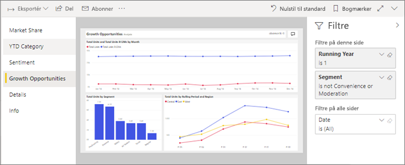
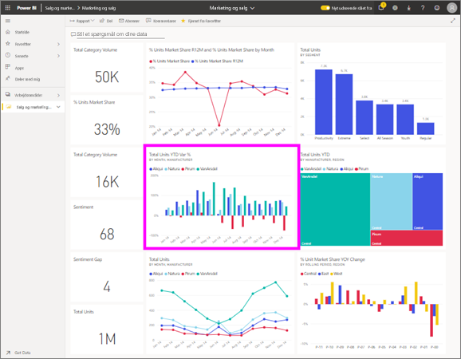

# Få vist en rapport i Power BI-tjenesten for *forbrugere*
En rapport er en eller flere sider med visualiseringer. Rapporter oprettes af Power BI *designere* og [deles med *forbrugere* direkte](end-user-shared-with-me.md) eller som en del af en [app](end-user-apps.md). 

Der er mange forskellige måder at åbne en rapport, og vi viser dig to af dem: Åbn hjemmefra og Åbn fra et dashboard. 

<!-- add art-->

## Åbn en rapport fra Power BI hjem
Lad os åbne en rapport, der er delt med dig direkte, og derefter åbne en rapport, der blev delt som en del af en app.

   

### Åbn en rapport, der er delt med dig
Power BI *designere* kan dele en rapport direkte med dig. Indhold, der er delt på denne måde, der vises på den **delt med mig** objektbeholder på din nav på værktøjslinjen og i de **delt med mig** afsnit af startsiden for lærredet.

1. Åbn Power BI-tjenesten (app.powerbi.com).

2. Navigationslinje, Vælg **hjem** til at vise hjem lærredet.  

   
   
3. Rul ned, indtil du ser **Delt med mig**. Kig efter rapportikonet . I dette skærmbillede har vi et dashboard og én rapport med navnet *salg og marketing sample*. 
   
   

4. Vælg rapporten, skal du blot *kort* at åbne rapporten.

   

5. De faner i venstre side.  Hver fane repræsenterer en *side* i rapporten. Vi har i øjeblikket den *mulighed for vækst* side, der er åben. Vælg den *kategori ÅTD* fane for at åbne denne rapportside i stedet for. 

   

6. Lige nu er vi får vist siden i hele rapporten. For at ændre visningen (zoom) på siden, skal du vælge rullelisten visning i øverste højre hjørne ( **>** ), og vælg **faktisk størrelse**.

   

   

### Åbn en rapport, der er en del af en app
Hvis du har modtaget apps fra kollegaer eller fra AppSource, er tilgængelige fra apps, hjem og fra den **Apps** objektbeholder på din navigationslinje. En [app](end-user-apps.md) er et bundt af dashboards og rapporter.

1. Gå tilbage til startsiden ved at vælge **hjem** nav menulinjen.

7. Rul ned, indtil du ser **Mine apps**.

   

8. Vælg en af appsene for at åbne den. Afhængigt af de indstillinger der er angivet af app*designeren*, åbner appen enten et dashboard, en rapport eller en apps indholdsliste. Hvis valg af appen:
    - åbner en rapport, er du klar.
    - åbner et dashboard, skal du se ***Åbn en rapport fra et dashboard*** nedenfor.
    - åbner appens indholdsliste, skal du vælge rapporten under **Rapporter** for at åbne den.

## Åbn en rapport fra et dashboard
Rapporter kan åbnes fra et dashboard. De fleste dashboardfelter er *fastgjort* fra rapporter. Når du vælger et felt, åbnes den rapport, der blev brugt til at oprette feltet. 

1. Vælg et felt fra et dashboard. I dette eksempel har vi valgt søjlediagramfeltet "Enheder i alt ÅTD...".

    

2.  Den tilknyttede rapport åbnes. Bemærk, at vi er på siden "ÅTD-kategori". Dette er rapportsiden, der indeholder det søjlediagram, vi har valgt på dashboardet.

    

> [!NOTE]
> Det er ikke alle felter, der fører til en rapport. Hvis du vælger et felt, der er [oprettet med spørgsmål og svar](end-user-q-and-a.md), så åbnes skærmbilledet spørgsmål og svar. Hvis du vælger et felt, der er [oprettet ved hjælp af dashboardets widget **Tilføj felt**](../service-dashboard-add-widget.md), kan der ske flere ting.  

##  Der er stadig flere måder at åbne en rapport
Når du bliver mere fortrolig navigering i Power BI-tjenesten, skal du finde ud af arbejdsprocesser, der fungerer bedst for dig. Der er et par enkelte andre måder at få adgang til rapporter på:
- Navigationen til værktøjslinjen ved hjælp af **Favoritter** og **seneste**    
- Brug [Få vist relaterede](end-user-related.md)    
- Via en mail, når nogen [deler med dig](../service-share-reports.md), eller du [angiver en advarsel](end-user-alerts.md)    
- Fra dit [Meddelelsescenter](end-user-notification-center.md)    
- og meget mere

## Næste trin
Der er [så mange måder at interagere med en rapport på](end-user-reading-view.md).  Begynd at udforske hver fane til side af rapportcanvasset.

