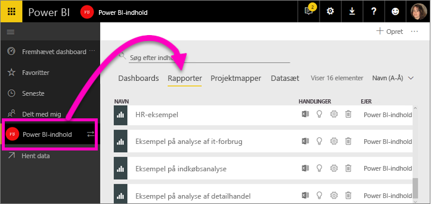
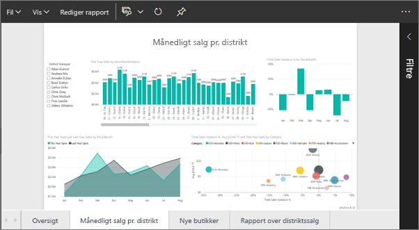
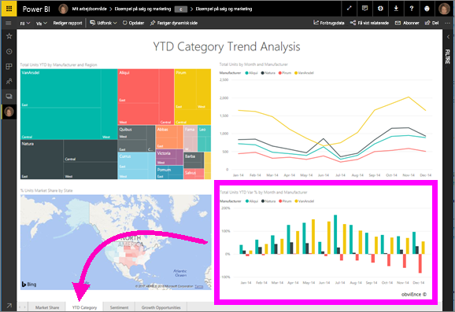
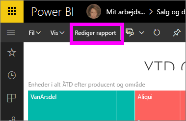
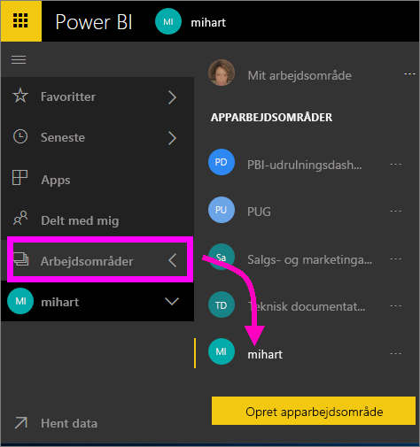
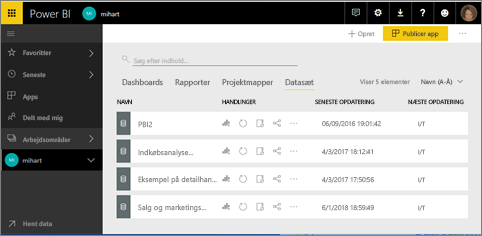
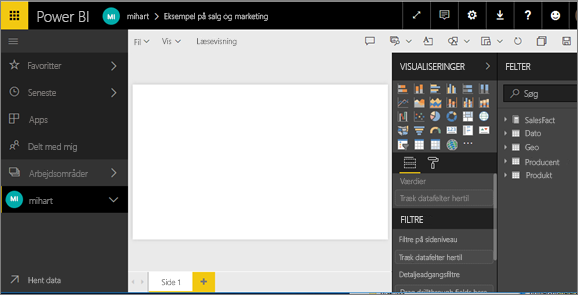

# Åbn en rapport i Power BI-tjenesten (app.powerbi.com)
Rapporter er tilgængelige i Power BI-tjenesten, Power BI Desktop, Power BI - Mobil og endda Power BI Embedded. Denne artikel gælder for åbning af rapporter i ***Power BI-tjenesten***.

Der er to forskellige tilstande til at få vist og interagere med rapporter i Power BI-tjenesten: [Læsevisning og Redigeringsvisning](end-user-reading-view.md). Læsevisning er tilgængelig for alle brugere og er især udviklet til *forbrugere* af rapporter, mens Redigeringsvisning kun er tilgængelig for *oprettere* og ejere af rapporter. 

## Åbn en rapport fra et arbejdsområde (via indholdsvisningslisten **Rapporter**)

1. Start i et arbejdsområde, og vælg fanen **Rapporter** for at få vist alle rapporter i dette arbejdsområde.  
   
   
2. Vælg rapportens navn for at åbne rapporten i Læsevisning.  
   
    
3. Der er [så meget, du kan gøre i Læsevisning](end-user-reading-view.md).  Denne eksempelrapport indeholder flere sider, så du kan starte med at udforske hver fane nederst på rapportlærredet. 

## Åbn en rapport fra et dashboard
Der er mange andre måder at åbne en rapport. Du kan f.eks. starte på et dashboard og vælge et felt, der er oprettet ud fra en rapport.  Når flisen vælges, åbnes rapporten i Læsevisning. [Åbn eksempeldashboardet Salg og marketing](../sample-datasets.md) for at følge med.

1. Åbn et dashboard, og vælg et felt.

   Hvis du vælger et felt, der er [oprettet med spørgsmål og svar](../service-dashboard-pin-tile-from-q-and-a.md), så åbnes skærmbilledet spørgsmål og svar. Hvis du vælger et felt, der er [oprettet ved hjælp af dashboardet **Tilføj felt**-widget'en](../service-dashboard-add-widget.md), skal du åbne guiden, hvis du vil redigere denne widget.  

2.  I dette eksempel har vi valgt søjlediagramfeltet "Enheder i alt ÅTD...".

    

3.  Den tilknyttede rapport åbner i Læsevisning. Bemærk, at vi er på siden "ÅTD-kategori". Dette er rapportsiden, der indeholder det søjlediagram, vi har valgt på dashboardet.

    

4. Bliv i Læsevisning eller vælg **Rediger rapport** for at åbne rapporten i Redigeringsvisning. Vær opmærksom på, at kun brugere med redigeringsrettigheder for denne rapport kan åbne den i redigeringstilstand.

    

## Opret en ny rapport ud fra et datasæt
Og én metode mere til at åbne en rapport er fra et datasæt. Når du starter fra et datasæt, vil rapportcanvasset være tomt, så denne metode anbefales til *oprettere* af rapporter, som er interesserede i at oprette en ny rapport, der er baseret på et datasæt, som vedkommende ejer. Som eksemplet ovenfor, skal du downloade [Eksempelprogrammet salg og marketing](../sample-datasets.md) for at følge med.

1. Start i arbejdsområdet, der indeholder det datasæt, du vil bruge som udgangspunkt for en rapport.

   

2. Vælg fanen **Datasæt** for at få vist listen over alle datasæt i dette arbejdsområde. Dette kaldes listen over **Datasætindhold**.
   
   

1. Find datasættet og vælg ikonet **Opret rapport** for at åbne datasættet i redigeringsvisning. Hvis du ikke har redigeringsrettigheder til et datasæt, kan du ikke åbne det. 
   
    

3. Datasættet åbnes i rapporteditoren. Du får vist de datafelter, der vises til højre, som kun venter på, at du begynder at udforske og oprette visualiseringer. 

   

##  Der er stadig flere måder at åbne en rapport
Når du bliver mere fortrolig med at navigere i Power BI-tjenesten, finder du ud af hvilke arbejdsprocesser, der fungerer bedst for dig. Der er et par enkelte andre måder at få adgang til rapporter på:
- Fra den venstre navigationsrude ved hjælp af **Favoritter**, **Seneste**, **Apps** og **Delt med mig**. 
- Brug [Få vist relaterede](end-user-related.md)
- I en mail, når nogen [deler med dig](../service-share-reports.md), eller du [angiver en advarsel](../service-set-data-alerts.md).    
- Fra dit [Meddelelsescenter](end-user-notification-center.md)    
- og meget mere

## Næste trin
Få mere at vide om [rapporter i Power BI](end-user-reports.md)

Har du flere spørgsmål? [Prøv at spørge Power BI-community'et](http://community.powerbi.com/)  

