# Skift størrelsen på en rapportside
I den [tidligere artikel og video](../power-bi-report-display-settings.md) lærte du to forskellige måder at styre sidevisning i Power BI-rapporter på: **Vis** og **Sidestørrelse**. Sidevisning og Sidestørrelse fås i både Power BI-tjenesten og Power BI Desktop med næsten samme udseende og funktionsmåde, men i dette selvstudium bruger vi Power BI-tjenesten.

### Forudsætninger
- Power BI-tjenesten   
- [Retail Analysis Sample-rapport](../sample-retail-analysis.md)

## Først skal vi ændre sidens Visningsindstilling

1. Åbn rapporten i Læsevisning eller Redigeringsvisning, og vælg rapportfanen for **Nye butikker**. Denne rapportside vises som standard ved hjælp af indstillingen **Tilpas til siden**.  I dette tilfælde viser Tilpas til siden rapportsiden uden rullepaneler, men nogle af oplysningerne og titlerne er for små til at læse.

   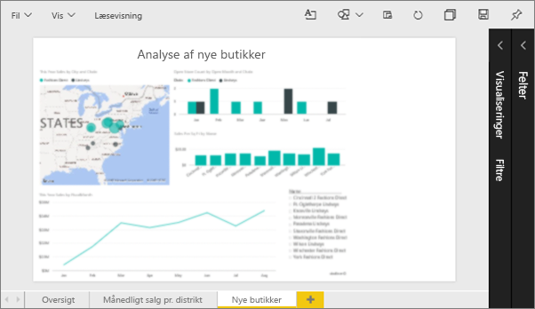
2. Sørg for, at der ikke er valgt nogen visuelle effekter på lærredet. Vælg **Vis** og gennemse visningsindstillingerne.

   * I Læsetilstand ser du dette.

     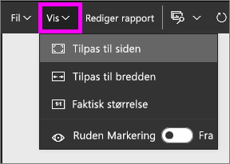
   * I Redigeringstilstand ser du dette.

     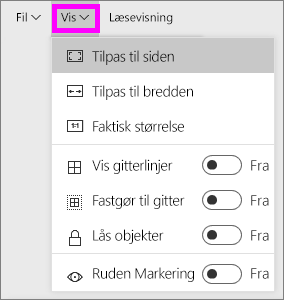

3. Lad os se, hvordan siden ser ud til, vha. indstillingen **Faktisk størrelse**.

   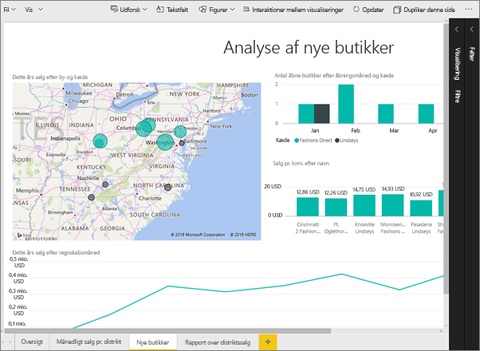

   Ikke fantastisk. Dashboardet har nu dobbelte rullepaneler.
4. Skift til **Tilpas til bredde**.

   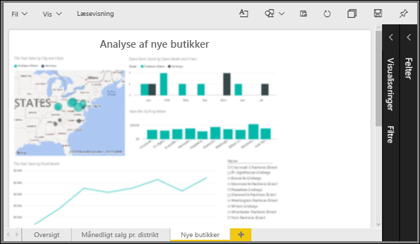

   Det ser bedre ud. Vi har stadig ét rullepanel, men det er nemmere at læse oplysningerne.

## Skift standardvisningen for en rapportside
Hvis du er *forfatter* til rapporten, så kan du ændre standardvisningen for dine rapportsider. Når du deler din rapport med andre, åbnes rapportsiderne ved hjælp af den visning, du har angivet. Rapportens *forbrugere* kan ændre visningen, men kan ikke gemme ændringer, når de afslutter rapporten.

1. På siden **New stores** i rapporten, kan du skifte tilbage til visningen **Faktisk størrelse**.

   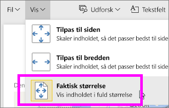

2. På rapportsiden **District Monthly Sales** skal du indstille Vis til **Tilpas til bredde**.

3. På rapportsiden **Oversigt** skal du beholde standardindstillingen for Vis.

4. Nu skal du gemme rapporten ved at vælge **Filer > Gem**. Næste gang du åbner denne rapport, vises siderne ved hjælp af de nye indstillinger for Vis. Lad os se.

   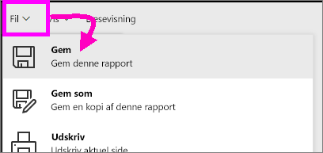
3. Vælg navnet på arbejdsområdet i den øverste navigationslinje for at vende tilbage til det arbejdsområde.  

   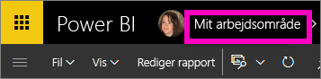
4. Vælg fanen **Rapporter**, og vælg den samme rapport (Detail Analysis Sample).

    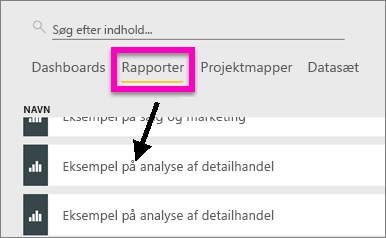
5. Åbn hver side i rapporten for at se de nye indstillinger.

   

## Nu skal vi kigge nærmere på indstillingen *Sidestørrelse*
Indstillingerne for sidestørrelse er kun tilgængelige i [Redigeringsvisning](../service-interact-with-a-report-in-editing-view.md), så du skal have redigeringstilladelse (*forfatter*) for at ændre indstillingerne for sidestørrelse i rapporten. Hvis du har oprettet forbindelse til nogle af vores [eksempler](../sample-datasets.md), har du *forfatter*rettigheder til disse rapporter.

1. Åbn siden "District monthly sales" for [Eksempel på analyse af detailhandel](../sample-retail-analysis.md) i Redigeringsvisning.
2. Sørg for, at der ikke er valgt nogen visuelle effekter på lærredet.  Vælg malerrulleikonet i ruden **Visuelle effekter**.
3. Vælg **Sidestørrelse** &gt; **Type** for at få vist indstillinger for sidestørrelse.

   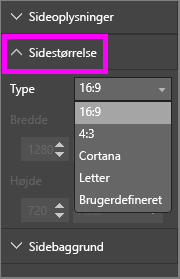
4. Vælg **Letter**.  På lærredet forbliver kun indholdet, der passer til 816 x 1056 pixel (Letter) på den hvide del af lærredet.

   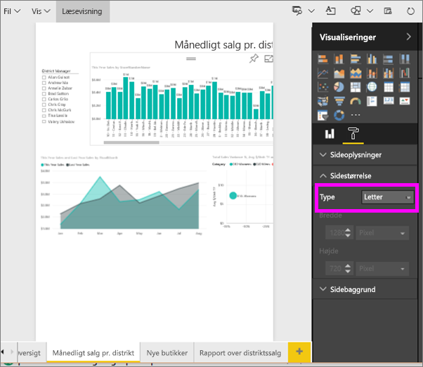
5. Vælg **Sidestørrelse** **16:9**-højde-bredde-forhold.

   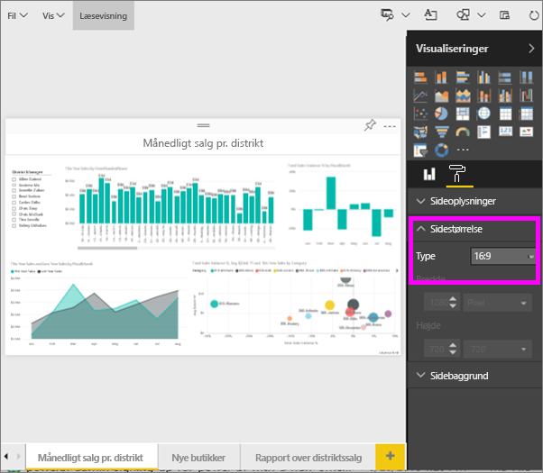

   Siden i rapporten vises med et højde-bredde-forhold på 16 bred og 9 høj. Se den faktiske pixelstørrelse, der bruges, ved at se på de gråtonede Bredde- og Højde-felter (1280 x 720). Der er meget tom plads rundt om rapportlærredet. Dette skyldes, at vi tidligere angav **Vis** til "Tilpas til bredde".
7. Fortsæt med at udforske indstillingerne **Sidestørrelse**.

## Brug siderne Visning og Sidestørrelse sammen
Brug siden Visning og Sidestørrelse sammen for at oprette en rapport, der ser bedst ud, når den deles med kollegaer eller er integreret i et andet program.

I denne opgave skal du oprette en rapportside, der vises i et program, som har plads til 500 pixel i bredden og 750 pixel i højden.

Husk, at vi i det forrige trin så, at vores rapportside i øjeblikket vises med 1280 pixel i bredden og 720 pixel i højden. Så vi ved, at vi skal udføre meget tilpasning af størrelse og omarrangering, hvis alle vores visuelle effekter skal passe.

1. Tilpas og flyt de visuelle effekter, så de passer på mindre end halvdelen af det aktuelle lærredsområde.

    
2. Vælg **Sidestørrelse** &gt; **Brugerdefineret**.
3. Angiv Bredde til 500, og angiv Højde til 750.

    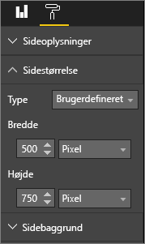
4. Skift rapportsiden, så den ser bedst ud. Skift mellem **Vis > Faktisk størrelse** og **Vis > Tilpas til siden** for at foretage ændringer.

    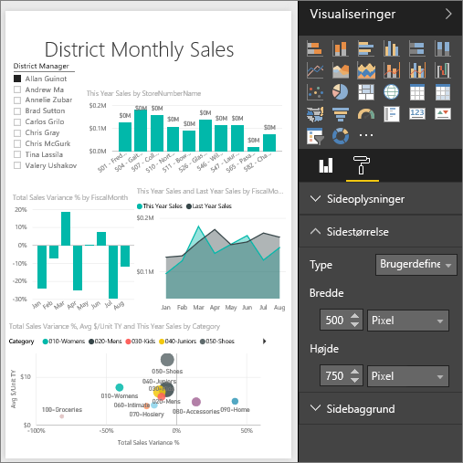

## Næste trin
[Opret rapporter for Cortana](../service-cortana-answer-cards.md)

Tilbage til [Indstillinger for sidevisning i en Power BI-rapport](../power-bi-report-display-settings.md)

Har du flere spørgsmål? [Prøv at spørge Power BI-community'et](http://community.powerbi.com/)
