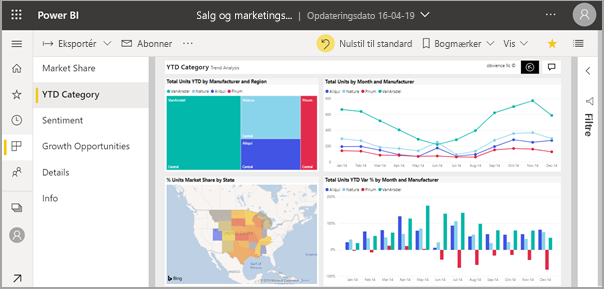
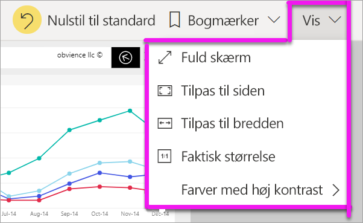
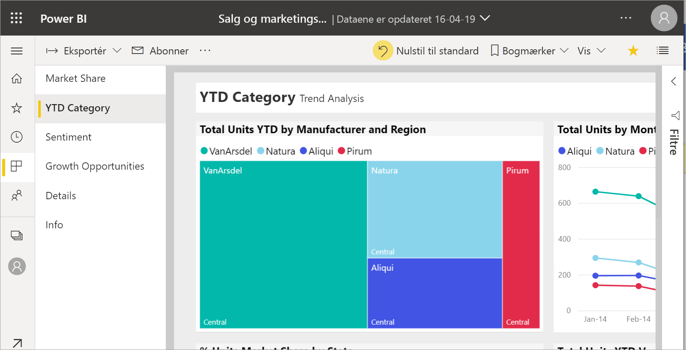
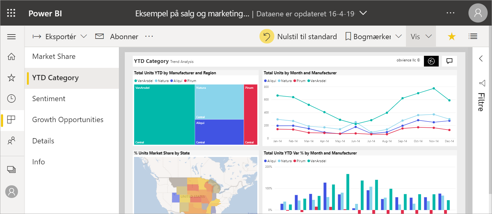
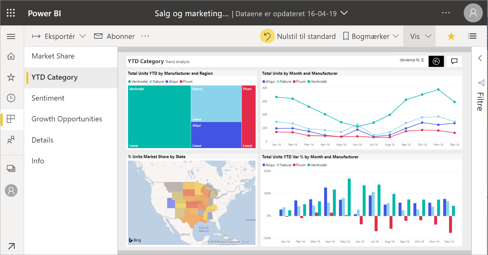
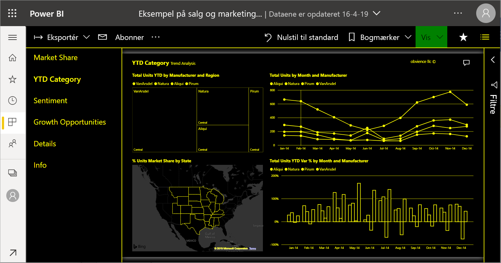
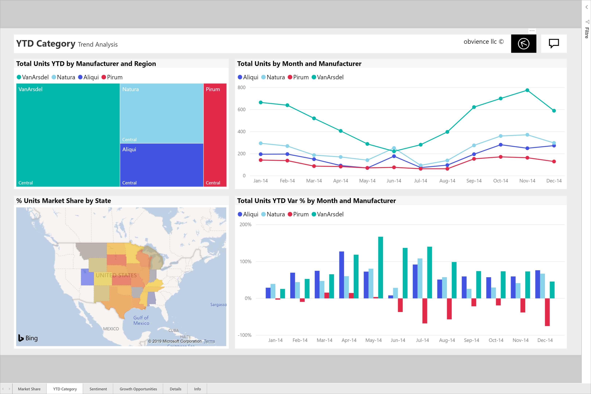

# Skift visningen af en rapportside

[!INCLUDE[consumer-appliesto-yyny](../includes/consumer-appliesto-yyny.md)]

[!INCLUDE [power-bi-service-new-look-include](../includes/power-bi-service-new-look-include.md)]

Folk får vist rapporter på mange forskellige enheder med forskellige skærmstørrelser og størrelsesforhold. Rediger, hvordan en rapportside skal vises, så den passer til dine behov.

## Udforsk menuen Vis

Indstillingerne på menuen **Vis** giver dig fleksibilitet til at få vist rapportsiderne i en størrelse og bredde, du selv vælger:

- Lad os sige, at du får vist en rapport på en lille enhed, og du har svært ved at se titler og forklaringer.  Vælg **Vis** > **Faktisk størrelse** for gøre rapportsiden større. Brug rullepanelerne til at bevæge dig rundt i rapporten.

    

- En anden mulighed er at tilpasse rapporten til din skærmbredde vælge **Tilpas til bredden**. Da det er kun bredden, der tilpasses, og ikke højden, skal du muligvis stadig bruge det lodrette rullepanel.

  

- Hvis du ikke ønsker nogen rullepaneler, men vil udnytte skærmens størrelse bedst muligt, skal du vælge **Tilpas til siden**.

   

- Du kan også vælge mellem fire **Farver med høj kontrast**: Høj kontrast #1, Høj kontrast #2, Høj kontrast sort og Høj kontrast hvid. Dette er en funktion til øget tilgængelighed, som gør det nemmere for svagtseende at se rapporterne. Nedenstående eksempel er stor kontrast 1. 

    

- Den sidste indstilling er **Fuld skærm**, der viser din rapportside uden menulinjer og overskrifter. Fuld skærm kan være et godt valg til små skærme, hvor det er svært at se detaljerne.  Fuld skærm kan også være nyttigt, når rapportsider skal projiceres op på en stor skærm, så andre kan se dem, og der ikke er behov for at interagere med dem.  

    

Når du lukker rapporten, gemmes indstillingerne i **Vis** ikke, men nulstilles til standardværdien. Hvis det er vigtigt for dig at gemme disse indstillinger, kan du bruge [bogmærker](end-user-bookmarks.md).

## Brug din browser til at ændre sidevisningen

Zoomkontrolelementerne i din browser øger og reducerer det tilgængelige lærredsområde. Reduktion af zoom medfører, at det tilgængelige lærredsområde udvides og omvendt. 

Tilpasning af størrelsen af hele browseren er en anden måde at ændre rapportens visningsstørrelse på. 

## Zoom ind på en visualisering
Nogle gange er det svært at se detaljerne i en visualisering. Du kan gøre visningen af den pågældende visualisering større og separat. Du kan finde flere oplysninger under [Fokustilstand og fuldskærmsvisning](end-user-focus.md)

### En visualisering i *Fokustilstand*

### En visualisering i *Fuldskærmsvisning*

## Næste trin

* [Få en præsentation af ruden Rapportfiltre](end-user-report-filter.md)