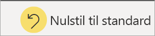

# Rapporter i Power BI

[!INCLUDE [power-bi-service-new-look-include](../includes/power-bi-service-new-look-include.md)]

En Power BI-rapport er en visning med flere perspektiver af et datasæt med visualiseringer, som repræsenterer forskellige resultater og indsigter fra dette datasæt.  En rapport kan indeholde en enkelt visualisering eller sider fulde af visualiseringer. Afhængigt af din jobfunktion kan du være en person, der *designer* rapporter. Du også kan være en person, der *forbruger* eller anvender rapporter. Denne artikel er til *forbrugere*.

A. Denne rapport indeholder seks sider (eller faner), og du ser i øjeblikket siden **Synspunkt**.    
B. På denne side er der fem forskellige visualiseringer og en sidetitel.    
C. Ruden *Filtre* viser ét filter, som er anvendt på alle rapportsider. Hvis du vil skjule ruden Filtre, skal du vælge pilen ( **>** ).    
D. På Power BI-banneret kan du se navnet på rapporten og de seneste opdaterede dato. Vælg pilen for at åbne en menu, der også viser navnet på ejeren af rapporten.    
E. Handlingslinjen indeholder handlinger, du kan udføre på denne rapport.  Du kan f.eks. tilføje en kommentar, få vist et bogmærke eller eksportere data fra rapporten.  Vælg **Flere indstillinger** (...) for at få vist en liste over yderligere rapportfunktionalitet.    

Hvis du ikke har arbejdet med Power BI før, kan du få et godt overblik ved at læse [Grundlæggende begreber for forbrugere af Power BI-tjenesten](end-user-basic-concepts.md). Rapporter er tilgængelige til visning, deling og anmærkning på mobilenheder. Du kan få flere oplysninger under: [Udforsk rapporter i Power BI-mobilapps](mobile/mobile-reports-in-the-mobile-apps.md).

## Fordele ved rapporter

Power BI baserer en rapport på et enkelt datasæt. *Designere* af rapporter opretter visualiseringerne i en rapport, der repræsenterer en guldgrube af oplysninger. Visualiseringerne er ikke statiske.  De opdateres, når de underliggende data ændres. Du kan interagere med visualiseringer og filtre, når du graver dig dybere ned i dataene for at få indsigt og søge efter svar. Ligesom et dashboard er en rapport meget interaktiv og kan tilpasses i høj grad.

### Sikker interaktion med indhold

Når du udforsker og interagerer med dit indhold, kan du filtrere, lave udsnit, abonnere og eksportere – og du kan ikke ødelægge rapporterne. Dit arbejde påvirker ikke det underliggende datasæt eller det oprindelige delte indhold. Dette gælder for dashboards, rapporter og apps.

> [!NOTE]
> Husk, at du ikke kan skade dine data. Power BI er et fantastisk sted at udforske og eksperimentere, uden at du behøver at bekymre dig om at ødelægge noget.

### Gem dine ændringer, eller gendan standardindstillingerne

Dette betyder ikke, at du ikke kan gemme dine ændringer. Det kan du godt, men disse ændringer påvirker kun din visning af indholdet. Hvis du vil vende tilbage til den oprindelige standardvisning af rapporten, skal du vælge **Nulstil til standard**.

## Dashboards sammenlignet med rapporter

[Dashboards](end-user-dashboards.md) forveksles ofte med rapporter, da de også viser lærreder med visualiseringer. Men der er nogle store forskelle.  

| **Egenskab** | **Dashboards** | **Rapporter** |
| --- | --- | --- |
| Sider |Én side |Én eller flere sider |
| Datakilder |Én eller flere rapporter og et eller flere datasæt pr. dashboard |Et enkelt datasæt pr. rapport |
| Filtrering |Der kan ikke filtreres eller laves udsnit |Der er mange forskellige måder at filtrere, fremhæve og lave udsnit på |
| Angivelse af beskeder |Der kan oprettes beskeder, som sendes til dig via mail, når dashboardet opfylder visse betingelser |Nej |
| Udvalgt |Der kan angives ét dashboard som dit udvalgte dashboard |Der kan ikke oprettes en udvalgt rapport |
| Kan underliggende datasættabeller og felter ses? |Nej. Der kan eksporteres data, men datasættets tabeller og felter kan ikke ses på selve dashboardet |Ja. Det er muligt at se de tabeller, felter og værdier fra datasættet, som du har tilladelse til at se |
| Tilpasning |Nej  |Det er muligt at filtrere, eksportere, få vist relateret indhold, tilføje bogmærker, generere QR-koder, analysere i Excel og meget mere |

<!--| Available in Power BI Desktop |No |Yes, can create and view reports in Desktop |
| Pinning |Can pin existing visuals (tiles) only from current dashboard to your other dashboards |Can pin visuals (as tiles) to any of your dashboards. Can pin entire report pages to any of your dashboards. | -->

## Rapportdesignere og rapportforbrugere

Afhængigt af din rolle kan du være en person, der *designer* rapporter til eget brug eller til at dele med kolleger. Du vil gerne vide mere om, hvordan du opretter og deler rapporter.

Eller måske er du en *forbruger*, der modtager rapporter fra andre. Du vil gerne vide mere om, hvordan du forstår og interagerer med rapporter. Hvis du er *forbruger* af rapporter, er disse links beregnet til dig:

* Start med en [præsentation af Power BI-tjenesten](end-user-basic-concepts.md), så du ved, hvor du kan finde rapporter og værktøjer til rapporten.
* Få mere at vide om, hvordan du [åbner en rapport](end-user-report-open.md) og alle de [handlinger, der er tilgængelige for forbrugere](end-user-reading-view.md).
* Bliv fortrolig med rapporter ved at se præsentationen af et af vores [eksempler](../sample-tutorial-connect-to-the-samples.md).  
* Hvis du vil se, hvilke datasæt rapporten bruger, og hvilke dashboards der indeholder visualiseringer fra rapporten (*fastgjorte*), skal du se [Få vist relateret indhold i Power BI-tjenesten](end-user-related.md).

> [!TIP]
> Hvis du ikke kunne finde det, du ledte efter her, kan du bruge indholdsfortegnelsen til venstre til at gennemse alle artikler om *Rapporter*.

## Næste trin

[Åbn og få vist en rapport](end-user-report-open.md)    
[Dashboards i Power BI-tjenesten](end-user-dashboards.md)