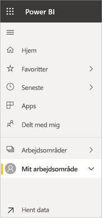
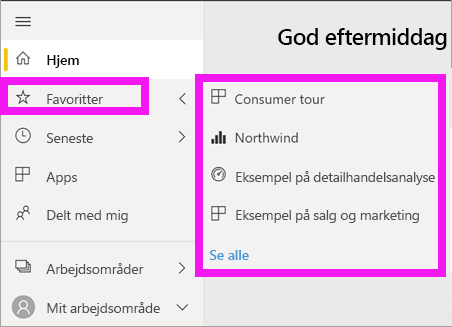

# Navigation: Søg i, find og sortér dit indhold i Power BI-tjenesten
Der er mange forskellige måder at navigere rundt i dit indhold i Power BI-tjenesten på. Indholdet organiseres i dit arbejdsområde efter type: dashboards og rapporter.  Indholdet er også sorteret efter forbrug: Favoritter, seneste, apps, delt med mig og udvalgt. På Power BI *Start* organiseres indhold på én og samme side for at sikre samlet navigation. Med disse forskellige stier til dit indhold kan du hurtigt finde det, du søger, i Power BI-tjenesten.  

## Navigation i arbejdsområder

Power BI-*forbrugere* har typisk kun ét arbejdsområde: **Mit arbejdsområde**. Der er kun indhold på **Mit arbejdsområde**, hvis du har downloadet Microsoft-eksempler eller oprettet eller downloadet dine egne dashboards, rapporter eller apps.  

I **Mit arbejdsområde** opdeler Power BI-tjenesten indholdet efter type: dashboards, rapporter, projektmapper og datasæt. Når du vælger et arbejdsområde, får du vist denne opdeling. I dette eksempel indeholder **Mit arbejdsområde** et dashboard, en rapport, ingen projektmappe og et datasæt.

________________________________________
## Navigation ved hjælp af søgefeltet
Brug indholdsoversigten **Mit arbejdsområde** til at søge efter, filtrere og sortere dit indhold. I søgefeltet skal du skrive hele eller en del af navnet på et dashboard, en rapport, en projektmappe eller en ejer.  

Hvis du kun har begrænset indhold, er det ikke nødvendigt at søge og sortere.  Men når du har lange lister over dashboards og rapporter, er det meget nyttigt at kunne søge og sortere. Rapportlisten nedenfor indeholder f.eks. 83 elementer. 

Du kan også sortere indholdet efter navn eller ejer. Læg mærke til pil op til højre for **Navn**. Vi sorterer i øjeblikket 83 emner alfabetisk efter navn i stigende rækkefølge. Hvis du vil ændre sorteringsrækkefølgen til faldende, skal du vælge **Navn**. Pil op ændres til en pil ned.

Ikke alle kolonner kan sorteres. Peg på kolonneoverskrifterne for at finde ud af, hvilke der kan sorteres.

___________________________________________________________________
## Navigation ved hjælp af den venstre navigationslinje
Ved hjælp af den venstre navigationslinje klassificeres dit indhold, så du nemmere kan finde det, du har brug for, hurtigt.  

- Indhold, der er delt med dig, er tilgængeligt under **Delt med mig**.
- Det indhold, du har fået vist sidst, er tilgængeligt under **Seneste**. 
- Du finder dine apps ved at vælge **Apps**.
- **Start** er en visning af dit vigtigste indhold og foreslået indhold samt læringskilder på en enkelt side.

Derudover kan du mærke indhold som [foretrukket](end-user-favorite.md) og [udvalgt](end-user-featured.md). Vælg det dashboard eller den rapport, du forventer at se oftest, og angiv det som dit *foretrukne* indhold. Hver gang du åbner Power BI-tjenesten, bliver dit udvalgte dashboard vist først. Har du en række dashboards og apps, som du ofte besøger? Når du angiver dem som favoritter, er de altid tilgængelige i den venstre navigationslinje.

.

## Overvejelser og fejlfinding
* **Sortér efter** ikke tilgængelig efter ejer i forbindelse med datasæt.

## Næste trin
[Sorter visualiseringer i rapporter](end-user-change-sort.md)

Har du flere spørgsmål? [Prøv at spørge Power BI-community'et](http://community.powerbi.com/)
