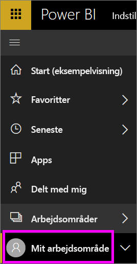
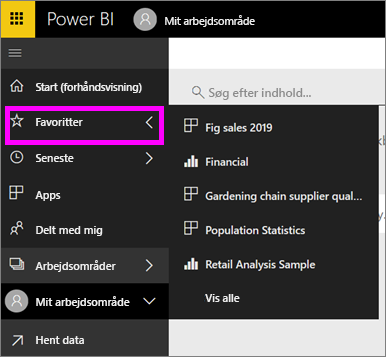

# Navigation: Søg i, find og sortér dit indhold i Power BI-tjenesten
Der er mange forskellige måder at navigere rundt i dit indhold i Power BI-tjenesten på. Indholdet organiseres i fire arbejdsområder efter type: dashboards, rapporter, projektmapper og datasæt.  Indholdet er også sorteret efter forbrug: Favoritter, seneste, apps, delt med mig og udvalgt. På startsiden organiseres indhold på én og samme side for at sikre samlet navigation. Med disse forskellige stier til dit indhold kan du hurtigt finde det, du søger, i Power BI-tjenesten.  

## Navigation i arbejdsområder

Power BI-*forbrugere* har typisk kun ét arbejdsområde: **Mit arbejdsområde**. Der er kun indhold på **Mit arbejdsområde**, hvis du har downloadet Microsoft-eksempler eller oprettet eller downloadet dit eget indhold.  

I **Mit arbejdsområde** opdeler Power BI-tjenesten indholdet efter type: dashboards, rapporter, projektmapper og datasæt. Når du vælger et arbejdsområde, får du vist denne opdeling. I dette eksempel indeholder **Mit arbejdsområde** ét dashboard, to rapporter, ingen projektmappe og to datasæt.

________________________________________

## Navigation ved hjælp af den venstre navigationslinje
Ved hjælp af den venstre navigationslinje klassificeres dit indhold, så det bliver endnu nemmere at finde det, du har brug for, hurtigt.  

- Indhold, der er delt med dig, er tilgængeligt under **Delt med mig**.
- Det indhold, du har fået vist sidst, er tilgængeligt under **Seneste**. 
- Du finder dine apps ved at vælge **Apps**.
- **Start** er en visning af dit vigtigste indhold og foreslået indhold samt læringskilder på en enkelt side.

Derudover kan du mærke indhold som [foretrukket](end-user-favorite.md) og [udvalgt](end-user-featured.md). Vælg det dashboard, du forventer at se oftest, og angiv det som dit *foretrukne* dashboard. Hver gang du åbner Power BI-tjenesten, bliver dit udvalgte dashboard vist først. Har du en række dashboards og apps, som du ofte besøger? Når du angiver dem som favoritter, er de altid tilgængelige i den venstre navigationslinje.

.

## Overvejelser og fejlfinding
* **Sortér efter** ikke tilgængelig efter ejer i forbindelse med datasæt.

## Næste trin
[Power BI – Grundlæggende begreber](end-user-basic-concepts.md)

Har du flere spørgsmål? [Prøv at spørge Power BI-community'et](http://community.powerbi.com/)