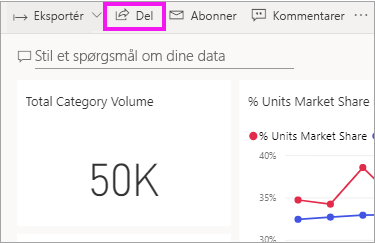
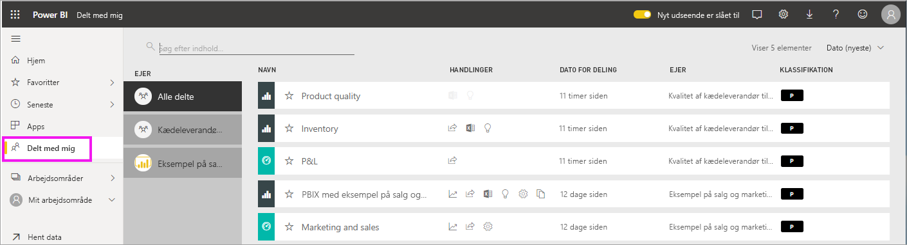
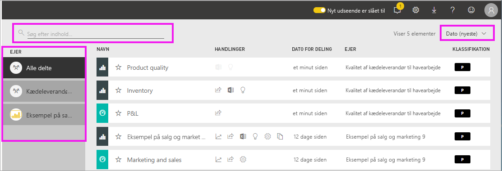

# Få vist dashboards og rapporter, der er delt med mig

[!INCLUDE [power-bi-service-new-look-include](../includes/power-bi-service-new-look-include.md)]

Når en kollega deler indhold med dig ved hjælp af knappen **Del**, vises det i din objektbeholder **Delt med mig**. Dashboardet eller rapporten er kun tilgængelig under **Delt med mig** og ikke under **Apps**.

Se Amanda forklare **Delt med mig**-indholdslisten og vise dig, hvordan du navigerer og filtrerer listen. Følg derefter en trinvis vejledning under videoen for at prøve det selv. For at du kan få vist dashboards, der deles med dig, skal du have en Power BI Pro-licens. Læs [Hvad er Power BI Premium?](../service-premium-what-is.md) for at få flere oplysninger.
    

> [!NOTE]
> I denne video bruges en ældre version af Power BI-tjenesten.
    

<iframe width="560" height="315" src="https://www.youtube.com/embed/G26dr2PsEpk" frameborder="0" allowfullscreen></iframe>

## Interager med delt indhold

Du har mulighed for at interagere med de delte dashboards og rapporter, afhængigt af de tilladelser *designeren* giver dig. Disse omfatter at kunne oprette kopier af dashboard'et, åbne rapporten [i Læsevisning](end-user-reading-view.md) og dele videre med andre kollegaer.

### Handlinger, der er tilgængelige via objektbeholderen **Delt med mig**
De handlinger, der er tilgængelige for dig, afhænger af de indstillinger, *designeren* af indholdet har tildelt. Nogle af dine muligheder kan omfatte:
* Vælg stjerneikonet for at [føje et dashboard eller en rapport til Favoritter](end-user-favorite.md) .
* Fjern et dashboard eller en rapport  .
* Nogle dashboards og rapporter kan deles igen  .
* [Åbn rapporten i Excel](end-user-export.md)  
* [Vis indsigt](end-user-insights.md), som Power BI finder i dataene .
  
  > [!NOTE]
  > Vælg knappen **Klassificering**, eller [gå til Dashboard for dataklassificering](../service-data-classification.md) for at få oplysninger om EGRC-klassificeringer.
  > 

## Søg på og sortér delte dashboards
Hvis din indholdsliste bliver lang, har du flere muligheder for at finde det, du har brug for. Du kan bruge søgefeltet eller sortere efter dato, eller du kan vælge fra kolonnen **Ejer**.    

