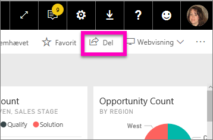
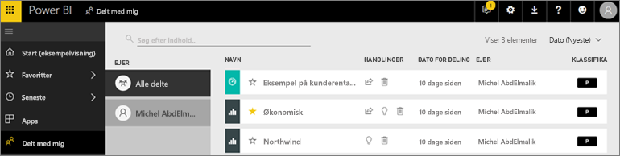
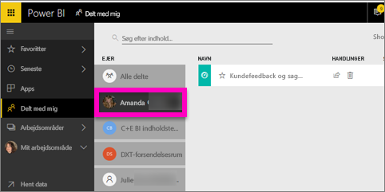

# Få vist dashboards og rapporter, der er delt med mig
## Delt med mig

Når en kollega deler indhold med dig ved hjælp af knappen **Del**, vises det i din objektbeholder **Delt med mig**. Dashboardet eller rapporten er kun tilgængelig under **Delt med mig** og ikke under **Apps**.

Se Amanda forklare **Delt med mig**-indholdslisten og vise dig, hvordan du navigerer og filtrerer listen. Følg derefter en trinvis vejledning under videoen for at prøve det selv. For at du kan få vist dashboards, der deles med dig, skal du have en Power BI Pro-licens. Læs [Hvad er Power BI Premium?](../service-premium-what-is.md) for at få flere oplysninger.

<iframe width="560" height="315" src="https://www.youtube.com/embed/G26dr2PsEpk" frameborder="0" allowfullscreen></iframe>

Du har mulighed for at interagere med dashboardsene og rapporterne, afhængigt af de tilladelser designeren giver dig. Disse omfatter at kunne oprette kopier af dashboard'et, åbne rapporten [i Læsevisning](end-user-reading-view.md) og dele videre med andre kollegaer.

## Handlinger, der er tilgængelige via objektbeholderen **Delt med mig**
* Vælg stjerneikonet for at [føje et dashboard eller en rapport til Favoritter](end-user-favorite.md).
* Fjern et dashboard eller en rapport  
* Nogle dashboards og rapporter kan deles igen  
* Hvis dine lister bliver lange, kan du desuden [bruge søgefeltet og sortering til at finde det, du har brug for](end-user-search-sort.md).
  
  > [!NOTE]
  > Vælg knappen klassifikation for at få oplysninger om EGRC-klassificeringer eller [besøg Dashboard-dataklassificering ](../service-data-classification.md).
  > 
  > 
* Vælg navnet på et dashboard for at åbne og udforske det. Når du har åbnet det delte dashboard, kan du bruge Spørgsmål og svar til at stille spørgsmål om de underliggende data eller vælge et felt til at åbne og interagere med rapporten i Læsevisning.

## Filtrer delte dashboards efter ejer
Indholdet i **Delt med mig**-skærmen kan filtreres yderligere efter indholdsejer. Hvis jeg f.eks. vælger **Amanda**, får jeg kun vist det dashboard, som Amanda har delt med mig.

