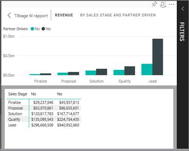
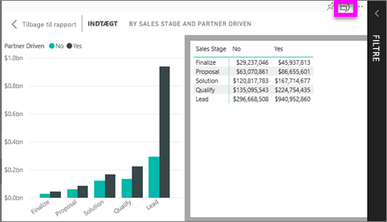

# Vis de data, der blev brugt til at oprette visualiseringen
## Vis data
En Power BI-visualisering oprettes vha. data fra underliggende datasæt. Hvis du vil se bag kulisserne, kan du i Power BI *få vist* de data, der bruges til at oprette visualiseringen. Når du vælger **Vis data**, vises dataene under (eller ud for) visualiseringen i Power BI.

## Brug af *Vis data* i Power BI-tjenesten
1. Åbn en rapport i Power BI-tjenesten, og vælg en visualisering.  
2. Hvis du vil have vist de underliggende data for visualiseringen, skal du vælge ellipsen (...) og vælge **Vis data**.
   
   
3. Som standard vises dataene under visualiseringen.
   
   

4. Hvis du vil ændre retningen, skal du vælge lodret layout  i øverste højre hjørne af visualiseringen.
   
   

### Næste trin
[Visualiseringer i Power BI-rapporter](../visuals/power-bi-report-visualizations.md)    
[Power BI-rapporter](end-user-reports.md)    
