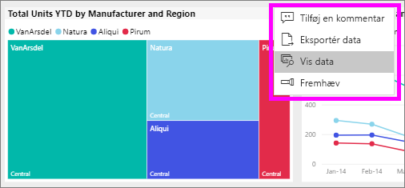
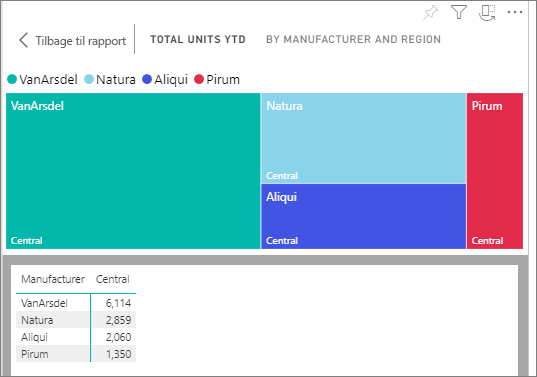
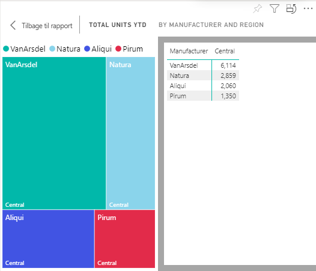

# Vis de data, der blev brugt til at oprette det visuelle element

En Power BI-element er oprettet ved hjælp af data fra de underliggende datasæt. Hvis du vil se bag kulisserne, kan du i Power BI *få vist* de data, der bruges til at oprette visualiseringen. Når du vælger **Vis Data**, vises dataene under (eller ud for) i Power BI det visuelle element.

1. I Power BI-tjenesten, [åbne en rapport](end-user-report-open.md) og vælge en visualisering.  
2. Hvis du vil have vist de underliggende data for visualiseringen, skal du vælge ellipsen (...) og vælge **Vis data**.
   
   
3. Som standard vises dataene under visualiseringen.
   
   

4. Hvis du vil ændre retningen, skal du vælge lodret layout  i øverste højre hjørne af visualiseringen.
   
   

## Næste trin
[Visualiseringer i Power BI-rapporter](../visuals/power-bi-report-visualizations.md)    
[Power BI-rapporter](end-user-reports.md)    
