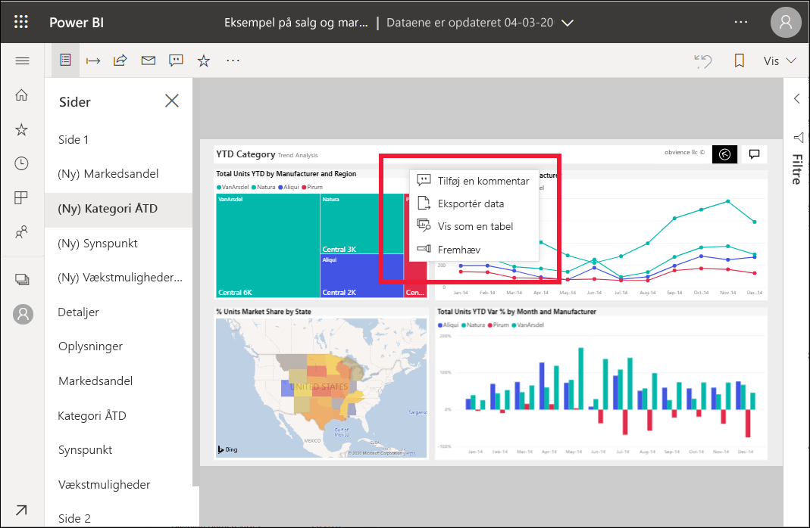
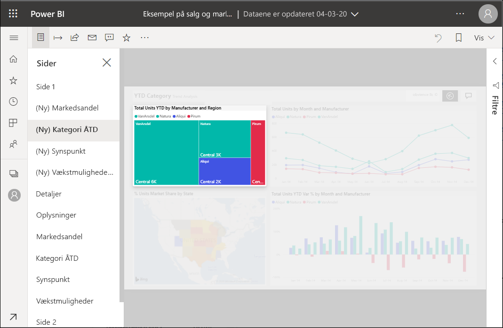

# Føj fremhævelser til Power BI-rapporter

[!INCLUDE[consumer-appliesto-yyny](../includes/consumer-appliesto-yyny.md)]

Med Fremhæv kan du henlede opmærksomheden på en bestemt visualisering på en rapportside.  Hvis fremhævelsestilstanden er markeret, når du tilføjer et bogmærke, bevares den pågældende tilstand i bogmærket.

## Brug af en fremhævelse

1. [Åbn en rapport](end-user-report-open.md) i Power BI-tjenesten.

2. Find ud af, hvilken visualisering du vil fremhæve på rapportsiden. Vælg rullelisten **Flere handlinger (...)** .  

    

3. Vælg indstillingen for **Fremhæv**. Den valgte visualisering fremhæves, hvilket betyder, at alle andre visualiseringer på siden kan tones op og ned til næsten gennemsigtig. 

    

## Næste trin

* [Vis et dashboardfelt eller en rapportvisualisering i fokustilstand](end-user-focus.md)

