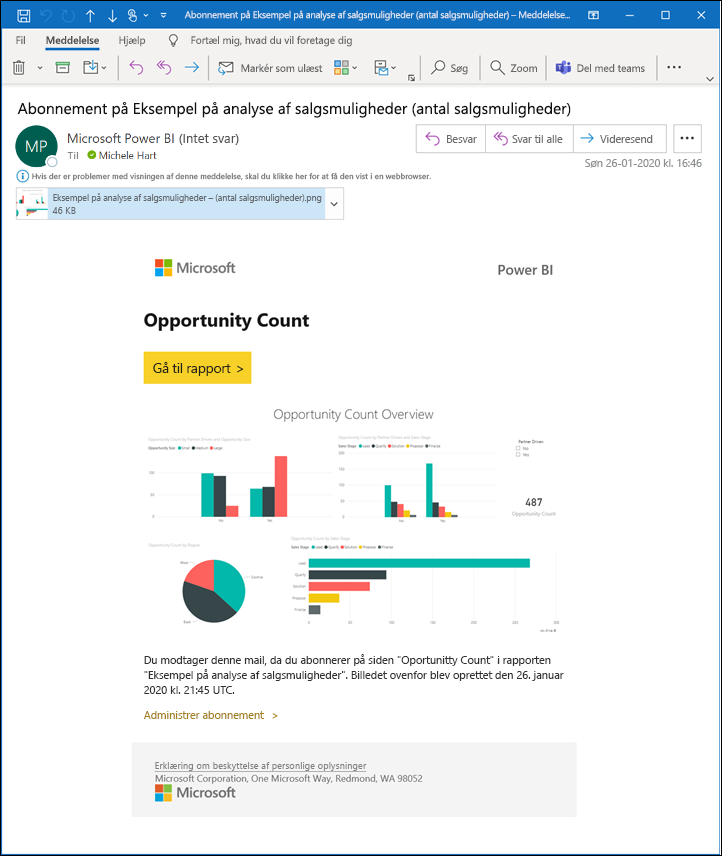
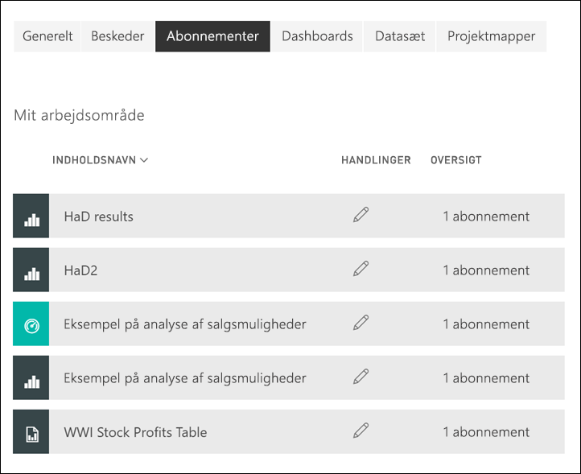

# Abonner på en rapport eller et dashboard i Power BI-tjenesten 

[!INCLUDE[consumer-appliesto-ynny](../includes/consumer-appliesto-ynny.md)]

[!INCLUDE [power-bi-service-new-look-include](../includes/power-bi-service-new-look-include.md)]

Det har aldrig været nemmere at holde dig opdateret om dine vigtigste dashboards og rapporter. Abonner på rapportsider og dashboards, der betyder mest for dig, og Power BI sender et snapshot til din indbakke. Fortæl Power BI, hvor ofte du vil modtage mails: dagligt, ugentligt eller efter dataopdatering. Du kan tilmed angive et bestemt tidspunkt for, hvornår Power BI sender mails, eller køre det nu.  Du kan i alt konfigurere op til 24 forskellige abonnementer pr. rapport eller dashboard.

Det sprog, der er angivet under Power BI-indstillingerne, bruges til mail og snapshot (se [Understøttede sprog og lande/regioner til Power BI](../fundamentals/supported-languages-countries-regions.md)). Hvis der ikke er angivet et sprog, bruger Power BI det sprog, der stemmer overens med indstillingen for landestandard i din aktuelle browser. Hvis du vil se eller indstille dine sprogindstillinger, skal du vælge  > **Indstillinger > Generelt > Sprog**. 

Når du modtager mailen, indeholder den et link til at "gå til rapport eller dashboard". På mobile enheder med Power BI-apps installeret, startes appen (i modsætning til standardhandlingen med at åbne rapporten eller dashboardet på Power BI-webstedet), hvis du vælger dette link.

## Krav
Hvis du vil **oprette** et abonnement til dig selv, skal du have en bestemt type [licens](end-user-license.md). Hvis du ikke kan oprette et abonnement, skal du kontakte din Power BI-administrator. **Abonnement til andre** kan kun oprettes af ejeren af dashboardet eller rapporten. Det er lidt anderledes at abonnere på sideinddelte rapporter. Du kan finde flere oplysninger i [Meld dig selv og andre til et abonnement på en sideinddelt rapport i Power BI-tjenesten](paginated-reports-subscriptions.md). 

## Abonner på et dashboard eller en rapportside
Uanset om du abonnerer på et dashboard eller en rapport, er processen den samme. Du bruger den samme knap til at abonnere på dashboards og rapporter i Power BI-tjenesten.
 
.

1. Åbn dashboardet eller rapporten.
2. Vælg **Abonner** på menulinjen øverst, eller vælg konvolutikonet .
   

   
    
    Skærmen til venstre vises, når du er på et dashboard og vælger **Abonner**. Skærmen til højre vises, når du er på en rapportside og vælger **Abonner**. 
    
    a. Hvis du vil abonnere på mere end én side i en rapport, skal du vælge **Tilføj et andet abonnement** og vælge en anden side på rullelisten øverst.

    b. Brug den gule skyder til at slå abonnementet til og fra.  Abonnementet slettes ikke, når skyderen sættes til Fra. Hvis du vil slette abonnementet, skal du vælge ikonet for papirkurven.

    c. Alternativt kan du tilføje et emne og mailoplysninger. 

    d. Vælg en **Hyppighed** for dit abonnement.  Du kan vælge Dagligt, Ugentligt eller Efter dataopdatering (dagligt).  Hvis du kun vil modtage abonnementsmailen på bestemte dage, skal du vælge **Ugentligt** og vælge, hvilke dage du vil modtage den.  Hvis du f.eks. kun vil modtage abonnementsmailen på hverdage, skal du vælge **Ugentligt** som hyppighed og fjerne markeringen i felterne for lørdag og søndag. Hvis du vælger **Månedligt**, skal du angive den eller de dage på måneden, hvor du vil modtage abonnementsmailen.   

    e. Hvis du vælger Dagligt, Hver time, Månedligt eller Ugentligt, kan du også vælge et planlagt tidspunkt for abonnementet. Du kører den hver hele time eller 15, 30 eller 45 minutter over. Vælg morgen (AM) eller eftermiddag/aften (PM). Du kan også angive tidszonen. Hvis du vælger Hver time, skal du vælge det planlagte tidspunkt, som abonnementet skal starte på, hvorefter det kører hver time.  

    f. Planlæg start- og slutdato ved at angive datoer i datofelterne. Starttidspunktet for dit abonnement er som standard den dato, du opretter den, og slutdatoen vil være et år senere. Du kan ændre den til en hvilken som helst dato i fremtiden (op til år 9999) når som helst, før abonnementet slutter. Når et abonnement når en slutdato, ophører det, indtil du aktiveret det igen.  Du modtager en meddelelse, før den planlagte slutdato, hvor du bliver spurgt, om du vil forlænge det.     

    eks. Hvis du vil gennemse abonnementet og teste det, skal du vælge **Kør nu**.  Så sendes der en mail til dig med det samme. 

3. Hvis alt ser rigtigt ud, skal du vælge **Gem og luk** for at gemme abonnementet. Du modtager en mail og et snapshot af dashboardet eller rapporten iht. den plan, du har angivet. For alle abonnementer, hvor hyppigheden er angivet til **Efter dataopdatering**, sendes der kun en mail efter den første planlagte opdatering på den pågældende dag.
   
   
   
    Opdatering af rapportsiden opdaterer ikke datasættet. Det er kun ejeren af datasættet, der kan opdatere et datasæt manuelt. Hvis du vil søge efter navnet på ejeren af det eller de underliggende datasæt, skal du vælge rullelisten på den øverste menulinje eller søge efter den oprindelige abonnementsmail.
   
    

## Administrer dine abonnementer
Det er kun dig, der kan administrere de abonnementer, du opretter. Vælg **Abonner** igen, og vælg **Administrer alle abonnementer** i nederste venstre hjørne. Se skærmbilleder ovenfor. De abonnementer, der vises, afhænger af, hvilket arbejdsområde der er aktivt i øjeblikket. Hvis du vil se alle dine abonnementer på én gang for alle arbejdsområder, skal du sørge for, at **Mit arbejdsområde** er aktivt. Du kan få hjælp til arbejdsområder i [Arbejdsområder i Power BI](end-user-workspaces.md). 

Et abonnement slutter, hvis Pro-licensen udløber, dashboardet eller rapporten slettes af ejeren, eller hvis den brugerkonto, der blev brugt til oprettelse af abonnementet, slettes.

## Overvejelser og fejlfinding
* Hvis du vil undgå abonnementsmails i mappen med uønsket post, skal du føje dit Power BI-mailalias (no-reply-powerbi@microsoft.com) til dine kontakter. Hvis du bruger Microsoft Outlook, skal du højreklikke på aliasset og vælge **Føj til Outlook-kontaktpersoner**. 
* Dashboards med mere end 25 fastgjorte felter eller 4 fastgjorte liverapportsider gengives muligvis ikke fuldstændigt i abonnementsmails, der sendes til brugerne. Det anbefales, at du kontakter designeren af dashboardet og beder vedkommende om at reducere antallet af fastgjorte felter til mindre end 25 og fastgjorte liverapporter til mindre end 4 for at sikre, at mailen gengives korrekt.  
* Hvis der er anvendt sikkerhed på rækkeniveau på nogen af felterne, bliver disse felter ikke vist for e-mailabonnementer på dashboard.  
* Hvis linkene i din mail (til indholdet) ikke længere fungerer, kan det være, at indholdet er blevet slettet. Under skærmbilledet i mailen kan du se, om du eller en anden har tilmeldt dig. Hvis en anden person har, kan du bede denne kollega om enten at annullere mailene eller at tilmelde dig igen.
* Visse typer felter understøttes endnu ikke for dashboardabonnementer. Det omfatter: streamingfelter, videofelter, felter med brugerdefineret webindhold. 
* Rapportsideabonnementer er bundet til navnet på siden i rapporten. Hvis du abonnerer på en rapportside, og den bliver omdøbt, skal du genoprette dit abonnement.
* Hvis du ikke kan bruge abonnementsfunktionen, skal du kontakte din systemadministrator. Din organisation kan have deaktiveret denne funktion.  
* Mailabonnementer understøtter ikke de fleste [brugerdefinerede visuelle elementer](../developer/visuals/power-bi-custom-visuals.md).  Undtagelsen er de brugerdefinerede Power BI-visuals, der er blevet [certificeret](../developer/visuals/power-bi-custom-visuals-certified.md).    
* Mailabonnementer sendes med rapportens tilstande for standardfilter og -udsnit. Hvis du ændrer standardværdierne, efter du har oprettet abonnementet, vises de ikke i mailen. Sideinddelte rapporter understøtter denne egenskab og giver dig mulighed for at angive de specifikke parameterværdier pr. abonnement.  
* Mailabonnementer understøtter ikke R-drevne Power BI-visuals på nuværende tidspunkt.  
* Særligt for dashboardabonnementer understøttes nogle typer af felter endnu ikke.  Det omfatter: streamingfelter, videofelter, felter med brugerdefineret webindhold.     
* Abonnementer mislykkes muligvis på dashboards og rapporter med meget store billeder på grund af størrelsesbegrænsninger for mails.    
* Power BI afbryder automatisk midlertidigt opdatering af datasæt, der er knyttet til dashboards og rapporter, som ikke er blevet besøgt i mere end to måneder.  Men hvis du føjer et abonnement til et dashboard eller en rapport, sættes det ikke på pause, selvom det ikke besøges.
* I sjældne tilfælde kan det tage længere tid end 15 minutter at levere mailabonnementer til deres modtagere.  Hvis det sker, anbefaler vi, at du kører en opdatering af dine data og dit mailabonnement på forskellige tidspunkter for at sikre rettidig levering.  Hvis problemet fortsætter, skal du kontakte Power BI-support.

## Næste trin

[Søg efter og sortér indhold](end-user-search-sort.md)
