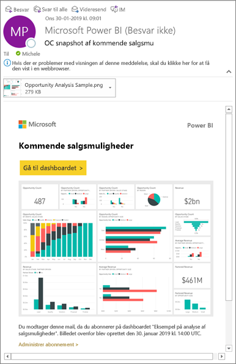
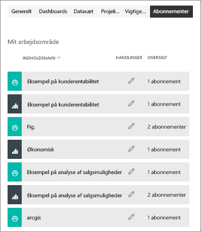

# Abonner på en rapport eller et dashboard i Power BI-tjenesten 
Det har aldrig været nemmere at holde dig opdateret om dine vigtigste dashboards og rapporter. Abonner på rapportsider og dashboards, der betyder mest for dig, og Power BI sender et snapshot til din indbakke. Fortæl Power BI, hvor ofte du vil modtage mails: dagligt, ugentligt eller efter dataopdatering. Du kan tilmed angive et bestemt tidspunkt for, hvornår Power BI sender mails, eller køre det nu.  

Det sprog, der er angivet under Power BI-indstillingerne, bruges til mail og snapshot (se [Understøttede sprog og lande/regioner til Power BI](../supported-languages-countries-regions.md)). Hvis der ikke er angivet et sprog, bruger Power BI det sprog, der stemmer overens med indstillingen for landestandard i din aktuelle browser. Hvis du vil se eller indstille dine sprogindstillinger, skal du vælge  > **Indstillinger > Generelt > Sprog**. 

Når du modtager mailen, indeholder den et link til at "gå til rapport eller dashboard". På mobile enheder med Power BI-apps installeret, startes appen (i modsætning til standardhandlingen med at åbne rapporten eller dashboardet på Power BI-webstedet), hvis du vælger dette link.

## Krav
**Oprettelse af** et abonnement er en Power BI Pro-funktion.   

## Abonner på et dashboard eller en rapportside
Uanset om du abonnerer på et dashboard eller en rapport, er processen den samme. Du bruger den samme knap til at abonnere på dashboards og rapporter i Power BI-tjenesten.
 
.

1. Åbn dashboardet eller rapporten.
2. Vælg **Abonner** på menulinjen øverst, eller vælg konvolutikonet .
   
   

   
    
    Skærmen til venstre vises, når du er på et dashboard og vælger **Abonner**. Skærmen til højre vises, når du er på en rapportside og vælger **Abonner**. Hvis du vil abonnere på mere end én side i en rapport, skal du vælge **Tilføj et andet abonnement** og vælge en anden side. 

4. Brug den gule skyder til at slå abonnementet til og fra.  Abonnementet slettes ikke, når skyderen sættes til Fra. Hvis du vil slette abonnementet, skal du vælge ikonet for papirkurven.

4. Din mailadresse, der automatisk føjes til den **Abonner** felt. Tilføj samt deres mailadresser her for at abonnere på andre i din organisation. 

5. Alternativt kan du tilføje mailoplysninger. 

5. Vælg en **Hyppighed** for dit abonnement.  Du kan vælge Dagligt, Ugentligt eller Efter dataopdatering (dagligt).  Hvis du kun vil modtage abonnementsmailen på bestemte dage, skal du vælge **Ugentligt** og vælge, hvilke dage du vil modtage den.  Hvis du f.eks. kun vil modtage abonnementsmailen på hverdage, skal du vælge **Ugentligt** som hyppighed og fjerne markeringen af felterne for lørdag og søndag.   

6. Planlæg det tidspunkt, som mailen skal sendes på, ved at vælge Dagligt eller Ugentligt som hyppighed, og angiv et **planlagt** **tidspunkt** for abonnementet.   

7. Planlæg start- og slutdato ved at angive datoer i datofelterne. Starttidspunktet for dit abonnement er som standard den dato, du opretter den, og slutdatoen vil være et år senere. Når et abonnement når en slutdato, ophører det, indtil du aktiveret det igen.  Du modtager en meddelelse, før den planlagte slutdato, hvor du bliver spurgt, om du vil forlænge det.     

8. Hvis du vil gennemse abonnementet og teste det, skal du vælge **Kør nu**.  Så sendes der en mail til dig med det samme. 

8. Hvis alt ser rigtigt ud, skal du vælge **Gem og luk** for at gemme abonnementet. Du og dine kolleger, der abonneres på modtager en mail og snapshot af dashboardet eller rapporten med tidsplanen, du har angivet. For alle abonnementer, hvor hyppigheden er angivet til **Efter dataopdatering**, sendes der kun en mail efter den første planlagte opdatering på den pågældende dag.
   
   
   
    Opdatering af rapportsiden opdaterer ikke datasættet. Det er kun ejeren af datasættet, der kan opdatere et datasæt manuelt. Hvis du vil søge efter ejernavnet på den eller de underliggende datasæt, skal du vælge **få vist relaterede** fra den øverste menulinje eller look up den oprindelige mail med abonnement.
   
    

## Administrer dine abonnementer
Du kan kun administrere de abonnementer, du opretter. Vælg **Abonner** igen, og vælg **Administrer alle abonnementer** i nederste venstre hjørne. Se skærmbilleder ovenfor. 

Et abonnement slutter, hvis Pro-licensen udløber, dashboardet eller rapporten slettes af ejeren, eller hvis den brugerkonto, der blev brugt til oprettelse af abonnementet, slettes.

## Overvejelser og fejlfinding
* Dashboards med mere end 25 fastgjorte felter eller 4 fastgjorte liverapportsider gengives muligvis ikke fuldstændigt i abonnementsmails, der sendes til brugerne. Vi anbefaler, at du kontakte dashboarddesigneren, og bed vedkommende om at reducere fastgjorte felter i mindre end 25 og fastgjorte direkte rapporter på mindre end fire til at sikre, at mailen gengives korrekt.  
* Hvis der er anvendt sikkerhed på rækkeniveau på nogen af felterne, bliver disse felter ikke vist for e-mailabonnementer på dashboard.  Hvis datasættet bruger RLS, vil du ikke kunne oprette et abonnement for mailabonnementer på rapporter.
* Rapportsideabonnementer er bundet til navnet på siden i rapporten. Hvis du abonnerer på en rapportside, og det henter omdøbt, har du genoprette dit abonnement.
* Hvis du ikke kan bruge abonnementsfunktionen, skal du kontakte din systemadministrator. Din organisation kan have deaktiveret denne funktion pga. godkendelse eller af andre årsager.  
* Mailabonnementer understøtter ikke de fleste [brugerdefinerede visuelle elementer](../power-bi-custom-visuals.md).  Undtagelsen er de brugerdefinerede visualiseringer, der er blevet [certificeret](../power-bi-custom-visuals-certified.md).  
* Mailabonnementer understøtter ikke R-drevne brugerdefinerede visuals på nuværende tidspunkt.  
* Særligt for dashboardabonnementer understøttes nogle typer af felter endnu ikke.  Det omfatter: streamingfelter, videofelter, felter med brugerdefineret webindhold.     
* Abonnementer mislykkes muligvis på dashboards og rapporter med meget store billeder på grund af størrelsesbegrænsninger for mails.    
* Power BI afbryder automatisk midlertidigt opdatering af datasæt, der er knyttet til dashboards og rapporter, som ikke er blevet besøgt i mere end to måneder.  Men hvis du føjer et abonnement til et dashboard eller en rapport, standses det ikke midlertidigt, selvom det ikke besøges.    

## Næste trin

[Søg efter og sortér indhold](end-user-search-sort.md)
