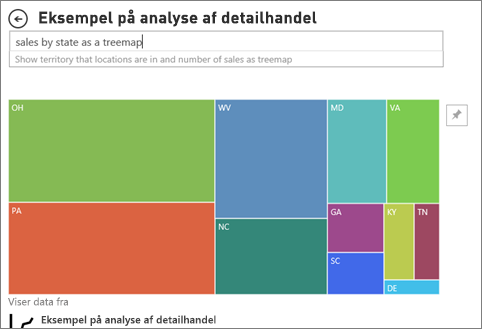

# Visualiseringstyper i Power BI

[!INCLUDE[consumer-appliesto-yynn](../includes/consumer-appliesto-yynn.md)]

Visuals (også kaldet *diagrammer* og *visualiseringer*) er billedgengivelser af dine data. Nogle almindelige eksempler er søjlediagrammer, kort, punktdiagrammer og radiale målere. Du finder visualiseringer i rapporter, på dashboards og under Spørgsmål og svar.

De visuals, der er beskrevet på denne side, er dem, der følger med Power BI. Disse visualtyper er dem, du oftest støder på. Denne side giver et hurtigt overblik over de medfølgende visuals. Du kan finde detaljerede oplysninger om disse visuals i dokumentationen om visualtyper til [Power BI Report *Designer*](../visuals/power-bi-visualization-types-for-reports-and-q-and-a.md).

Visuals, som ikke automatisk er inkluderet i Power BI, kaldes *brugerdefinerede visuals*. Brugerdefinerede visuals kan importeres til Power BI fra eksterne websteder, f. eks. Microsoft AppSource, eller fra interne kilder, f. eks. organisationslageret. Import af brugerdefinerede visuals kræver redigeringsrettigheder til rapporten. Hvis du vil vide mere om disse tilføjelsesvisuals kan du besøge [Visualiseringer i Power BI](../developer/visuals/power-bi-custom-visuals.md).

## Liste over visualiseringer, der er tilgængelige i Power BI
Du finder alle disse visualiseringer på dashboards, i rapporter og [angivet under Spørgsmål og svar](end-user-q-and-a.md) i Power BI. Hvis du vil vide mere om, hvordan du interagerer med visualiseringer, skal du se [Interager med visualiseringer i rapporter, på dashboards og i apps](end-user-visualizations.md)

### Områdediagrammer: Grundlæggende (lagdelte) og stablede

Det grundlæggende områdediagram er baseret på kurvediagrammet med området mellem aksen og kurven udfyldt. Områdediagrammer fremhæver omfanget af ændringer over tid og kan bruges til at fremhæve den samlede værdi på tværs af en udvikling. Data, som repræsenterer indtjening over tid, kan f.eks. afbildes i et områdediagram for at fremhæve den samlede indtjening.

### Liggende søjlediagrammer og søjlediagrammer

 

Liggende søjlediagrammer er standarden for at finde en specifik værdi på tværs af en række kategorier.

### Kort: Enkelt tal

Kort med et enkelt tal viser et enkelt faktum, dvs. et enkelt datapunkt. Nogle gange er et enkelt tal det vigtigste, du vil finde frem til på dit Power BI-dashboard eller i din Power BI-rapport som f.eks. salg i alt, markedsandel fra år til år eller salgsmuligheder i alt.  

### Kort: Med flere rækker

Kort med flere rækker viser et eller flere datapunkter; én pr. række.

### Kombinationsdiagrammer

I et kombinationsdiagram kombineres et søjlediagram og et kurvediagram. Ved at kombinere disse to diagrammer kan du hurtigere sammenligne dine data. Kombinationsdiagrammer kan have en eller to Y-akser, så sørg for at se nøje efter. 

Kombinationsdiagrammer er et fantastisk valg i følgende tilfælde:
- Når du har et kurvediagram og et søjlediagram med den samme X-akse.
- til at sammenligne flere målinger med forskellige værdiområder
- til at illustrere sammenhængen mellem to målinger i én visualisering
- til at kontrollere, om en måling opfylder målet, der er defineret af en anden måling
- til at spare plads på lærredet.

### Fordelingstræ

Fordelingstrævisual'et giver dig mulighed for at visualisere data på tværs af flere dimensioner. Den samler automatisk data og giver dig mulighed for at foretage detailudledning i dine dimensioner i vilkårlig rækkefølge. Det er også en AI-visualisering (kunstig intelligens), så du kan bede den om at finde den næste dimension, så du kan foretage detailudledning på baggrund af bestemte kriterier. Det gør det til et værdifuldt værktøj til ad hoc-udforskning og udførelse af rodårsags analyser.

### Kransediagrammer

Kransediagrammer ligner cirkeldiagrammer.  De viser relationen mellem dele og en helhed. Den eneste forskel er, at centreret i det er tomt og giver plads til en etiket eller et ikon.

### Tragtformede diagrammer

Tragtformede diagrammer hjælper med at visualisere en proces med faser og elementer, der flyder sekventielt fra den ene fase til den næste.  Et eksempel er en salgsproces, der starter med kundeemner og ender med køb.

F.eks. et tragtformet salgsdiagram, der sporer kunder gennem forskellige faser: Kundeemne > Kvalificeret kundeemne > Kundeemne > Kontrakt > Luk. I korte træk afspejler tragtens form tilstanden af den proces, du holder øje med.
De enkelte faser i tragten repræsenterer en procentdel af det samlede antal. Så i de fleste tilfælde vil et tragtformet diagram være formet som en tragt – hvor det første trin er det største, og hvor hvert efterfølgende trin bliver mindre end det foregående. En pæreformet tragt er også nyttig – det kan bruges til at identificere et problem i processen. Det første trin i fasen, "indgangsfasen", er dog typisk det største.

### Målerdiagrammer

Et radialt målerdiagram har en cirkulær bue og viser en enkelt værdis status i forhold til et mål/en KPI. Målet, eller målværdien, er repræsenteret med en streg (nål). Statussen mod målet repræsenteres med en skygge. Den værdi, der repræsenterer statussen, vises med fed i buen. Alle de mulige værdier er fordelt langs buen fra minimumværdien (længst til venstre) til maksimumværdien (længst til højre).

I eksemplet ovenfor spores det gennemsnitlige salg pr. måned for salgsteamet hos en bilforhandler. Målet er 140, hvilket repræsenteres med den sorte nål. Det mindst mulige salg er 0, og vi har angivet maksimum til 200. Den blå farve viser, at vi i øjeblikket er på 120 salg i denne måned. Der er heldigvis stadig en uge til at nå målet.

Radiale målere er fantastiske til:
- at vise statussen mod et mål
- repræsentere en percentilmåling, f.eks. KPI
- vise tilstanden for en enkelt måling
- vise oplysninger, der er hurtige at skimme og forstå.

 ### Diagram over nøglepersoner med indflydelse

Et diagram over nøglepersoner med indflydelse viser de største bidragydere for et valgt resultat eller en valgt værdi.

Nøglepersoner med indflydelse er et godt valg til at hjælpe dig med at forstå de faktorer, der påvirker en nøglemetrikværdi. Det kan eksempelvis være, *hvad der har indflydelse på, at kunderne afgiver ordre nummer to *, eller* hvorfor salget var så højt sidste år i juni*. 

### KPI'er

Et nøgletal (KPI) er en visuel ledetråd, der viser fremgangen mod et målbart mål. 

KPI'er er et godt valg:
- til at måle fremgang (hvad er jeg foran eller bagefter med?)
- til at måle afstanden til et mål (hvor langt foran eller bagefter er jeg?)

### Kurvediagrammer

Kurvediagrammer fremhæver den overordnede form af en hel serie af værdier som regel over tid.

### Kort: Basiskort

Brug et basiskort til at knytte både kategoriinddelte og kvantitative oplysninger til spatiale placeringer.

### Kort: ArcGIS-kort

Kombinationen af ArcGIS-kort og Power BI tager kort til et helt nyt niveau, som involverer mere end præsentation af punkter på et kort. De tilgængelige indstillinger til grundlæggende kort, placeringstyper, temaer, symboltypografier og referencelag opretter fantastiske informative kortvisualiseringer. Kombinationen af autoritative datalag på et kort (f.eks. census-data) med rumlige analyser giver en bedre forståelse af dataene i visualiseringen.

### Kort: Kartogrammer (Choropleth)

Et udfyldt kort bruger skygger eller toner eller mønstre til at vise, hvordan en værdi varierer i forhold på tværs af et geografisk område eller en region. Fremvis hurtigt disse relative forskelle med skygger, der går fra lys (mindre-hyppige/lavere) til mørk (mere-hyppige/mere).

### Kort: Figurkort

Med figurkort sammenlignes områder på et kort ved hjælp af farve. Et figurkort kan ikke vise den nøjagtige geografiske placering af datapunkter på et kort. I stedet er dets primære formål at vise relative sammenligninger mellem områder på et kort ved at give dem forskellige farver.

### Matrix

Matrixvisualiseringen er en type tabelvisualisering (se "Tabel" herunder), som understøtter et trinvist layout. Rapportdesignere inkluderer ofte matricer i rapporter og på dashboards, så brugerne kan vælge et eller flere elementer (rækker, kolonner, celler) i matrixen til tværgående fremhævning af andre visualiseringer på en rapportside.  

### Cirkeldiagrammer

I cirkeldiagrammer vises relationen mellem dele og en helhed. 

### Power Apps-visualisering

Rapportdesignere kan oprette en Power-app og integrere den i en Power BI-rapport. Forbrugere kan interagere med denne visualisering i Power BI-rapporten. 

### Visualisering til Spørgsmål og svar

>[!TIP]
>På samme måde som [oplevelsen med Spørgsmål og svar på dashboards](../create-reports/power-bi-tutorial-q-and-a.md) kan du bruge visualiseringen af Spørgsmål og svar til at stille spørgsmål om dine data i et naturligt sprog. 

Du kan finde flere oplysninger under [Visualiseringer af Spørgsmål og svar i Power BI](../visuals/power-bi-visualization-types-for-reports-and-q-and-a.md).

### Bånddiagram

I bånddiagrammer vises, hvilken datakategori der har den højeste placering (største værdi). Bånddiagrammer er effektive til at vise ændringer af placeringer, hvor den højeste placering (værdi) altid vises øverst for hver tidsperiode.

### Punktdiagrammer, boblediagrammer og prikdiagrammer

Et punktdiagram har altid to værdiakser for at vise ét sæt numeriske data langs en vandret akse og et andet sæt numeriske værdier langs en lodret akse. Diagrammet viser punkter ved skæringspunktet for en numerisk x- og y-værdi og kombinerer disse værdier i enkelte datapunkter. Disse datapunkter kan være fordelt jævnt eller ujævnt på tværs af den vandrette akse afhængigt af dataene.

Et boblediagram erstatter datapunkter med bobler, hvor boblestørrelsen repræsenterer en yderligere dimension af dataene.

Et prikdiagram svarer til et boblediagram og et punktdiagram, bortset fra at der plottes numeriske eller kategoriske data langs X-aksen. Dette eksempel anvender firkanter i stedet for cirkler og afbilder salg langs X-aksen.

### Punktdiagram – høj tæthed

Stikprøver af data med høj tæthed tages pr. definition for at kunne oprette visualiseringer forholdsvist hurtigt og bruge disse visualiseringer interaktivt. Ved stikprøvetagning med høj tæthed bruges en algoritme, der fjerner overlappende punkter og sikrer, at alle punkter i datasættet repræsenteres i visualiseringen. Der afbildes ikke blot en repræsentativ stikprøve af dataene.  

Dette sikrer den bedste kombination af svartid, repræsentation og tydelig bevarelse af vigtige punkter i det samlede datasæt.

### Udsnit

Et udsnit er et separat diagram, der kan bruges til at filtrere de andre visualiseringer på siden. Udsnit kommer i mange forskellige formater (kategori, område, dato osv.) og kan formateres til kun at tillade valg af én, mange eller alle tilgængelige værdier. 

Udsnit er et fantastisk valg til at:
- vise almindeligt anvendte eller vigtige filtre på rapportlærredet af hensyn til lettere adgang
- gøre det nemmere at se den aktuelle filtrerede tilstand uden at skulle åbne en rulleliste
- filtrere efter kolonner, der ikke er behov for, og som er skjult i datatabeller
- oprette mere fokuserede rapporter ved at placere udsnit ved siden af vigtige visualiseringer.

### Separate billeder

Et separat billede er en grafik, der er blevet føjet til en rapport eller et dashboard. 

### Tabeller

En tabel er et gitter, der indeholder relaterede data i logiske serier af rækker og kolonner. Den kan også indeholde overskrifter og en række til totaler. Tabeller fungerer godt med kvantitative sammenligninger, hvor du får vist mange værdier for en enkelt kategori. I denne tabel vises f.eks. fem forskellige målinger for Kategori.

Tabeller er et godt valg til at:
- Se og sammenligne detaljerede data og nøjagtige værdier (i stedet for visuelle repræsentationer).
- Se data i tabelformat.
- Se numeriske data efter kategorier.

### Trækort

Trækort er diagrammer med farvede rektangler, hvor størrelsen repræsenterer værdien.  De kan være hierarkiske, hvor rektangler er indlejret i de primære rektangler. Pladsen inde i hvert rektangel er allokeret ud fra den værdi, der måles. Og rektanglerne er arrangeret efter størrelse fra øverst til venstre (størst) til nederst til højre (mindst).

Trækort er et godt valg:
- til at vise store mængder hierarkiske data
- når et liggende søjlediagram ikke kan håndtere det store antal værdier effektivt
- til at vise proportionerne mellem de enkelte dele og en helhed
- til at vise fordelingsmønsteret for målingen på tværs af hvert niveau af kategorier i hierarkiet
- til at vise attributter ved hjælp af størrelse og farvekodning
- til at identificere mønstre, udenforliggende værdier, de vigtigste bidragsydere samt undtagelser.

### Vandfaldsdiagrammer

Et vandfaldsdiagram viser en løbende total som værdier, der tilføjes eller trækkes fra. Det er nyttigt for at forstå, hvordan en indledende værdi (f.eks, årets resultat) påvirkes af en række positive og negative ændringer.

Kolonnerne er farvekodet, så du hurtigt kan se stigninger og fald. Kolonnerne med den indledende og endelige værdi starter ofte på den vandrette akse, mens de mellemliggende værdier er flydende kolonner. Vandfaldsdiagrammer kaldes også brodiagrammer på grund af deres "udseende".

Vandfaldsdiagrammer er et godt valg:
- når du har ændringer til målingen på tværs af tider eller forskellige kategorier
- til overvågning af overordnede ændringer, der bidrager til den samlede værdi
- til afbildning af årets resultatet for virksomhed vha. visning af flere omsætningskilder og opnåelse af det samlede resultat.
- til illustration af antal medarbejdere ved årets start og slutning
- til visualisering af, hvor mange penge du tjener og bruger hver måned, samt den løbende kontobalance.

## Fortæl Spørgsmål og svar, hvilken visualisering der skal bruges
Når du skriver forespørgsler i naturligt sprog med Spørgsmål og svar i Power BI, kan du angive visualiseringstypen i din forespørgsel.  Eksempel:

"***salg efter område som trækort***"

## Næste trin
[Interager med visualiseringer i rapporter, på dashboards og i apps](end-user-visualizations.md)    
[Den rette visuelle reference fra sqlbi.com](https://www.sqlbi.com/wp-content/uploads/videotrainings/dashboarddesign/visuals-reference-may2017-A3.pdf)

