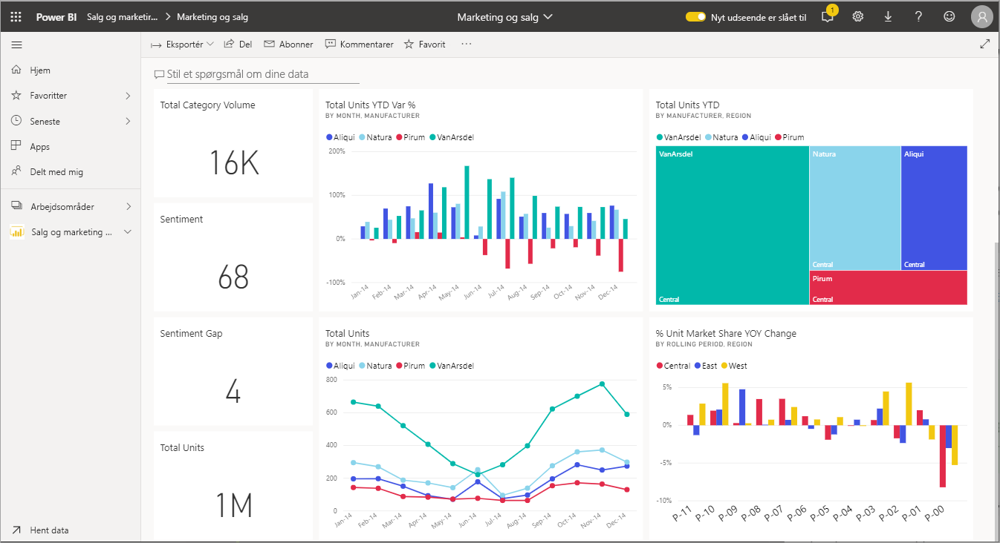
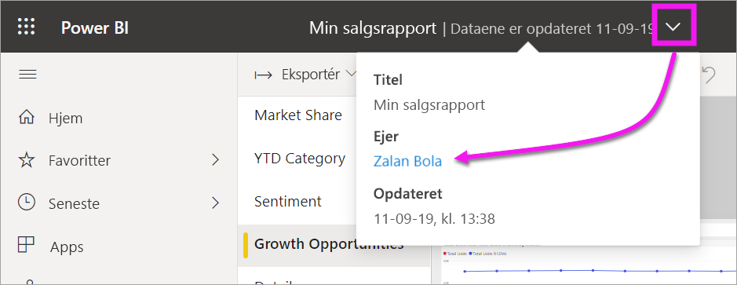

# Interager med visualiseringer i rapporter, på dashboards og i apps

[!INCLUDE[consumer-appliesto-ynny](../includes/consumer-appliesto-ynny.md)]

Helt grundlæggende er en ***visualisering*** (eller et *visuelt element*) en form for diagram, der er udarbejdet af Power BI-*designere* ved hjælp af dataene i rapporter og datasæt. 

Der findes visualiseringer på dashboards, i rapporter, og de kan oprettes ved hjælp af Spørgsmål og svar i Power BI. Når en designer opretter en visualisering i en rapport, er det muligt at *fastgøre* den pågældende visualisering til et dashboard. En [visualisering i et dashboard kaldes et *felt*](end-user-tiles.md). Dette dashboard indeholder otte felter. 

> [!TIP]
> Vi anbefaler, at du først læser det overordnede emne [Power BI – grundlæggende begreber for *forbrugere*](end-user-basic-concepts.md), før du læser dette mere detaljerede indhold.

## Hvad kan jeg gøre med visualiseringer?

Visualiseringer oprettes af *designere* af rapporter og dashboards og deles med *forbrugere*. Som forbruger har du mange muligheder for at interagere med visualiseringerne for at få indsigt og træffe databaserede forretningsbeslutninger. De fleste af disse muligheder er angivet i tabellen nedenfor med links til en trinvis vejledning.

I forbindelse med mange af disse indstillinger kan din administrator eller *designeren* deaktivere din mulighed for at få vist eller bruge disse funktioner. Og nogle af disse funktioner fungerer kun på bestemte visualiseringer.  Hvis du har spørgsmål, skal du kontakte administratoren eller ejeren af rapporten eller dashboardet. Du kan finde ejeren ved at vælge dashboardet eller rapporten på rullelisten. 

> [!IMPORTANT]
> Først lidt om spørgsmål og svar. Spørgsmål og svar er Power BI's søgeværktøj til naturligt sprog. Du skriver et spørgsmål i et naturligt sprog, og derefter svarer Spørgsmål og svar på spørgsmålet i form af en visualisering. Forbrugerne kan bruge Spørgsmål og svar til løbende at oprette deres egne visualiseringer. De visualiseringer, du opretter med Spørgsmål og svar, kan dog ikke gemmes. Hvis der er noget bestemt, du vil have at vide via dataene, og designeren ikke inkluderede det i en rapport eller på et dashboard, er Spørgsmål og svar en rigtig god mulighed. Få mere at vide om Spørgsmål og svar under [Spørgsmål og svar til forbrugere](end-user-q-and-a.md).

|Opgave  |På et dashboard  |I en rapport  | I Spørgsmål og svar
|---------|---------|---------|--------|
|[Føj kommentarer til en visualisering til dig selv, eller start en samtale med kolleger om visualiseringen](end-user-comment.md).     |  ja       |   ja      |  nej  |
|[Åbn og udforsk den rapport, som visualiseringen blev oprettet i](end-user-tiles.md).     |    ja     |   i/t      |  nej |
|[Få vist en liste over de filtre og udsnit, der påvirker visualiseringen](end-user-report-filter.md).     |    hvis du åbner i fokustilstand     |   ja      |  nej |
|[Åbn og udforsk en visualisering i Spørgsmål og svar (hvis *designeren* benyttede Spørgsmål og svar til at oprette visualiseringen)](end-user-q-and-a.md).     |   ja      |   i/t      |  i/t  |
|[Opret en visualisering i Spørgsmål og svar (du kan ikke gemme den i forbindelse med udforskningen)](end-user-q-and-a.md).     |   ja      |   Hvis designeren har føjet Spørgsmål og svar til rapporten      |  ja  |
|[Bed Power BI om at søge efter interessante fakta eller tendenser](end-user-insights.md) i visualiseringens data for dig.  Disse automatisk genererede visuelle elementer kaldes *indsigt*.     |    ja, for felter    |  nej       | nej   |
|[Få kun vist én visualisering ad gangen ved hjælp af *fokustilstand*](end-user-focus.md).     | ja, for felter        |   ja, for visuals      | i/t  |
|[Undersøg, hvornår visualiseringen sidst blev opdateret](end-user-fresh.md).     |  ja       |    ja     | i/t  |
|[Få kun vist én visualisering ad gangen uden kanter eller navigationsruder ved hjælp af *fuldskærms*tilstand](end-user-focus.md).     |   ja      |  ja       | Standard  |
|[Udskriv](end-user-print.md).     |  ja       |   ja      | nej  |
|[Se nærmere på visualiseringen ved at tilføje og redigere visualiseringsfiltre.](end-user-report-filter.md)     |    nej     |   ja      | nej  |
|Hold over en visualisering for at få vist flere oplysninger og værktøjstip.     |    ja     |   ja      | ja  |
|[Brug tværgående filtrering og tværgående fremhævning på andre visualiseringer på siden.](end-user-interactions.md)    |   nej      |   ja      | i/t  |
|[Vis de data, der er brugt til at oprette visualiseringen](end-user-show-data.md).     |  nej       |   ja      | nej  |
| [Skift den måde visualiseringen sorteres på](end-user-change-sort.md). | nej  | ja  | kan ændre sortering ved at omformulere spørgsmålet  |
| Føj spotlight til en visualisering. | nej  | ja  |  nej |
| [Eksportér til Excel.](end-user-export.md) | ja | ja | nej|
| [Opret en besked](end-user-alerts.md), som giver dig besked, når en værdi overskrider den angivne grænse.  | ja  | nej  | nej |
| [Filtrer og fremhæv på tværs af de andre visualiseringer på siden](end-user-report-filter.md).  | nej      | ja  | i/t |
| [Foretag detailudledning af en visualisering, der har et hierarki](end-user-drill.md).  | nej  | ja   | nej |

## De næste trin
Tilbage til [Grundlæggende begreber for forbrugere](end-user-basic-concepts.md)    
[Vælg en visualisering for at åbne en rapport](end-user-report-open.md)    
[Typer af visualiseringer, der er tilgængelige i Power BI](end-user-visual-type.md)