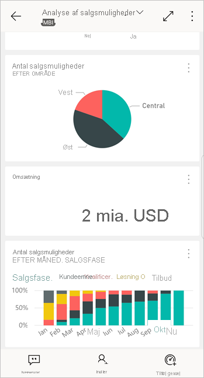
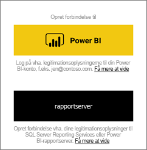
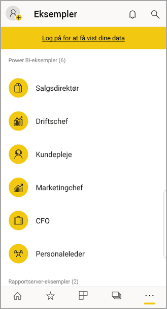

# Introduktion til Power BI-mobilappen på Android-enheder
Android-appen til Microsoft Power BI leverer BI-mobiloplevelsen til Power BI, Power BI Report Server og Reporting Services. Få vist og interager med dit firmas dashboards lokalt og i skyen overalt – med direkte, berøringsfølsom mobiladgang. Udforsk dataene i dashboards, og del dem med dine kollegaer i mails eller tekstmeddelelser. 

Du kan oprette Power BI-rapporter i Power BI Desktop og publicere dem:

* [Publicer dem til Power BI-tjenesten](../../fundamentals/power-bi-overview.md), og opret dashboards.
* [Publicer dem i det lokale miljø på Power BI rapportserver](../../report-server/quickstart-create-powerbi-report.md).

Derefter interagerer du i Power BI-appen til Android med dine dashboards og rapporter, både lokalt og i clouden.

Find ud af, [hvad der er nyt i Power BI-mobilappene](../../mobile-whats-new-in-the-mobile-apps.md).

## Forudsætninger

### Hent appen

[Download Power BI til Android-appen](https://go.microsoft.com/fwlink/?LinkID=544867) fra Google Play.
  
Power BI kan køre på en lang række forskellige Android-enheder, der kører operativsystemet Android 5.0 eller nyere. Hvis du vil kontrollere det på din enhed, skal du gå til **Indstillinger** > **Om enheden** > **Android-version**. 

**Start, når du åbner appen**    
Når du åbner appen, kan du uden hverken at tilmelde dig eller logge på gennemse logonsiderne for at få et hurtigt overblik over ting, du kan gøre med Power BI-appen på din Android-enhed. Tryk på **Spring over** for at få vist og gennemse eksemplerne og få praktisk erfaring med appen. Du kan når som helst [gå tilbage til eksemplerne](mobile-android-app-get-started.md#try-the-power-bi-and-reporting-services-samples) fra startsiden for dashboards.

Find ud af, [hvad der er nyt i Power BI-mobilappene](../../mobile-whats-new-in-the-mobile-apps.md).

## Tilmeld dig Power BI-tjenesten på internettet
Hvis du endnu ikke har tilmeldt dig, kan du gå til [Power BI-tjenesten](https://powerbi.com/) og tilmelde din egen konto for at oprette og lagre dashboards og rapporter samt samle dine data. Log derefter på Power BI fra din Android-enhed for at se dine egne dashboards overalt.

1. I Power BI-tjenesten skal du trykke på [Tilmeld](https://go.microsoft.com/fwlink/?LinkID=513879) for at oprette en Power BI-konto.
2. Gå i gang med at [oprette dine egne dashboards og rapporter](../../service-get-started.md).

## Kom i gang med Power BI-appen på din enhed
1. Fra startskærmen på din Android-enhed åbner du Power BI til Android-app.
   
   
2. Hvis du vil logge på Power BI, skal du trykke på fanen **Power BI** og udfylde dine logonoplysninger.

    Hvis du får en meddelelse om, at Power BI ikke kan logge dig på, kan du læse ["Godkendelsen lykkedes ikke, da der ikke er tillid til din virksomheds SSL-certifikat"](mobile-android-app-error-corporate-ssl-account-is-untrusted.md) for at få oplysninger om, hvordan du kan udbedre problemet.

   Hvis du vil logge på dine Reporting Services-mobilrapporter og -KPI'er, skal du trykke på fanen **Rapportserver** og udfylde dine logonoplysninger.
   
   

## Prøv eksemplerne til Power BI og Reporting Services
Selv uden at tilmelde dig kan du få vist og interagere med Power BI- og Reporting Services-eksemplerne.

Hvis du vil have adgang til eksemplerne, skal du trykke på **Flere indstillinger** (...) på navigationslinjen og vælge **Eksempler**.

Nogle Power BI-eksempler efterfølges af flere eksempler til rapportserver.
   
   

   
   > [!NOTE]
   > Ikke alle funktioner er tilgængelige i eksemplerne. Du kan f.eks. ikke se eksempler på rapporter, der ligger til grund for de pågældende dashboards, du kan ikke dele eksemplerne med andre, og du kan ikke gøre dem til dine favoritter. 
   > 
   >

## Find dit indhold i Power BI-mobilapperne

Tryk på forstørrelsesglasset i overskriften for at begynde at søge efter dit Power BI-indhold.

## Få vist de dashboards og rapporter, du har gjort til favoritter
Tryk på **Favoritter** () på navigationslinjen for at få vist siden Favoritter. 

Læs mere om [favoritter i Power BI-mobilapperne](mobile-apps-favorites.md).

## Erhvervssupport til Power BI-mobilappsene
Virksomheder kan bruge Microsoft Intune til at styre enheder og apps, herunder Power BI-mobilapperne til Android og iOS.

Microsoft Intune giver virksomhederne mulighed for at kontrollere ting som anmode om adgangspinkode, kontrollere, hvordan data skal håndteres af programmet, og kryptere programdata, selv når appen ikke er i brug.

> [!NOTE]
> Hvis du bruger Power BI-mobilappen på din Android-enhed, og din virksomhed har konfigureret Microsoft Intune MAM, er dataopdatering i baggrunden slået fra. Næste gang du bruger appen, vil Power BI opdatere dataene fra Power BI-tjenesten på internettet.
> 
> 

Læs mere om at [konfigurere Power BI-mobilapps med Microsoft Intune](../../service-admin-mobile-intune.md). 

## Næste trin
Her er nogle andre ting, du kan gøre i Android-enhedsappen til Power BI med dashboards og rapporter i Power BI samt rapporter og KPI'er i Power BI-rapportserveren eller Reporting Services-webportalen.

### Power BI-dashboards og -rapporter
* Få vist [dine apps](../../service-create-distribute-apps.md).
* Få vist dine [dashboards](../../mobile-apps-view-dashboard.md).
* Udforske [fliserne på dine dashboards](../../mobile-tiles-in-the-mobile-apps.md).
* Åbne [Power BI-rapporter](../../mobile-reports-in-the-mobile-apps.md).
* Få vist [dine apps](../../service-create-distribute-apps.md).
* [Anmærke og dele fliser](mobile-annotate-and-share-a-tile-from-the-mobile-apps.md).
* Dele [dashboards](../../mobile-share-dashboard-from-the-mobile-apps.md).
* [Scanne en Power BI QR-kode](../../mobile-apps-qr-code.md) med din Android-telefon for at åbne et relateret dashboardfelt eller en relateret rapport. 
* Få vist [beskeder om opdateringer til din Power BI-konto](../../mobile-apps-notification-center.md), f.eks dashboards, som kolleger deler med dig.

### Rapporter og KPI'er på webportalerne for Power BI-rapportserver og Reporting Services
* [Få vist rapporter og KPI'er på webportalen](mobile-app-ssrs-kpis-mobile-on-premises-reports.md) i Power BI-mobilappen til Android-enheder.
* Oprette [KPI'er på webportalen](https://docs.microsoft.com/sql/reporting-services/working-with-kpis-in-reporting-services).
* Oprette [rapporter i Power BI Desktop og publicere dem på Power BI Rapport Server](../../report-server/quickstart-create-powerbi-report.md)-webportalen

### Se også
* [Download Android-appen](https://go.microsoft.com/fwlink/?LinkID=544867) fra Android App Store.
* [Hvad er Power BI?](../../fundamentals/power-bi-overview.md)
* Har du spørgsmål? [Prøv at spørge Power BI-community'et](https://community.powerbi.com/)

