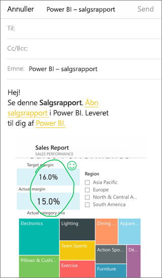

# Anmærk og del et felt, en rapport eller en visualisering i Power BI-mobilapps
Gælder for:

|  |  |  |  |
|:--- |:--- |:--- |:--- |
| iPhone-telefoner |iPad-tablets |Android-telefoner |Android-tablets |

Du kan anmærke og dele et øjebliksbillede af et felt, en rapport eller en visualisering fra Power BI-mobilappen på iOS- og Android-enheder. Dine modtagere kan se det, præcis som det var, når du sender mailen med et link. Du kan sende et øjebliksbillede af felter til alle – ikke kun til kolleger på samme maildomæne. Du kan tilføje anmærkninger – streger, tekst eller stempler – før du deler.

*En rapport med anmærkninger*

Mailen med snapshottet af feltet, rapporten eller visualiseringen indeholder også et link til det faktiske objekt i Power BI-tjenesten ([https://powerbi.com](https://powerbi.com)). Dine modtagere kan klikke på linket og gå direkte til feltet, rapporten eller visualiseringen, hvis både du og modtagerne har Power BI Pro-licenser, eller hvis indholdet er i en [Premium-kapacitet](../../service-premium-what-is.md), og du allerede har delt et element med disse modtagere. 

Du kan også [dele et felt fra Power BI-mobilappen til Windows 10-enheder](mobile-windows-10-phone-app-get-started.md), men du kan ikke anmærke det.

## Åbn et felt for at oprette anmærkninger i det
1. Tryk på feltet for at åbne det i Fokustilstand.
2. Tryk på anmærkningsikonet  i øverste højre hjørne af feltet.
3. Nu kan du [anmærke og dele feltet](mobile-annotate-and-share-a-tile-from-the-mobile-apps.md#annotate-and-share-the-tile-report-or-visual).

## Åbn en rapport for at oprette anmærkninger i den
1. Åbn en rapport. 
2. Tryk på anmærkningsikonet  i øverste højre hjørne af rapporten.
3. Nu kan du [anmærke og dele rapporten](mobile-annotate-and-share-a-tile-from-the-mobile-apps.md#annotate-and-share-the-tile-report-or-visual).

## Åbn en visualisering for at oprette anmærkninger i den
1. Tryk på en visualisering i en rapport, og tryk derefter på ikonet Udvid for at åbne den i Fokustilstand. 
   
    
2. Tryk på anmærkningsikonet  i øverste højre hjørne af visualiseringen.
3. Nu kan du [anmærke og dele visualiseringen](mobile-annotate-and-share-a-tile-from-the-mobile-apps.md#annotate-and-share-the-tile-report-or-visual).

## Anmærk og del feltet, rapporten eller visualiseringen
1. Sådan opretter du en anmærkning:  
   
   
   
   *Anmærkningslinjen på iPhone og iPad*
   
   
   
   *Anmærkningslinjen på Android-enheder*
   
   * Hvis du vil tegne linjer med andre farver eller en anden tykkelse, skal du trykke på ikonet med bølgestregen, vælge en bredde og farve og tegne.  
   * Hvis du vil skrive kommentarer, skal du trykke på **AA** og vælge tekststørrelse, farve og type.  
   * Hvis du vil indsætte stempler (som humørikoner) på et felt, skal du trykke på humørikonet, vælge en farve og trykke på det sted, hvor du vil indsætte det.   
2. Efter anmærkningen skal du trykke på **Del** i øverste højre hjørne.
3. Åbn din mailapp, skriv navnene på modtagerne, og tilpas eventuelt meddelelsen.  
   
   
   
   Mailen indeholder et billede og et link til feltet, rapporten eller visualiseringen. 
4. Tryk på **Send**.

## Næste trin
* [Del et dashboard fra din Power BI-mobilapp](mobile-share-dashboard-from-the-mobile-apps.md)
* Har du spørgsmål? [Prøv at spørge Power BI-community'et](https://community.powerbi.com/)

