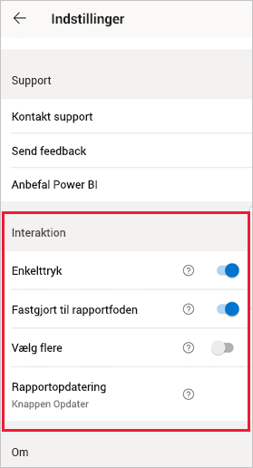
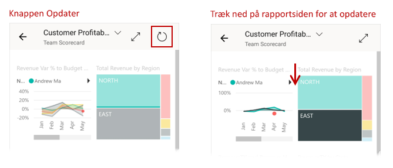
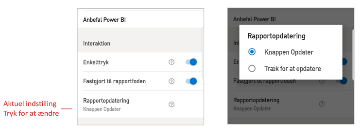

# Konfigurer indstillinger for rapportinteraktion

## Oversigt

Power BI-mobilappen har en række konfigurerbare indstillinger for "interaktion", som giver dig mulighed for at styre, hvordan du interagerer med dine data, og for at definere, hvordan nogle af elementerne i Power BI-mobilappen fungerer. I nedenstående tabel vises de interaktionsindstillinger, der er tilgængelige i øjeblikket, og de enheder, som har disse indstillinger.

|| Android-telefon | iPhone | Android-tablet  | iPad |
|-|:-:|:-:|:-:|:-:|
| [Interaktion via enkelttryk i forhold til dobbelttryk på rapportvisualiseringer](#single-tap) |✔|✔|||
| [Flere markeringer i forhold til enkelte markeringer af datapunkter på visualiseringer i rapporter](#multi-select) |✔|✔|✔|✔|
| [Forankret i forhold til dynamisk rapportfod](#docked-report-footer) |✔|✔|||
| [Opdatering af rapport ved at trykke på en knap i forhold til at trække](#report-refresh) |✔||||
|

Hvis du vil have vist interaktionsindstillingerne, skal du trykke på dit profilbillede for at åbne [sidepanelet](./mobile-apps-home-page.md#header), vælge **Indstillinger** og finde sektionen **Interaktion**.

Indstillingerne for interaktionen er beskrevet i afsnittene nedenfor.

## Interaktionsindstillinger

### Enkelttryk
Når du downloader Power BI-mobilappen, er den angivet til interaktion med enkelttryk. Det betyder, at når du trykker på en visualisering for at udføre en handling, f.eks. markering af et udsnitselement, tværgående fremhævning, klik på et link eller en knap osv., vælges det visuelle element, når du trykker, og samtidig udføres den handling, du ønsker.

Hvis du foretrækker det, kan du slå interaktion med enkelttryk fra. Du har derefter interaktion med dobbelttryk. Hvis du vælger interaktion med dobbelttryk, skal du først trykke på en visualisering for at markere den og derefter trykke på visualiseringen igen for at udføre den ønskede handling.

### Vælg flere

Multivalgstilstanden gør det muligt at vælge flere datapunkter på en rapportside. Når multivalgstilstand er slået til, bliver hvert enkelt datapunkt, du trykker på, føjet til de andre valgte datapunkter, og de kombinerede resultater fremhæves automatisk i alle visualiseringerne på siden. Når multivalgstilstanden er slået fra, erstatter den nye markering den aktuelle markering, når du trykker for at vælge et datapunkt.

Hvis du vil fjerne markeringen af et datapunkt, skal du trykke på det igen.

>[!NOTE]
>Multivalgstilstanden understøttes ikke i brugerdefinerede visualiseringer.
>
>Multivalgstilstanden understøttes på Power BI-rapportserver i den næste version af rapportserveren.

### Fastgjort til rapportfoden

Indstillingen for den forankrede rapportfod bestemmer, om rapportfoden forbliver forankret (dvs. fastgjort og altid synlig) nederst i rapporten, eller om den skjules og vises igen på baggrund af dine handlinger i rapporten, f.eks. rulning.

På Android-telefoner er indstillingen for den forankrede rapportfod som standard slået **til**, hvilket betyder, at rapportfoden er forankret og altid synlig nederst i rapporten. Skift indstillingen til **fra**, hvis du foretrækker en dynamisk rapportfod, der vises og forsvinder afhængigt af dine handlinger i rapporten.

### Rapportopdatering

Indstillingen for rapportopdatering definerer, hvordan du starter rapportopdateringer. Du kan enten vælge at have en Opdater-knap i alle rapportoverskrifter eller at bruge træk-handlingen (trække en smule fra toppen til bunden) på rapportsiden for at opdatere rapporten. I figuren nedenfor vises de to alternativer. 

På Android-telefoner tilføjes der som standard en opdateringsknap.

Hvis du vil ændre indstillingen for rapportopdatering, skal du gå til elementet for rapportopdatering i interaktionsindstillingerne. Den aktuelle indstilling vises. Tryk på værdien for at åbne et pop op-vindue, hvor du kan vælge en ny værdi.

## Fjernkonfiguration

Interaktioner kan også konfigureres eksternt af en administrator ved hjælp af et MDM-værktøj med en fil til konfiguration af en app. På denne måde er det muligt at standardisere rapportens interaktionsoplevelse i hele organisationen eller for bestemte grupper af brugere i organisationen. Se [Konfigurer interaktion ved hjælp af administration af mobilenheder](./mobile-app-configuration.md) for at få flere oplysninger.

## Næste trin
* [Arbejde med rapporter](./mobile-reports-in-the-mobile-apps.md#interact-with-reports)
* [Konfigurer interaktion ved hjælp af administration af mobilenheder](./mobile-app-configuration.md)
