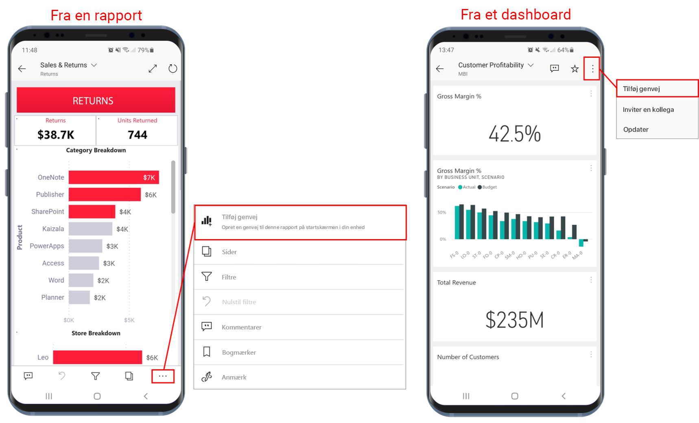
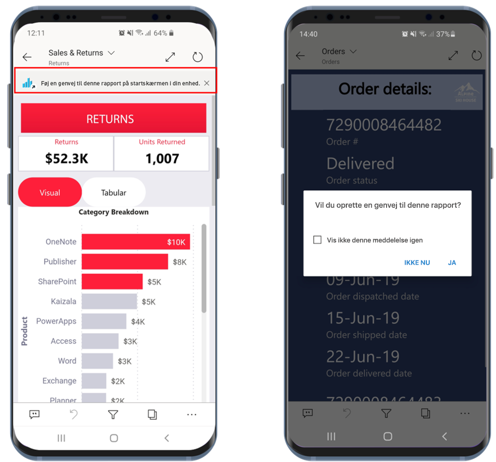
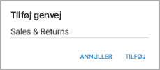
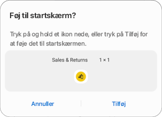
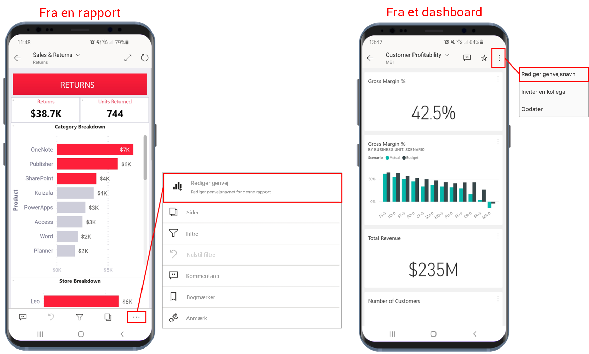
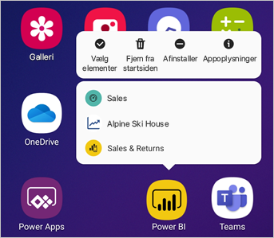

# Brug af Android-appgenveje i Power BI Android-appen

Gælder for:

|  |  |
|:--- |:--- |
| Android-telefoner |Android-tablets |

Med Power BI-mobilappen til Android kan du få direkte adgang til de rapporter eller dashboards, du har brug for, uden at skulle navigere gennem appen: **genveje til enhedens startskærm** og **genveje til appstarteren**.
 * **Genveje til enhedens startskærm**: Du kan oprette en genvej til en rapport eller et dashboard og fastgøre den til din enheds startskærm. Rapporten eller dashboardet behøver ikke at være i et af dine arbejdsområder – du kan også oprette genveje til rapporter og dashboards i apps eller endda til rapporter eller dashboards, der er placeret i en ekstern lejer (B2B).
 * **Genveje til appstarter**: Du kan gå direkte til ofte viste rapporter og dashboards ved at udføre et langt tryk på appstarterikonet på enhedens startskærm for at åbne appstarteren. En menu til hurtig adgang indeholder genveje til tre elementer, som du ofte får vist. Disse elementer ændres fra tid til anden – Power BI-mobilappen holder styr på det, du får vist ofte, og ændrer genvejene i overensstemmelse hermed.

 >[!NOTE]
 >Android-appgenveje er tilgængelige fra Android 8 og nyere.

## Opret en genvej til en rapport eller et dashboard

Du kan oprette en genvej til en rapport eller et dashboard.

1. Klik på **Flere indstillinger...** i menuen Handlinger, og vælg **Tilføj genvej**.

   

   Hvis Power BI-appen registrerer, at du ofte har adgang til et element, foreslår den, at du opretter en genvej til elementet. Dette sker på to måder:
   * På ofte viste rapporter og dashboards vises indstillingen **Tilføj genvej** i et banner, når du åbner elementet.
   * Hvis du ofte bruger et link til at få adgang til en rapport (f.eks. fra en delt mail, en anmærkning osv.), bliver du efter et par gange spurgt, om du vil oprette en genvej. Hvis du vælger **Ja**, åbnes dialogboksen **Tilføj genvej** (se nedenfor), og hvis du vælger **Ikke nu** kommer du til det element, du forsøgte at få adgang til.
   
   Disse to oplevelser er illustreret nedenfor.

   

 1. Dialogboksen **Tilføj genvej** åbnes med navnet på dit element. Du kan redigere navnet, hvis du vil. Tryk på **Tilføj**, når du er færdig.

    

1. Du bliver bedt om at bekræfte, om du vil tilføje genvejen. Tryk på **Tilføj** for at føje genvejen til enhedens startskærm.

   

   Der føjes et genvejsikon til dashboardet eller rapporten til enhedens startskærm med det navn, du har angivet.

   

## Rediger navnet på genvejen

Hvis du vil redigere navnet på en genvej, skal du vælge **Flere indstillinger...** i menuen Handlinger og derefter vælge **Rediger genvejsnavn**

 

## Brug appstarteren til Power BI – Mobil til at få adgang til indhold, som du ofte får vist

Du kan bruge appstarteren til Power BI – Mobil til at få direkte adgang til elementer, du ofte åbner.

Hvis du trykker med et langt tryk på appstarteren, får du vist en menu til hurtig adgang til elementer, der ofte vises. Tryk derefter på en genvej for at åbne det ønskede element.

Du kan oprette en permanent genvej til alle elementerne på listen ved blot at trække det ønskede genvejsikon til enhedens startskærm.

## Næste trin
* [Søg efter og få adgang til indhold med Google-søgning](mobile-app-find-access-google-search.md)
* Hvis du bruger iOS og har brug for Siri-genveje, kan du se [Brug af Siri-genveje i iOS-appen til Power BI – Mobil](mobile-apps-ios-siri-shortcuts.md).
* [Favoritter i Power BI-mobilapps](mobile-apps-favorites.md)
