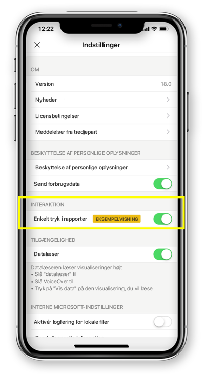

# Konfigurer rapportinteraktion til enkelt tryk eller dobbelttryk
Gælder for:

|  |  | 
|:--- |:--- |
| iPhone-telefoner |Android-telefoner |

En Power BI-rapport er en interaktiv visning af dine data, hvor visualiseringer repræsenterer forskellige resultater og indsigter fra disse data.

Du kan konfigurere, hvordan du interagerer med dine data. Du kan bestemme, om du vil have interaktion med et enkelt tryk eller med dobbelttryk.

* Ved interaktion med dobbelttryk markeres elementet ved første tryk på en visualisering, mens det først er ved andet tryk, at selve handlingen udføres. Det gælder f.eks. valg af element i udsnit, tværgående fremhævning eller klik på et link, en knap osv.

* Ved interaktion med et enkelt tryk udføres begge handlinger med et enkelt tryk – både markering af visualiseringen og udførelse af handlingen.

Fra og med Power BI-appversion 18.0 til iOS og 112540 til Android bliver alle nye installationer konfigureret med enkelt tryk som standardfunktion.
Brugere, der allerede har Power BI installeret på telefonen og vil opgradere til disse nye versioner, bliver tilbudt at skifte til enkelt tryk.

## Skift funktionalitet ved interaktion

Hvis du vil ændre funktionaliteten ved interaktion, kan du gå til indstillingerne for appen og slå interaktion med enkelt tryk til eller fra.

Denne artikel gælder for både liggende rapporter og telefonrapporter.

## Næste trin
* [Få vist og interager med Power BI-rapporter, der er optimeret til din telefon](mobile-apps-view-phone-report.md)
* Har du spørgsmål? [Prøv at spørge Power BI-community'et](https://community.powerbi.com/)

