# Vis rapporter og KPI'er fra rapportserveren i det lokale miljø i Power BI-mobilapps

Power BI-mobilapps leverer live, touchaktiveret mobiladgang til dine firmaoplysninger i det lokale miljø via Power BI-rapportserver og SQL Server 2016 Reporting Services (SSRS).

Gælder for:

|  |  |  |  |
|:--- |:--- |:--- |:--- |
| iPhones |iPad-tablets |Android-telefoner |Android-tablets |

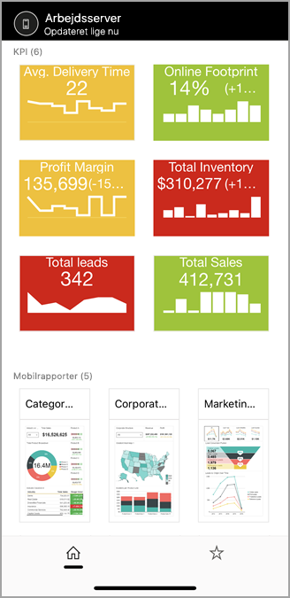

## Det vigtigste først
**Mobilappsene er der, hvor du ser Power BI-indhold, ikke hvor du opretter det.**

* Du og andre personer, der opretter rapporter i din organisation, [opretter Power BI-rapporter med Power BI Desktop, og publicerer dem derefter på webportalen Power BI-rapportserver](../../report-server/quickstart-create-powerbi-report.md). 
* Du opretter [KPI'er direkte i webportalen](https://docs.microsoft.com/sql/reporting-services/working-with-kpis-in-reporting-services), organiserer dem i mapper og markerer dine favoritter, så du nemt kan finde dem. 
* Du [opretter Reporting Services-mobilrapporter](https://docs.microsoft.com/sql/reporting-services/mobile-reports/create-mobile-reports-with-sql-server-mobile-report-publisher) med SQL Server 2016 Enterprise Edition Mobile Report Publisher, og publicerer dem på [Reporting Services-webportalen](https://docs.microsoft.com/sql/reporting-services/web-portal-ssrs-native-mode).  

Derefter opretter du forbindelse til op til fem rapportservere i Power BI-mobilappsene for at se Power BI-rapporter og -KPI'er, organiseret i mapper eller samlet som favoritter. 

## Se nærmere på eksemplerne i mobilappsene uden serverforbindelse
Selvom du ikke har adgang til en Reporting Services-webportal, kan du stadig udforske funktionerne i Reporting Services-mobilrapporter og -KPI'er. 

1. Tryk på dit profilbillede i øverste venstre hjørne, og tryk derefter på **Indstillinger** på det kontopanel, der glider ud.

2. Tryk på **Reporting Services-eksempler** på siden Indstillinger, og gennemse for at interagere med eksemplerne på KPI'er og mobilrapporter.
   
   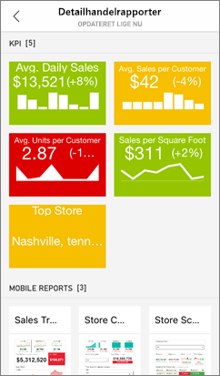

## Opret forbindelse til en rapportserver i det lokale miljø
Du kan se Power BI-rapporter, Reporting Services-mobilrapporter og KPI'er i Power BI-mobilapps. 

1. Åbn Power BI-appen på din mobilenhed.
2. Hvis du ikke er logget på Power BI endnu, skal du trykke på **Rapportserver**.
   
   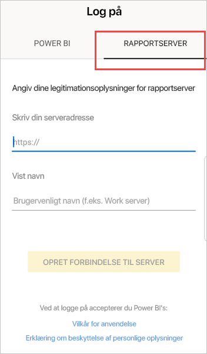
   
   Hvis du allerede er logget på Power BI-appen, skal du trykke på dit profilbillede i øverste venstre hjørne og derefter trykke på **Indstillinger** på det kontopanel, der glider ud.
3. Tryk på **Opret forbindelse til server** på siden Indstillinger, der åbnes.
   
    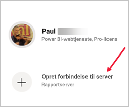

    Mobilappen skal have adgang til serveren på en eller anden måde. Der er et par måder at gøre det på:
     * Den nemmeste måde er at være på samme netværk/anvende en VPN-forbindelse.
     * Det er muligt at bruge en Web Application Proxy til at oprette forbindelse, hvis du er uden for organisationen. Du kan få flere oplysninger under [Brug af OAuth til at oprette forbindelse til Reporting Services](mobile-oauth-ssrs.md).
     * Åbn en forbindelse (port) i firewallen.

4. Udfyld serveradressen, og giv serveren et brugervenligt navn, hvis du vil. Brug dette format til serveradressen:
   
     `https://<servername>/reports`
   
     OR
   
     `https://<servername>/reports`
   
   Inkluder **http** eller **https** foran forbindelsesstrengen.
   
    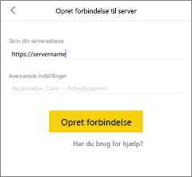
5. Når du har skrevet serveradressen og et valgfrit brugervenligt navn, skal du trykke på **Opret forbindelse** og derefter udfylde dit brugernavn og din adgangskode, når du bliver bedt om det.
6. Nu kan du se serveren i ruden Konti – i dette eksempel hedder den "Arbejdsserver".
   
   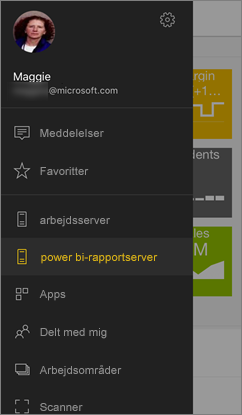

## Opret forbindelse til en rapportserver i det lokale miljø i iOS eller Android

Hvis du får vist Power BI i iOS- eller Android-mobilappen, kan din it-administrator have defineret en appkonfigurationspolitik. Hvis det er tilfældet, skal du ikke angive lige så mange oplysninger, når du skal oprette forbindelse til en rapportserver. 

1. Du får vist en meddelelse om, at din mobilapp er konfigureret med en rapportserver. Tryk på **Log på**.

    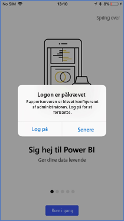

2.  Detaljerne om rapportserveren er allerede udfyldt på siden **Opret forbindelse til server**. Tryk på **Opret forbindelse**.

    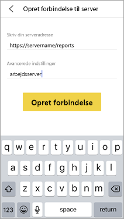

3. Skriv en adgangskode, og tryk derefter på **Log på**. 

    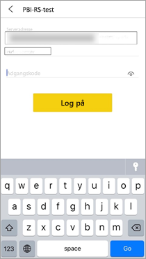

Nu kan du få vist og interagere med KPI'er og Power BI-rapporter på rapportserveren.

## Se Power BI-rapporter og -KPI'er i Power BI-appen
Power BI-rapporter, Reporting Services-mobilrapporter og KPI'er vises i de samme mapper, som de er placeret i på Reporting Services-webportalen. 

* Tryk på en Power BI-rapport . Den åbnes i vandret tilstand, og du kan interagere med den i Power BI-appen.

    > [!NOTE]
  > Analysér ned og op er i øjeblikket ikke aktiveret i Power BI-rapporter på en Power BI-rapportserver.
  
    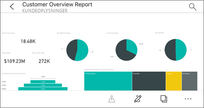
* I Power BI Desktop kan ejere [optimere en rapport](../../create-reports/desktop-create-phone-report.md) til Power BI-mobilapps. På din mobiltelefon har optimerede rapporter et særligt ikon, , og layout.
  
    
* Tryk på en KPI for at få den vist i fokuseret tilstand.
  
    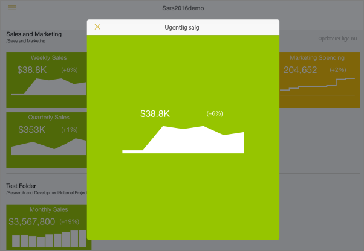

## Se dine foretrukne KPI'er og rapporter
Du kan markere KPI'er og rapporter som favoritter på webportalen og derefter se dem i en enkelt praktisk mappe på din mobilenhed sammen med din foretrukne Power BI-dashboards.

* Tryk på **Favoritter** på navigationslinjen.
  
   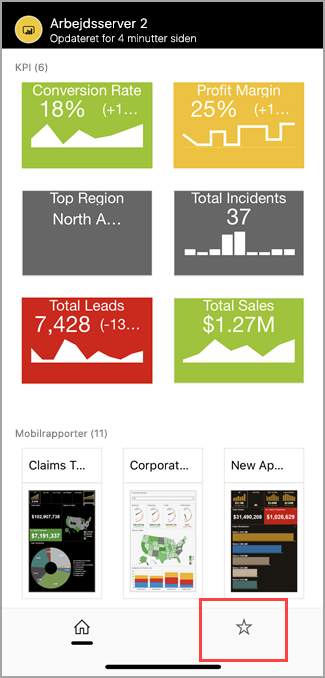
  
   Dine foretrukne KPI'er og rapporter fra webportalen findes alle på denne side sammen med Power BI-dashboards i Power BI-tjenesten:
  
   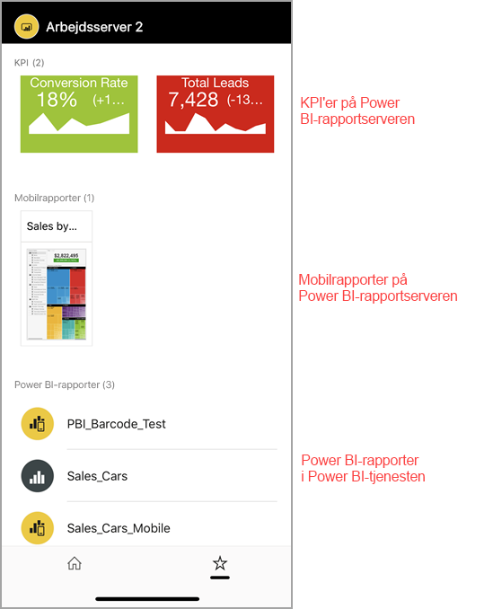

## Fjern en forbindelse til en rapportserver
1. Åbn ruden Konti, og tryk på **Indstillinger**.
2. Tryk på navnet på den server, som du ikke vil oprette forbindelse til.
3. Tryk på **Fjern server**.

## De næste trin
* [Hvad er Power BI?](../../fundamentals/power-bi-overview.md)  
* Har du nogen spørgsmål? [Prøv at spørge Power BI-community'et](https://community.powerbi.com/)
