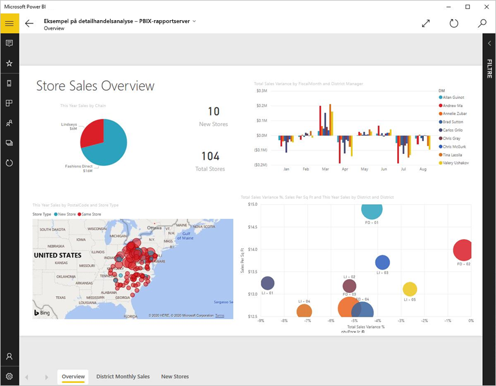
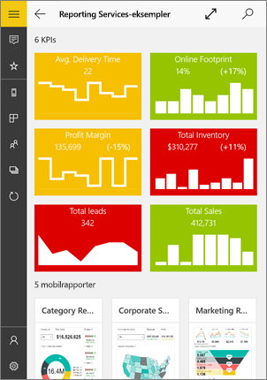
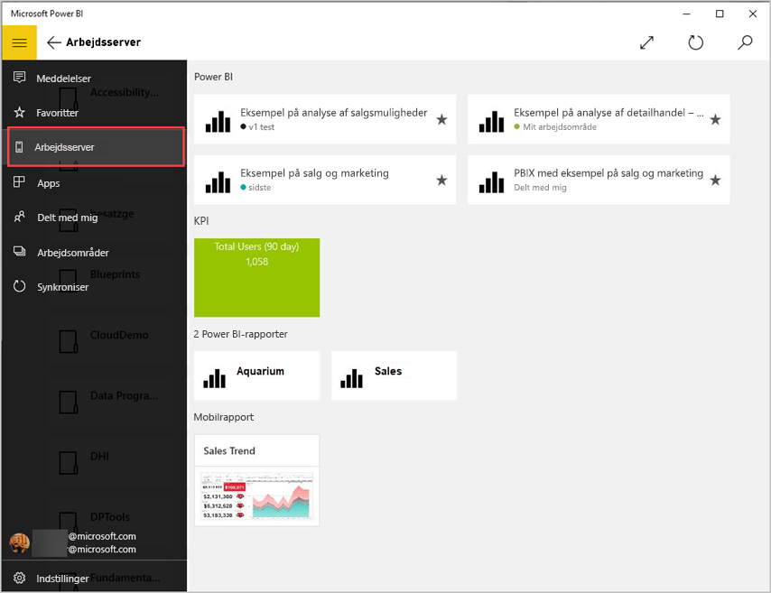
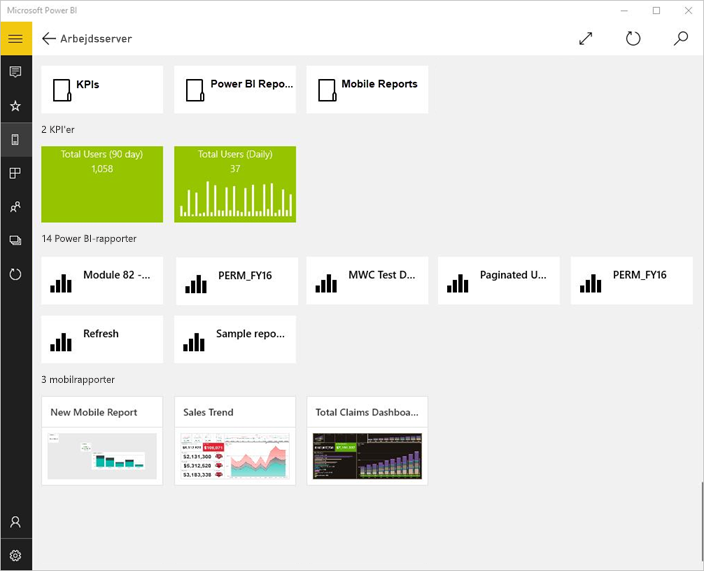
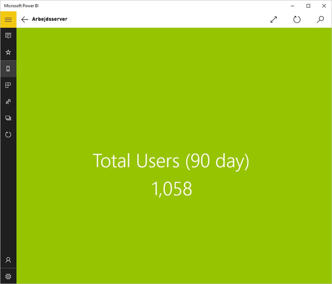
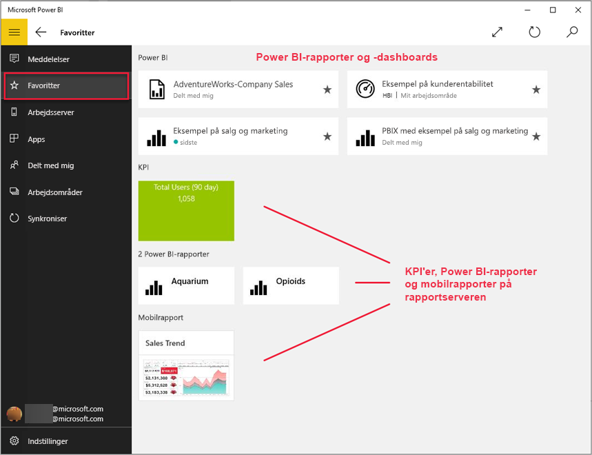
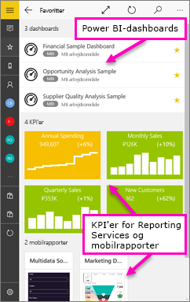

# Få vist SSRS-mobilrapporter (SQL Server Reporting Services) og KPI'er i Windows 10 Power BI-mobilappen
Power BI-mobilappen til Windows 10 tilbyder live, touchaktiveret mobiladgang til dine vigtige firmaoplysningerne i det lokale miljø via SQL Server 2016 Reporting Services. 

## Det vigtigste først
[Opret Reporting Services-mobilrapporter](https://msdn.microsoft.com/library/mt652547.aspx) med SQL Server 2016 Enterprise Edition Mobile Report Publisher, og publicer dem på [Reporting Services-webportalen](https://msdn.microsoft.com/library/mt637133.aspx). Opret KPI'er direkte på webportalen. Organiser dem i mapper, og markér dine favoritter, så du nemt kan finde dem. 

Få derefter vist mobilrapporter og KPI'er organiseret i mapper eller samlet som favoritter i Power BI-mobilappen til Windows 10. 

> [!NOTE]
> Din enhed skal køre Windows 10. Appen fungerer bedst på enheder med mindst 1 GB RAM og 8 GB internt lager.
> 
> 

## Udforsk eksempler uden en SQL Server 2016 Reporting Services-server
Selvom du ikke har adgang til en Reporting Services-webportal, kan du stadig udforske funktionerne i Reporting Services-mobilrapporter.

1. Åbn Power BI-appen på din Windows 10-enhed.
2. Tryk på knappen til global navigation  i øverste venstre hjørne.
3. Tryk på ikonet **Indstillinger** , højreklik eller tryk på **Opret forbindelse til serveren**, og tryk derefter på **Få vist eksempler**.
   
   
4. Åbn mappen Retail Reports eller Sales Reports for at se deres KPI'er og mobilrapporter.
   
   

Gennemse eksemplerne for at interagere med KPI'er og mobilrapporter.

## Opret forbindelse til en Reporting Services-rapportserver
1. Nederst på navigationslinjen til venstre skal du trykke på **Indstillinger** 
2. Tryk på **Opret forbindelse til serveren**.
3. Udfyld serveradressen og dit brugernavn og din adgangskode. Brug dette format til serveradressen:
   
     `http://<servername>/reports` ELLER   `https://<servername>/reports`
   
   > [!NOTE]
   > Inkluder **http** eller **https** i begyndelsen af forbindelsesstrengen.
   > 
   > 
   
    Tryk på **Avanceret indstilling** for evt. at give serveren et navn.
4. Tryk på markeringen for at oprette forbindelse. 
   
   Nu kan du se serveren på navigationslinjen til venstre.
   
   
   
   >[!TIP]
   >Tryk på knappen til globale navigation  når som helst for at skifte mellem dine Reporting Services-mobilrapporter og dine dashboards i Power BI-tjenesten. 
   > 

## Visning af Reporting Services-KPI'er og mobilrapporter i Power BI-appen
Reporting Services-KPI'er og mobilrapporter vises i de samme mapper, som de er placeret i på Reporting Services-webportalen.

* Tryk på en KPI for at få den vist i fokuseringstilstand.
  
    
* Tryk på en mobilrapport for at åbne og interagere med den i Power BI-appen.
  
    

## Få vist dine foretrukne KPI'er og rapporter
Du kan markere KPI'er og mobilrapporter som favoritter på din Reporting Services-webportal og derefter se dem i en praktisk mappe på din Windows 10-mobilenhed sammen med dine foretrukne Power BI-dashboards og -rapporter.

* Tryk på **Favoritter**.
  
   
  
   Dine favoritter fra webportalen findes alle på denne side.
  
   

Læs mere om [Favoritter i Power BI-mobilappsene](mobile-apps-favorites.md).

## Fjern en forbindelse til en rapportserver
Du kan kun oprette forbindelse til én rapportserver ad gangen fra din Power BI-mobilapp. Hvis du vil oprette forbindelse til en anden server, skal du afbryde forbindelsen til den aktuelle.

1. Nederst på navigationslinjen til venstre skal du trykke på **Indstillinger** .
2. Tryk på og hold det servernavn nede, som du ikke vil have forbindelse til.
3. Tryk på **Fjern server**.
   
    

## Opret Reporting Services-mobilrapporter og -KPI'er
Du opretter ikke Reporting Services-KPI'er og -mobilrapporter i Power BI-mobilappen. Du opretter dem i SQL Server Mobile Report Publisher og på en SQL Server 2016 Reporting Services-webportal.

* [Opret dine egne Reporting Services-mobilrapporter](https://msdn.microsoft.com/library/mt652547.aspx), og publicer dem på en Reporting Services-webportal.
* Opret [KPI'er på en Reporting Services-webportal](https://msdn.microsoft.com/library/mt683632.aspx)

## Næste trin
* [Kom i gang med Power BI-mobilappen til Windows 10](mobile-windows-10-phone-app-get-started.md)  
* [Hvad er Power BI?](../../fundamentals/power-bi-overview.md)  
* Har du spørgsmål? [Prøv at spørge Power BI-community'et](http://community.powerbi.com/)

