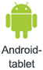
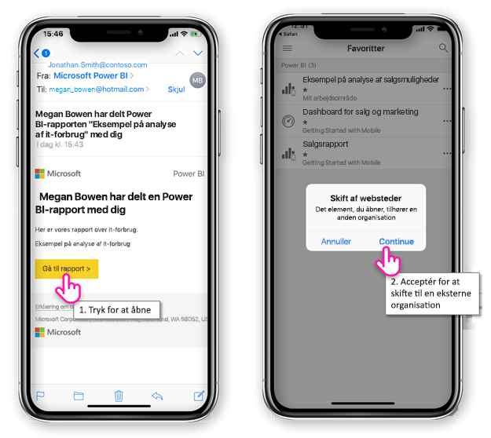
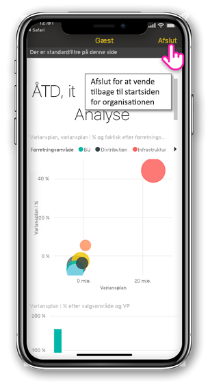
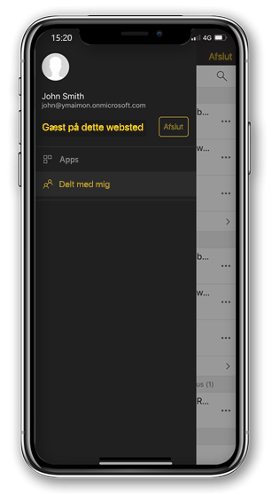

# Få vist Power BI-indhold, der deles med dig fra en ekstern organisation

Powerbi kan integreres med Azure Active Directory business-to-business (Azure AD B2B) til at tillade sikker distribution af Power BI-indhold til gæstebrugere uden for din organisation. Og eksterne gæstebrugere kan bruge Power BI-mobilappen til at få adgang til denne Power BI-indhold, der er delt med vedkommende. 

Gælder for:

|  |  |  |  |
|:--- |:--- |:--- |:--- |
| iPhones |iPad-tablets |Android-telefoner |Android-tablets |

## Adgang til delt indhold

**Først skal bruge du en anden person i en ekstern organisation at dele et element med dig.** Når nogen [deler et element med dig](../../service-share-dashboards.md), enten fra den samme organisation eller fra en ekstern organisation, modtager du en mail med et link til det delt element. Følger linket i den mobile enhed, åbner Power BI-mobilappen. Hvis appen genkender, at elementet blev delt fra en ekstern organisation, at appen opretter forbindelse til organisationen med din identitet. Appen indlæser derefter alle elementer, der blev delt med dig fra denne organisation.

> [!NOTE]
> Hvis dette er det første element, der er delt med dig som en ekstern gæstebruger, skal du gøre krav på invitationen i en browser. Du kan ikke gøre krav på invitationen i Power BI-appen.

Så længe du har forbindelse til en ekstern organisation, der vises en sort-header i appen. Denne header angiver, at du ikke har forbindelse til din startside organisation. For at oprette forbindelse tilbage til din startside organisation, at afslutte fra gæstetilstand.

Selvom du skal have et link til Power BI-artefakt til at oprette forbindelse til en ekstern organisation, når du skifter din app, kan du få adgang til alle elementer, der er delt med dig (ikke kun på det element, som du har åbnet fra mailen). Gå til menuen for at få vist alle elementer, du kan få adgang til i den eksterne organisation, og vælg **delt med mig**. Under **Apps** du finder apps, du kan også bruge.

## Begrænsninger

- Betinget adgang og andre Intune-politikker, understøttes ikke i Azure AD B2B og i Power BI – mobil. Det betyder, at appen gennemtvinger kun startside organisationens politikker, hvis de findes.
- Push-beskeder, der modtages fra webstedet startside organisation (selv når brugeren er tilsluttet som gæst til en ekstern organisation). Åbne beskeden igen opretter forbindelse mellem appen til brugerens startside organisation websted.
- Hvis brugeren lukker appen, når genåbnes på, at appen opretter automatisk forbindelse til brugerens startside organisation.
- Når du har forbindelse til en ekstern organisation, der har deaktiveret visse handlinger: favorit elementer, databeskeder, kommentarer og deling.
- Offlinedata er ikke tilgængelig, mens forbindelse til en ekstern organisation.
- Hvis du har appen firmaportal, der er installeret på din enhed, skal derefter din enhed være tilmeldt.
