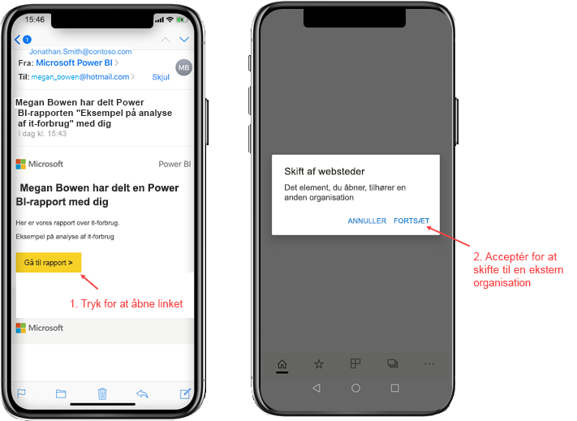
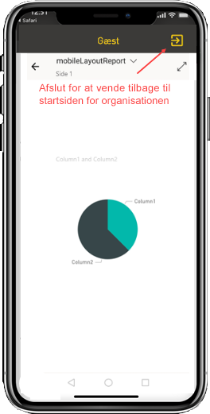
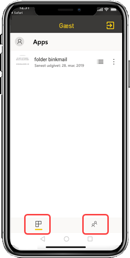

# Få vist Power BI-indhold, der er delt med dig, fra en ekstern organisation

Power BI kan integreres med Azure AD B2B (Azure Active Directory business-til-business) for at tillade sikker distribution af Power BI-indhold til gæstebrugere uden for din organisation. Og eksterne gæstebrugere kan bruge Power BI-mobilappen til at få adgang til Power BI-indhold, der er delt med dem. 

Gælder for:

|  |  |  |  |
|:--- |:--- |:--- |:--- |
| iPhones |iPad-tablets |Android-telefoner |Android-tablets |

## Adgang til delt indhold

**Først skal du have en person fra en ekstern organisation til at dele et element med dig.** Når nogen [deler et element med dig](../../collaborate-share/service-share-dashboards.md), enten fra den samme organisation eller fra en ekstern organisation, modtager du en mail med et link til det delte element. Når du følger linket på din mobilenhed, åbnes Power BI-mobilappen. Hvis appen registrerer, at elementet er delt fra en ekstern organisation, opretter appen forbindelse til den pågældende organisation igen med din identitet. Appen indlæser derefter alle de elementer, der blev delt med dig fra den pågældende organisation.

> [!NOTE]
> Hvis dette er det første element, der deles med dig som ekstern gæstebruger, skal du hente invitationen i en browser. Du kan ikke hente invitationen i Power BI-appen.

Så længe du har oprettet forbindelse til en ekstern organisation, vises der en sort overskrift i appen. Denne overskrift angiver, at du ikke har forbindelse til din hjemmeorganisation. Hvis du vil oprette forbindelse til din hjemmeorganisation igen, skal du afslutte gæstetilstand.

Selvom du skal have et link til et Power BI-artefakt for at oprette forbindelse til en ekstern organisation, kan du få adgang til alle de elementer, der er delt med dig (ikke kun det element, du har åbnet fra mailen), når din app skifter. Hvis du vil have vist alle elementer, du har adgang til i den eksterne organisation, skal du gå til appmenuen og vælge **Delt med mig**. Under **Apps** finder også du apps, som du kan bruge.

## Begrænsninger

- Brugere skal have en aktiv Power BI-konto og en Start-lejer.
- Brugerne skal være logget på deres Power BI Start-lejer, før de kan få adgang til det indhold, der er delt med dem fra en ekstern lejer.
- Betinget adgang og andre Intune-politikker understøttes ikke i Azure AD B2B og i Power BI – Mobil. Det betyder, at appen kun gennemtvinger hjemmeorganisationens politikker, hvis de findes.
- Pushmeddelelser modtages kun fra hjemmeorganisationens websted (også når brugeren har oprettet forbindelse som gæst til en ekstern organisation). Når du åbner meddelelsen, oprettes der forbindelse mellem appen og brugerens hjemmeorganisations websted igen.
- Hvis brugeren lukker appen, oprettes der automatisk forbindelse til brugerens hjemmeorganisation, når appen åbnes igen.
- Når der er oprettet forbindelse til en ekstern organisation, er nogle handlinger deaktiveret: foretrukne elementer, databeskeder, kommentering og deling.
- Offlinedata er ikke tilgængelige, når der er oprettet forbindelse til en ekstern organisation.
- Hvis du har Firmaportal-appen installeret på din enhed, skal din enhed være tilmeldt.
