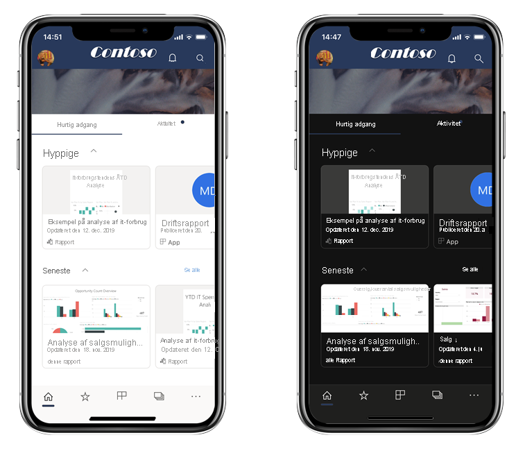
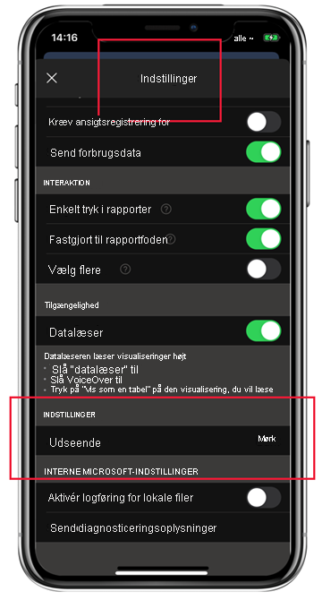

# Mørk tilstand

For at imødekomme dine individuelle visningspræferencer understøtter Power BI-mobilappen til iOS både lys og mørk skærmtilstand. Mørk tilstand reducerer skærmens lysstyrke, hvilket gør det lettere at se dit indhold.

 I mørk tilstand vises alle appoplevelser med en mørk baggrund. Power BI-indhold påvirkes dog ikke. Dine rapporter, dashboards og apps vises altid som designerne har angivet.
 
 Som standard bruger Power BI mobil-appen enhedens indstillinger til at bestemme, hvilken skærmtilstand der skal bruges. Hvis enheden er konfigureret til mørk tilstand, vises appen i mørk tilstand.
 
 Hvis du vil skifte mellem lys og mørk tilstand, eller hvis du vil lade enhedsindstillingerne bestemme tilstanden, skal du gå til **Indstillinger > Indstillinger** og trykke på **Udseende** for at vælge den ønskede tilstand.

