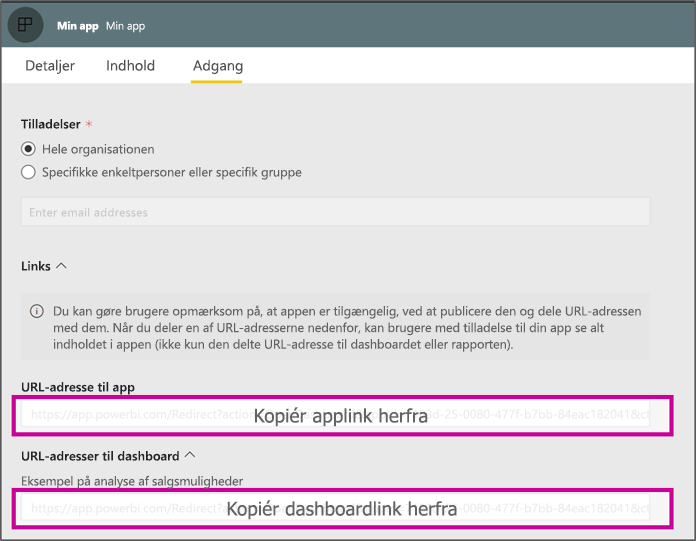

# <a name="create-a-link-to-a-specific-location-in-the-power-bi-mobile-apps"></a>Opret et link til en bestemt placering i Power BI-mobilappsene
Du kan bruge links til direkte adgang til bestemte elementer i Power BI: Rapporten Dashboard og felt.

Der er hovedsageligt to scenarier for brug af links i Power BI Mobile: 

* Til at åbne Power BI fra **uden for appen**, og lande på specifikt indhold (rapport/dashboard/app). Dette er normalt en integrationsscenarie, når du vil åbne Power BI – mobil fra andre app. 
* Til **navigere** i Power BI. Dette er normalt, når du vil oprette en brugerdefineret navigation i Power BI.


## <a name="use-links-from-outside-of-power-bi"></a>Brug links fra uden for Power BI
Når du bruger et link fra uden for Power BI-app, du vil sikre dig, så vil blive åbnet af appen, og hvis appen ikke er installeret på enheden, og derefter at tilbyde brugeren at installere den. For at understøtte lige præcis, har vi oprettet en særlig link-format. Dette link-format, sikrer, at enheden bruger appen til at åbne linket, og hvis appen ikke er installeret på enheden, det vil tilbyde brugeren om at gå til butikken for at få den.

Linket, der skal starte med følgende  
```html
https://app.powerbi.com/Redirect?[**QUERYPARAMS**]
```

> [!IMPORTANT]
> Hvis dit indhold er hostet i særlig datacenter som Goverment, Kina osv. Linket skal starte med den rigtige Power BI-adresse, som `app.powerbigov.us` eller `app.powerbi.cn`.   
>


Den **forespørgsel PARAMS** er:
* **handling** (obligatorisk) = OpenApp / OpenDashboard / OpenTile / ÅbnRapport
* **appId** =, hvis du vil åbne en rapport eller et dashboard, der er en del af en app 
* **groupObjectId** =, hvis du vil åbne en rapport eller et dashboard, der er en del af arbejdsområde (men ikke mit arbejdsområde)
* **dashboardObjectId** = dashboard objekt-ID (hvis handling er OpenDashboard eller OpenTile)
* **reportObjectId** = rapport objekt-ID (hvis handling er ÅbnRapport)
* **tileObjectId** = felt objekt-ID (hvis handling er OpenTile)
* **reportPage** =, hvis du vil åbne specifikke rapportsektion (hvis handling er ÅbnRapport)
* **ctId** = element organisations-ID (relevante til B2B-scenarie. Dette kan udelades, hvis elementet, der hører til brugerens organisation).

**Eksempler:**

* Åbn app-link 
  ```html
  https://app.powerbi.com/Redirect?action=OpenApp&appId=appidguid&ctid=organizationid
  ```

* Åbn dashboardet, der er en del af en app 
  ```html
  https://app.powerbi.com/Redirect?action=OpenDashboard&appId=**appidguid**&dashboardObjectId=**dashboardidguid**&ctid=**organizationid**
  ```

* Åbn en rapport, der er en del af et arbejdsområde
  ```html
  https://app.powerbi.com/Redirect?Action=OpenReport&reportObjectId=**reportidguid**&groupObjectId=**groupidguid**&reportPage=**ReportSectionName**
  ```

### <a name="how-to-get-the-right-link-format"></a>Sådan får du det rigtige link-format

#### <a name="links-of-apps-and-items-in-app"></a>Links på apps og elementer i app

For **apps og rapporter og dashboard, der er en del af en app**, er den nemmeste måde at få linket for at gå til apparbejdsområdet, og vælg "Opdater app". Derved åbnes oplevelsen "Publicer app" og under fanen adgang, skal du finde en **Links** afsnit. Udvider, afsnit, og du får vist en liste over app, og alle dens indhold links, der kan bruges til at få adgang til dem direkte.



#### <a name="links-of-items-not-in-app"></a>Links af elementer, der ikke er i app 

For rapporter og dashboards, der ikke er en del af en app, du har brug at udtrække id'erne fra element URL-adressen.

F.eks, for at finde 36 tegnet lange **dashboard** objekt-ID, skal du gå til det pågældende dashboard i Power BI-tjenesten 

```html
https://app.powerbi.com/groups/me/dashboards/**dashboard guid comes here**?ctid=**organization id comes here**`
```

Til at finde 36 tegnet lange **rapport** objekt-ID, skal du gå til den pågældende rapport i Power BI-tjenesten.
Dette er et eksempel på rapport fra "My Workspace"

```html
https://app.powerbi.com/groups/me/reports/**report guid comes here**/ReportSection3?ctid=**organization id comes here**`
```
Ovenstående URL-adressen indeholder også specifikke rapportside **"ReportSection3"** .

Dette er et eksempel på en rapport fra et arbejdsområde (ikke mit arbejdsområde)

```html
https://app.powerbi.com/groups/**groupid comes here**/reports/**reportid comes here**/ReportSection1?ctid=**organizationid comes here**
```

## <a name="use-links-inside-power-bi"></a>Brug links i Power BI

Links i Power BI arbejder i mobilappsene præcis som i Power BI-tjenesten.

Hvis du vil tilføje link til din rapport, der peger på en anden Power BI-element, kan du blot kopiere denne URL-adresse til element fra browserens adresselinje. Læs mere om [hvordan du føjer et hyperlink til et tekstfelt i en rapport](https://docs.microsoft.com/power-bi/service-add-hyperlink-to-text-box).

## <a name="use-report-url-with-filter"></a>Brug rapportens URL-adresse med filter
Samme som Power BI-tjenesten, Power BI Mobile apps understøtter også rapportens URL-adresse, der indeholder en filter-forespørgsel param. Du kan åbne en rapport i Power BI-mobilapp og filtrere dem til specifikke tilstand. F.eks, denne URL-adresse, åbnes rapporten og filtreres efter distrikt

```html
https://app.powerbi.com/groups/me/reports/**report guid comes here**/ReportSection3?ctid=**organization id comes here**&filter=Store/Territory eq 'NC'
```

Læs mere om [rapporter, hvordan du bygger param for forespørgslen til at filtrere](https://docs.microsoft.com/power-bi/service-url-filters).

## <a name="next-steps"></a>Næste trin
Din feedback hjælper os med at afgøre, hvad der skal implementeres fremover, så husk at stemme på andre funktioner, du gerne vil se i Power BI-mobilapps. 

* [Power BI-apps til mobilenheder](mobile-apps-for-mobile-devices.md)
* Følg @MSPowerBI på Twitter
* Deltag i samtalen i [Power BI-communityet](http://community.powerbi.com/)
* [Hvad er Power BI?](../../power-bi-overview.md)

